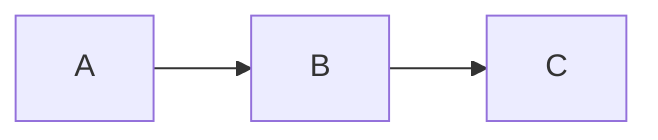

# SSHeRun's Blog

> 一个对 Agent 友好的博客 — 探索 AI 时代的个人网站新形态

**线上地址**: https://ssherun.github.io

## 项目定位

这不只是一个给人看的博客，也是一个给 AI Agent 读的接口。博客的核心主题是**"做一个对 Agent 友好的博客"**，在保证人类阅读体验的同时，提供机器可高效消费的结构化内容。

## 技术栈

| 类别 | 技术 |
|------|------|
| 框架 | [Astro](https://astro.build/) 6.x（从 Hexo 迁移） |
| 样式 | [Tailwind CSS](https://tailwindcss.com/) v4 + CSS 自定义属性 |
| 设计风格 | Glassmorphism（毛玻璃）+ Cyberpunk 配色 |
| 页面过渡 | Astro View Transitions（浏览器原生 API） |
| 知识图谱 | [Cytoscape.js](https://js.cytoscape.org/) |
| 语言 | TypeScript / Astro / Markdown |
| 部署 | GitHub Pages + GitHub Actions 自动构建 |
| 评论 | [Giscus](https://giscus.app)（基于 GitHub Discussions） |
| 图表 | [Mermaid](https://mermaid.js.org/)（通过 astro-mermaid） |
| Node | >= 22.12.0 |

## 项目结构

```
├── .github/workflows/deploy.yml   # CI/CD：push main → 自动构建部署
├── astro.config.mjs               # Astro 配置（Tailwind、插件、站点 URL）
├── public/
│   ├── robots.txt                 # 允许所有 AI 爬虫
│   └── fonts/                     # Atkinson 字体
├── src/
│   ├── assets/                    # 封面图等静态资源（经 Astro 优化）
│   ├── components/
│   │   ├── BaseHead.astro         # <head> 公共标签，含 View Transitions + llms.txt 发现入口
│   │   ├── Header.astro           # 导航栏（毛玻璃效果，含主题切换）
│   │   ├── Footer.astro           # 页脚
│   │   ├── ThemeToggle.astro      # 亮/暗主题切换按钮
│   │   ├── Giscus.astro           # 评论组件
│   │   ├── ReadingTime.astro      # 阅读时间估算
│   │   ├── ReadingProgress.astro  # 文章页顶部阅读进度条
│   │   ├── PostHeatmap.astro      # GitHub 风格发文热力图
│   │   ├── CodeSandbox.astro      # StackBlitz 代码沙箱嵌入组件
│   │   ├── CopyCode.astro         # 代码块复制按钮
│   │   └── BackToTop.astro        # 回到顶部按钮
│   ├── content/
│   │   └── blog/                  # 📝 文章 Markdown 文件存放处
│   ├── layouts/
│   │   └── BlogPost.astro         # 文章页布局（集成评论、进度条、阅读时间等）
│   ├── pages/
│   │   ├── index.astro            # 首页（动画渐变 Hero）
│   │   ├── about.astro            # 关于页（含热力图）
│   │   ├── graph.astro            # 知识图谱页（Cytoscape.js 可视化）
│   │   ├── blog/
│   │   │   ├── index.astro        # 文章列表页
│   │   │   ├── [...slug].astro    # 文章详情页（HTML）
│   │   │   └── [slug].md.ts       # 文章纯 Markdown 端点（给 Agent）
│   │   ├── llms.txt.ts            # /llms.txt — 站点概览（给 LLM）
│   │   ├── llms-full.txt.ts       # /llms-full.txt — 全部文章聚合
│   │   └── rss.xml.js             # RSS 订阅
│   ├── plugins/
│   │   └── remark-wikilinks.mjs   # 自定义插件：Obsidian 双向链接支持
│   ├── styles/
│   │   └── global.css             # Tailwind v4 配置 + 设计系统（@theme）
│   ├── consts.ts                  # 站点标题、描述等常量
│   └── content.config.ts          # 内容集合 Schema 定义
└── tsconfig.json
```

## 快速开始

```bash
# 安装依赖（需要 --legacy-peer-deps 因为 astro-mermaid 的 peer dep 声明）
npm install --legacy-peer-deps

# 本地开发
npm run dev

# 构建
npm run build

# 预览构建结果
npm run preview
```

## 写文章

### 基本流程

1. 在 `src/content/blog/` 下创建 `.md` 文件
2. 添加 frontmatter（见下方格式）
3. `git push origin main` → GitHub Actions 自动构建部署

### Frontmatter 格式

```yaml
---
title: '文章标题'
description: '一句话描述，会显示在列表和 SEO 中'
pubDate: '2026-03-18'
updatedDate: '2026-03-19'        # 可选
heroImage: '../../assets/xxx.jpg' # 可选，封面图
tags: ['标签1', '标签2']          # 可选
---
```

### Markdown 扩展语法

本博客的 Markdown 渲染支持以下扩展：

**Obsidian 双向链接（Wikilinks）**：可以直接从 Obsidian 复制 Markdown 文件发布，无需转换链接格式。

| 语法 | 效果 |
|------|------|
| `[[文章文件名]]` | 链接到 `/blog/文章文件名/` |
| `[[文章文件名\|显示文本]]` | 自定义链接文字 |
| `[[文章文件名#标题]]` | 带锚点的链接 |
| `![[图片.png]]` | 嵌入图片 |

注意：wikilink 中的文章名应与 `src/content/blog/` 下的文件名（不含 `.md`）一致。

**Mermaid 图表**：在代码块中使用 `mermaid` 语言标记即可渲染流程图、时序图等。

````markdown

````

**代码沙箱**：在 `.astro` 或 `.mdx` 文件中使用 `CodeSandbox` 组件嵌入 StackBlitz 交互式代码编辑器：

```astro
<CodeSandbox src="vitejs/vite/tree/main/packages/create-vite/template-vanilla" title="Vite Playground" />
```

## 视觉设计系统

### 配色

- **亮色模式**：青色 `#0891b2` / 紫色 `#7c3aed`，白色表面
- **暗色模式**：霓虹青 `#00f0ff` / 紫色 `#a855f7`，深蓝黑底色 `#0a0e1a`

### 核心效果

- **Glassmorphism（毛玻璃）**：Header、卡片、按钮使用 `backdrop-filter: blur()` + 半透明背景
- **Neon Glow（霓虹辉光）**：暗色模式下交互元素带青色辉光 `box-shadow`
- **View Transitions**：页面间平滑过渡，封面图 morph 动画
- **阅读进度条**：文章页顶部渐变进度指示
- **知识图谱**：`/graph` 页面可视化文章-标签关系网络

### 主题切换

通过 `<html data-theme="dark|light">` 控制，`ThemeToggle` 组件保存偏好到 `localStorage`，默认跟随系统。

## Agent 友好特性

本站为 AI Agent 和 LLM 提供以下机器可读接口：

| 端点 | 说明 |
|------|------|
| `/llms.txt` | 站点概览：标题、描述、文章列表（动态生成） |
| `/llms-full.txt` | 全部文章的完整 Markdown 内容聚合 |
| `/blog/{slug}.md` | 单篇文章的纯 Markdown 版本 |
| `/rss.xml` | RSS 订阅 |
| `/sitemap-index.xml` | 站点地图 |
| `/robots.txt` | 允许所有爬虫访问 |

每篇文章的 HTML 页面还嵌入了 **JSON-LD**（Schema.org BlogPosting）结构化数据和 `<link rel="help" href="/llms.txt">` 发现标签。

以上所有端点从内容集合自动生成，新增文章后零额外维护。

## 部署配置

### GitHub Actions（已配置）

推送到 `main` 分支后自动触发：`npm ci --legacy-peer-deps` → `npm run build` → 部署 `dist/` 到 GitHub Pages。

### GitHub Pages 设置要求

- **Source**: 必须选择 "GitHub Actions"（不是 "Deploy from a branch"）
- **Default branch**: `main`

### Giscus 评论（已配置）

评论通过 GitHub Discussions 实现，配置在 `src/components/Giscus.astro` 中：
- `data-repo`: `SSHeRun/SSHeRun.github.io`
- `data-category`: `Announcements`
- 需要在仓库设置中启用 Discussions，并安装 [giscus app](https://github.com/apps/giscus)

## 设计约束

1. **主题定位**：博客核心主题是"做一个对 Agent 友好的博客"，内容和功能围绕这一主题展开
2. **双端友好**：每个页面同时考虑人类阅读体验和 AI Agent 的消费效率
3. **Obsidian 兼容**：支持从 Obsidian 笔记库直接发布文章，双向链接语法自动解析
4. **零维护自动化**：Agent 友好端点（llms.txt 等）从内容集合自动生成，不需要手动维护
5. **主题切换**：亮/暗双模式，通过 `data-theme` 属性切换，默认跟随系统偏好
6. **中文优先**：日期格式 `zh-CN`、评论系统中文、排版针对中文优化
7. **依赖最小化**：自定义 remark 插件代替第三方包（如 wikilinks），减少维护负担
8. **视觉一致性**：所有颜色通过 CSS 自定义属性定义在 `global.css`，组件不使用硬编码颜色值

## 已知注意事项

- `astro-mermaid` 的 peer dependency 声明只支持 Astro 4/5，但实际兼容 Astro 6。安装和 CI 需要 `--legacy-peer-deps`
- `fast-xml-parser` 通过 `package.json` 的 `overrides` 字段锁定 `>=5.5.6` 以修复 CVE-2026-26278
- Cytoscape.js 通过 ESM CDN（`esm.sh`）动态加载，不参与 SSR 构建
- View Transitions 使用 `ClientRouter` 组件，Header 通过 `transition:persist` 在页面间持久化
