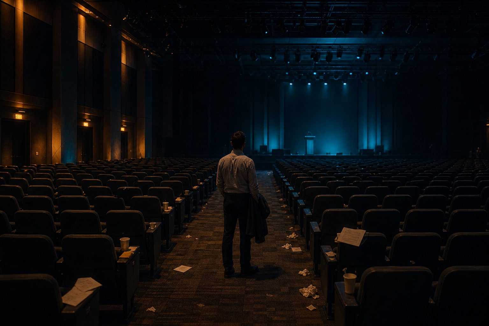
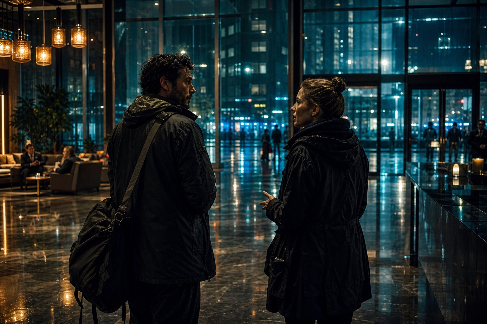

Yizhuang, Beijing. An AI conference had just ended.

Two days, four sessions, 1,500 people in the room, dozens of speakers, nearly two million watching online. For a lot of attendees it was supposed to be another AI event: models, products, startups, the future.

What kept the organizers up after the hall emptied was not how strong a model was, or how pretty a product looked. It was a simpler, slightly counter-intuitive feeling:

**The stronger AI gets, the more people need to actually live once.**

That sounds like a slogan. Put it in today's context and it is heavier than it looks.

We are in an era where almost everything can be compressed.

Books compress into summaries. Research compresses into reports. Meetings compress into minutes. Code compresses into a few prompts and an automatic generation. What AI is doing, at root, is one job: take a process that used to require you to go through it, digest it, and fail at it yourself, and squeeze it into a result.

That is valuable. The efficiency gain is real. The lower bar is real.

The problem: **the things that actually matter about a person are often the things that will not compress.**

## Information gets cheaper. Experience gets more expensive

People used to go to industry events to get information.

Someone on stage knew something you did not, so you spent time, money, and energy to be there.

That logic is being rewritten.

The session ends and social media fills with notes, clips, shorts, excerpted takes — and AI to organize and summarize them. Often someone who stayed home can get denser information in less time.

If the only goal is "what did they say on stage," showing up is less and less necessary.

People still go. They fly. They take the high-speed rail from one city to another, to sit for a few hours or a day or two.

Why?

Because information is not experience.

You can know online what someone said. You cannot get the feeling of *I was in the room*.

A sentence lands and the people around you go quiet at the same time. A performance hits and the whole hall lights up. Afterward you talk to a stranger for ten minutes and a viewpoint you would never have searched for opens — none of that is information. It is experience.

Experience almost cannot be retold. It certainly cannot be substituted.

You can know someone went to the sea. Hearing the description is not the same as the wind that day.

So a strange trend will get clearer in the AI era:

**The easier information is to get, the scarcer thing is not information. It is having actually been there.**

## Taste is not studied. It is lived

Talk about AI long enough and the anxiety arrives: if models keep getting stronger, what is left for people?

A common answer, and one that is easy to underestimate: **taste.**

Taste does not grow just because you "saw a lot." It is not feeding a model a million cases and averaging them.

Real taste comes from a person who has actually lived.

You have been in a city, walked a street, smelled the air, talked with someone from a completely different background. Your sense of what is good, what is accurate, what moves people, changes.

That judgment is not only a knowledge problem. It is a feeling problem.

AI can mimic a style quickly. It has a much harder time replacing *why* a person prefers that style. AI can generate a result efficiently. It has a much harder time replacing *why* a person is moved by a particular thing.

Those "whys" come from life itself.

Put simply: AI can help you produce. It cannot live for you.

If someone has no real life experience, not enough friction with the world, what they finally hand an AI is a flat instruction — not a dense judgment.

In that sense, the class the AI era most needs is not only a tools class. It is a life class.

## Offline is not only networking. It is breaking the algorithm

One more thing that is easy to miss:

**The offline world is still one of the few spaces recommendation systems have not fully tamed.**

Online, what you see, who you meet, what you believe, is increasingly a shape the recommender gave you. You like a kind of content; the system gives you more of it. You follow a kind of person; the platform sends more of them.

Over time you can mistake that for having seen the world. You are in a more and more refined bubble.

Offline is different.

The person next to you at an event might build robots, or make films, or be a student at their first conference, or a founder ten years in. You would never have met in the same recommendation stream. A shared theme put you in the same room.

A lot of the important sparks are not searched up. They are collided into.

You do not know the answer first and then ask. You bump into a person, a scene, a way of saying something — and only then realize the world had that question.

AI is very good at giving you a faster optimal solution.

A lot of human growth is not completed by optimal solutions. It is completed by accidents that were not on the itinerary.

Accident is one of the most valuable products of the offline world.

## Showing up is itself a signal

As AI makes communication cheaper, meeting in person gets more expensive.

Expensive is not only cost. It is weight.

When someone could have finished the conversation online and still walks out the door, spends the time, and arrives, the action itself says:

**This matters enough that I will be there in person.**

That is why a lot of relationships, collaborations, and connections with actual weight will lean *more* on offline, not less.

Online gets more efficient and lighter. Offline is inefficient — and that inefficiency naturally carries seriousness, investment, regard.

A model cannot send that signal for you.

## What AI cannot replace is the part you have lived

If the leftover feeling of that conference compresses to one sentence, it is this:

**AI will replace a lot of process. It will not replace the experience, judgment, taste, and weight that form after a person has actually lived.**

It can get you an answer faster. It cannot give you the life behind the answer.

It can tidy the world. It cannot collide with the world in your place.

It can generate language, images, code, even a sense of style. It has a much harder time generating the texture of a life that has been lived.

That is why, the further AI goes, the less you can afford to live as a person who is only a function.

If a human is reduced to execute / organize / output, of course they start to look like an outsourcing port for the model.

The precious part of a person was never only "can do the work." It is "why I understand the world this way."

That "why" comes from what you have read, loved, seen, lost, believed — and from whether you have walked into reality and connected with real people and real scenes.

That part cannot be outsourced. It cannot be downloaded.

## At the end

This is not an anti-AI essay.

The opposite: *because* AI is strong enough, we should get clearer about what it is actually good at, and what a person has to keep.

Tools raise efficiency. People are responsible for experience.

Tools compress. People grow.

Tools pave the road. The step forward is still yours to take.

So instead of only asking whether AI will replace you, ask a more useful question:

**If a lot of work can go to AI, what kind of person should I become with the time that frees?**

The answer may not be complicated.

See people. Go to the room. Go through it. Feel it. Do one real thing.

In this era the scarce resource is no longer knowing more. It is living deeper.

---

Original: [@数字生命卡兹克](https://x.com/Khazix0918/status/2042507385370243139)

## Related posts

- [[ai-era-clarity-matters|The scarcest skill in the AI era: saying it clearly]]
- [[ai-proof-human|When a 45-year-old paper is flagged as AI]]
