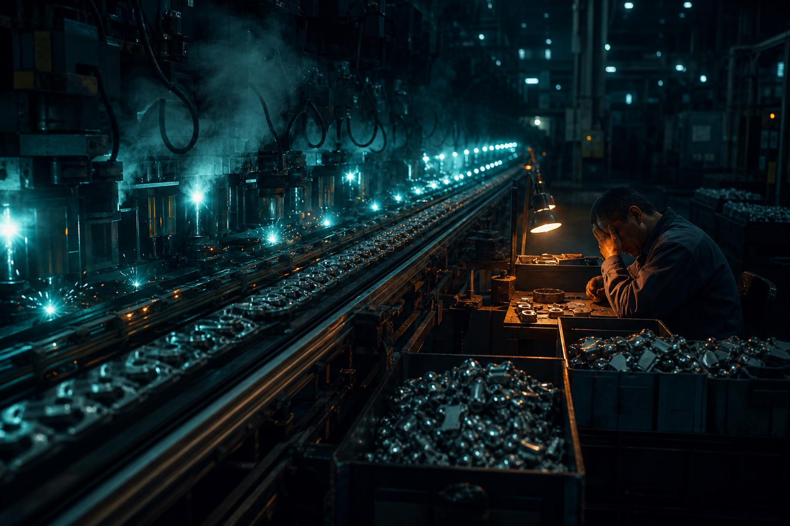

## 1. Behind the layoff wave, a line engineer popped the myth

2026, Silicon Valley kept cutting:

- January: Amazon, 16,000
- February: Block, nearly half the company
- March: Meta planning 16,000

**"AI will replace white-collar work" became workplace weather.**

Then Siddhant Khare, a software engineer at Ona, published a piece that opened the other side:

> **The efficiency gain from AI is badly overstated. People at work are in "AI fatigue."**

*AI Fatigue Is Real, and Nobody Is Talking About It* spread through the press and through readers.

---

## 2. The blunt fact: with AI, the work is 10× what it was

### Conflict 1: AI sped production. It did not speed review

**Khare's core:**

> "AI fatigue" is structural. AI multiplied how fast we generate code, copy, docs. Review and verification did not keep up. **A human is still the bottleneck in the whole flow — now processing ten times the volume.**

**The metaphor:**

> Imagine a factory that swapped in a press ten times faster. The inspector at the end of the line is still one person. Output explodes, defect rate does not move, and the person who absorbs all the review pressure is the one who breaks.

**In knowledge work:**

- AI automated **production**
- it did not automate **review**
- most managers have not noticed

They only see the surface:

- more code delivered ✅
- more docs ✅
- more mail sent ✅

**The dashboard looks gorgeous. The exhaustion does not show up.**

---

### Conflict 2: AI raised capacity. The company raised the "pass" line

**The harsher fact:**

> The productivity AI created did not become free time. It became a higher expectation. The pass line moved up.

**A concrete case:**

- **Before AI:** 20 PRs a week was a normal engineer
- **With AI:** theoretical capacity is 50, so 50 becomes the new normal

**Khare, first person:**

> I used to handle 20 to 25 PRs a week. Now it is over a hundred. Most of them are AI-generated. I still have to review every one.

**What that means:**

- everything the model emits still needs a human
- reviewing AI is more tiring than doing the work yourself
- you thought the model was helping. You are cleaning up after it

---

## 3. The numbers slap back: the gain was oversold

### Data 1: 93% of developers use AI. Throughput rose ~10%

DX, a platform that studies engineering productivity:

- 450+ companies, 120,000+ developers
- even with 93% of developers on AI coding tools, **real efficiency sat at about +10%**, and further gains were hard

---

### Data 2: with AI tools, efficiency *fell* 19%

METR, a model-evaluation lab, ran a controlled study:

- **developers using AI coding tools were 19% slower**
- they *felt* 24% faster

**What that means:**

- you think you sped up; you slowed down
- you think the tool is helping; it is dragging
- **subjective feel and objective data point opposite ways**

---

### Conflict 3: companies undercounted two costs

**1. Human review of AI output**

- almost nobody puts that time and drain into the cost model

**2. Professional identity**

- when most of the work is generated, people who used to get pride from craft start to feel like inspectors on a line
- that identity drop is hard to quantify and it walks people out the door

---

## 4. AI will not replace you. It will redefine the job

### Which seats go first?

**Easy to replace:**

- standardized output
- a low quality bar
- high repetition

**Examples:**

- first-draft copy
- basic data entry
- simple code generation
- templated reports

**"Good enough" work. A model can do it.**

---

### Which seats hold?

**Hard to replace:**

- global understanding
- taste
- independent judgment

**Examples:**

- system architecture
- product strategy
- commercial negotiation
- original creative direction

**The value was never "hands on the keyboard."**

---

### Conflict 4: the best employee will not be the one who ships the most. It will be the one who judges best

**Khare's prediction:**

> The best engineers will not be the fastest typists or the highest volume. They will be the ones who can see, in one look, whether an AI plan fits the system and whether the thinking is sound. That judgment comes from years in the industry and a picture of the whole system. You cannot prompt-engineer your way into it.

**Value is migrating:**

- from **volume of output** → **quality of judgment**
- from **execution speed** → **depth of thought**

**The least replaceable person is the one who can say right or wrong, and give a clear reason.**

**Judgment is the core value.**

---

## 5. Why AI fatigues more than older automation

### Conflict 5: AI is uncertain, and the errors hide

**Older automation:**

- same instruction, same input → same output
- errors throw
- **high certainty**

**AI:**

- the same prompt can emit completely different text
- even when it is wrong, the prose is fluent and convincing
- **high uncertainty**

**The errors hide:**

- the code runs ✅
- the copy reads clean ✅
- the report is tidy ✅

**And maybe:**

- a factual error on one page ❌
- a logic hole in one line ❌
- invented numbers in one paragraph ❌

**Quiet errors demand constant attention. Over months, that burns people out.**

---

## 6. How to live with AI: three usable rules

### 1. Do not use AI on work whose *thinking* is the value

**What is that work?**

- strategy
- product planning
- system architecture

**Why skip the model?**

- the value is the *thinking*, not the typing
- if you skip the thinking, you hollow out the job

**Where AI belongs:**

- repetitive work where the *result* matters more than the process

---

### 2. Put a hard boundary on review time

**Khare:**

> If you spend more than two hours a day reviewing AI output, the workflow is broken.

**Possible causes:**

- fuzzy prompts
- not enough context
- loose rules
- no automated checks

**Do not let "review everything the model emits, with no limit" become the job.**

---

### 3. Protect deep-work time

AI traps people in a loop:

generate → review → generate again → review again → …

**That loop keeps cutting attention.**

**Deliberately keep a block where you use no AI at all.**

**The most important work often does not need a prompt. It needs you thinking alone.**

---

## 7. How to change the dependency

### Change the habit: think first, then decide if you need the model

**The current default:**

- hit a problem → open ChatGPT
- have not thought yet → ask it to generate

**A better order:**

1. **Think alone** until the goal is clear
2. **Then** decide whether you need AI
3. Often a blank page and twenty minutes of deep work is better

---

### Take the steering wheel back

**Anxiety about AI is, at root, lost control.**

- when the model never stops generating and never stops suggesting
- you start to feel like a passive executor

**Once you own "whether to use it, and when":**

- control comes back
- anxiety drops
- you can actually leave AI fatigue

---

## 8. Close: the scarce thing is independent thought

**The piece names a hard fact:**

- AI did not make us lighter
- it put us in a deeper kind of fatigue

**That is not the model's fault. It is how we use it.**

**In the AI era the scarce thing is not technical skill. It is:**

1. **Judgment** — see in one look whether the plan is sound
2. **Depth** — finish hard thinking alone
3. **Control** — decide when to use the model and when not to

**Remember:**

- AI is a tool, not a boss
- you are the decider, not the inspector
- the most important work often does not need AI

**When you own the decision to use it or not, you can leave the fatigue.**

---

## References

- Original Chinese recap: *Layoffs sweep Silicon Valley; a line engineer pops the other truth: AI efficiency was oversold, humans were forced into AI-reviewer jobs, the workload is 10×*
- Source: National Business Daily (每日经济新闻)
- Interviewee: Siddhant Khare (software engineer, Ona)
- Data: DX, METR

## Related posts

- [[programmer-35-crisis-and-self-rescue|The 35-year-old programmer crisis — and how to get out]]
- [[ai-era-programmer-survival-guide|A programmer's survival guide in the AI era]]
- [[ai-era-clarity-matters|The scarcest skill in the AI era: saying it clearly]]
