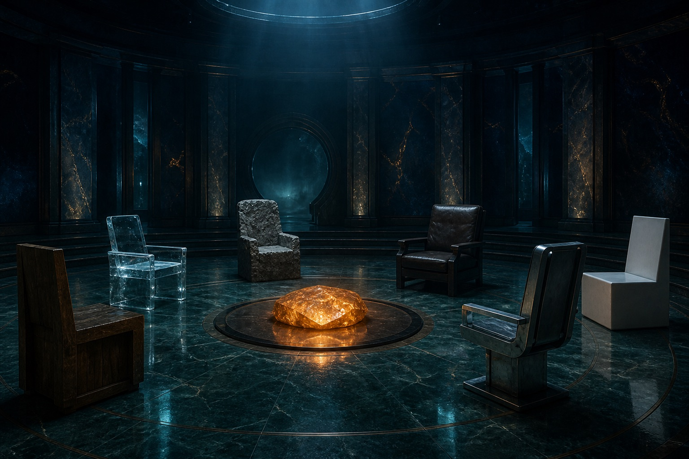

A founder named Jaden did something that sounds slightly unhinged — and more right the longer you use it: he put six people he respects into his working system.

Drucker owns the business. Munger watches decisions. Jobs does product. Kenya Hara owns architecture. Buffett helps you refuse. Musk pushes execution. Before a decision in that domain, you ask them first.

This is not mysticism. It is a Claude Code multi-advisor system that actually runs.



## Six advisors, six jobs

### Peter Drucker — business growth

One question, always: "Who is the customer? What value are you creating for them?"

Before a new feature or a new essay, run Drucker. Ninety percent of "good ideas" die here — and should. In practice: three features that looked great and had no user demand got cut.

### Steve Jobs — product design

"Is this the best experience, or is it merely usable?"

On student delivery flows and visual layout, Jobs gets a pass. He says: extra — delete. The experience breaks here — redo it. The product page lost half its content; conversion went up.

### Kenya Hara — system architecture

"Does this thing need to exist?"

Less is more is not a slogan. It is a design philosophy. When the workspace looks like a junkyard, Hara scans it: "Does this folder make the system clearer, or noisier?" Cut 60%. The remaining 40% ran better.

### Charlie Munger — investment / decisions

The weapon is a lattice of models: physics for time, psychology for people, economics for incentives.

On any big call — a hire, a market, a partnership — Munger has to take it apart with at least three disciplinary frames. That caught two opportunities that felt great and were traps.

### Warren Buffett — commercial advice

He does one job: help you say no.

The core idea is a moat — what do you have that others cannot copy? When the anxiety is "should we chase this trend," Buffett usually says: do the one thing you can be best at. Ignore the rest.

### Elon Musk — execution speed

The first five help you think. Musk helps you move.

"Why haven't you started? Perfect is the enemy of shipping. Put it out. Iteration beats planning."

He also first-principles every "we can't": is this a real constraint, or a wall you built? After being asked that, at least three things went from "we intend to" to "it's live."

## The architecture

The system maps onto three generals:

```
CEO (final decision)
│
├── Musk agent → execution (direct report)
│
├── Growth general
│   ├── Jobs agent → product experience
│   └── Hara agent → systemic minimalism
│
├── Commercial general
│   ├── Drucker agent → value definition
│   ├── Munger agent → multi-frame decisions
│   └── Buffett agent → moat
│
└── Delivery general
    └── the team executing
```

Each advisor has three design pieces:

- a private question frame (their most classic way of thinking)
- a private decision domain (no overlap, no wandering)
- a private brake (what they are there to stop)

The flow: match the domain → call the advisor → you still decide.


## Why the idea is worth attention

One person's cognition is finite. Each of these six spent decades grinding a world-class thinking system.

Instead of rediscovering it from zero, make that thinking part of the system. You are not copying them. You are deciding from their shoulders.

Technically this runs on Claude Code's agent-team feature plus custom Skills. It is not "paste a prompt and go." It takes long friction and iteration.

## A method you can use today

1. Pick one person you actually respect
2. Spend 30 minutes writing down their three core principles
3. Put them in your system prompt
4. Before the next decision, let them take a pass

Decision quality tends to rise quietly, one notch.

## What I take from this

The value is not "which six people." It is a decision architecture: turn expert thinking in different domains into modes, then into agents, then into a reusable system.

For indie developers and founders, this kind of cognitive outsourcing is unusually useful. You cannot hire six advisors. You can let AI play the roles and inspect your calls with their frames.

The constraint that matters: each advisor needs a hard boundary and a private question frame. Otherwise they collapse into agreeable generalists.

## References

- [Original post](https://x.com/Jaden_riku/status/2034136005113221142)
- Author: Jaden思考日志 (@Jaden_riku)

## Related posts

- [[agent-skills-five-design-patterns|Five design patterns for Agent Skills]]
- [[top-skill-yc-ceo-review|What a top Skill looks like: YC CEO's 600-line review prompt]]
- [[first-principles-startup-review|First-principles review with AI: a startup plan dies in 48 hours]]
- [[hello-world|An agent-friendly blog]]
