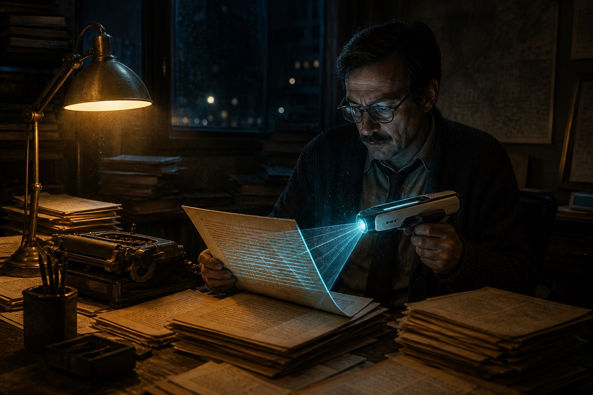

# When a 45-year-old paper is flagged as AI

> **The absurd fact:** a scholarly paper published in 1981 was scored "AI-generated" by a 2026 detector. Not a joke. A real event.

---

## Opening: when humans have to prove "I am not a model"

Picture this:

You spent real time on a paper. A detector flags it as AI-generated.

You: "I wrote this by hand."

Detector: "99.8% probability AI-generated."

You: "I published this in 1981. The internet barely existed."

Detector: "Sorry. The result does not lie."

**That is the absurd reality of 2026.**

---

## What happened: a classic paper, 45 years old, "failed"

### The victim: a well-known scholar's paper

- **Published:** 1981 (45 years ago)
- **Author:** a well-known professor (then a young scholar)
- **Content:** careful academic work
- **Detector result:** 99.8% AI-generated

### A timeline that should make the score impossible

| Year | Event |
|------|-------|
| **1981** | paper published |
| **1997** | IBM Deep Blue beats a chess champion |
| **2012** | deep learning takes off |
| **2022** | ChatGPT launches |
| **2026** | the 1981 paper is scored "AI-generated" |

**The question: in 1981, AI could not even play chess well. How did it write a journal article?**

---

## Why does this absurdity exist?

### 1. Training bias in the detector

**The detector's logic:**

- training data: lots of human text + lots of AI text
- learning target: features that separate the two
- judgment: does this text match an "AI-generated pattern"?

**The problem:**

- rigorous academic prose is already "regular"
- regular text is easy to mis-score as AI
- because the model was also trained to write regularly

**Like:**

- your handwriting is too neat, so it must be printed
- you speak too standard, so you must be a robot

### 2. Overfit detection criteria

**What detectors look at:**

- lexical diversity
- sentence complexity
- logical coherence
- lexical regularity

**Those features:**

- excellent human writers have them too
- academic papers *require* regularity, rigor, and clear logic

**The result:**

- humans who write well = flagged as AI
- humans who write badly = pass

**Are we rewarding bad writing?**

---

## The deeper problem: how does a human prove themselves?

### Trap 1: the burden of proof flipped

**Old logic:**

- the accuser proves
- "this is AI-generated" → they show it

**Now:**

- the accused proves
- "prove you are not AI" → you show it

**How, exactly?**

### Trap 2: you cannot prove a negative

**A philosophy problem:**

- proving "I am human" is hard
- proving "I am not AI" is harder
- you cannot prove a negation

**Like:**

- prove "I did not steal"
- prove "I am not an alien"
- prove "I am not a model"

### Trap 3: an arms race

**Now:**

- generation looks more human
- detectors get more sensitive
- humans sit in the middle and lose either way

**Next:**

- generation → more human
- detectors → stricter
- humans → easier to mis-score

**End state:**

- to pass, humans write *less* like humans
- is that not backwards?

---

## Five ways humans try to prove authorship (add yours)

### 1. Timestamps (most direct)

**Idea:** prove the work predates the technology.

**Fits:**

- historical documents
- early work
- anything with a hard date

**Limit:** only proves the past. Does nothing for work written today.

**Case:** a 1981 paper — no ChatGPT. A 2026 paper?

---

### 2. A record of the process (most reliable)

**Idea:** keep the whole trail — drafts, edits, thinking notes.

**How:**

- version control (Git)
- keep every draft
- record the session
- keep notes and sources of the idea

**Strength:** hard to fake; shows a human thinking.

**Cost:** expensive; not everyone has the habit.

---

### 3. A uniqueness mark (most clever)

**Idea:** leave "human features" in the work — a personal style a model struggles to copy.

**How:**

- a personal way of saying things
- a characteristic typo or verbal tic
- a cultural in-joke or a private memory
- deliberate imperfection

**Examples:** dialect, personal history, a unique metaphor, non-standard phrasing.

**Problem:** models are also learning to imitate human imperfection. Endless arms race.

---

### 4. Biometrics (most sci-fi)

**Idea:** pair the work with a biometric that says "a human was creating."

**Possible tech:**

- keystroke dynamics (everyone types and pauses differently)
- eye tracking (how you read and think)
- EEG (brain activity while writing)
- live video of the session

**Strength:** hard to fake; scientifically respectable.

**Cost:** privacy, money, and mostly unrealistic.

---

### 5. Community trust (most human)

**Idea:** a trust-based system instead of a cold algorithm.

**How:**

- peer review in academia
- a creator's history and reputation
- cross-checks by community members
- a mentor or colleague's endorsement

**Strength:** human, contextual, not a single cut.

**Cost:** hard to scale; bias can sneak in.

---

## Your turn: how would *you* prove it?

You may already be asking:

**If your work is flagged as AI tomorrow, how do you prove it is yours?**

I listed five methods. There are more.

Share in the comments:

1. **Which method do you think actually works?**
2. **Have you been in a similar trap?**
3. **Do you have a method I missed?**
4. **How should detectors get better?**

Especially welcome: practitioners, academics, working creators, lawyers.

This is an era problem. We should not solve it alone.

---

## Deeper: is this a tech problem or a philosophy problem?

### The Turing test, inverted

**Classic Turing test (1950):**

- can a machine act like a human?
- goal: the machine passes a "human test"

**2026 reverse Turing test:**

- can a human prove they are not a machine?
- goal: the human passes an "AI detector"

**The irony:**

- we spent 70 years making AI look human
- we now spend time proving humans are not AI

### Who defines "human"?

**The core questions:**

- what is "human writing"?
- what is "AI writing"?
- where is the boundary?

**When AI writes more like a human:**

- did the model get more human?
- or did "human" get defined more like a machine?

**In the end:**

- we may not be proving "I am human"
- we may be proving "I match some algorithm's definition of human"

---

## Don't let a detector define a human

The title is "how do humans prove themselves." The real question may be:

**Why do we have to?**

- because an imperfect algorithm said you "don't look human"?
- because a biased training set scored you "AI"?
- because a commercial detector needs to prove its own value?

**Maybe what has to change is not how humans prove authorship. It is our dependence on "detection."**

### Three suggestions

**To detector makers:**

- cutting false positives matters more than raising detection rate
- better to miss than to wrongly kill
- human variety is larger than your training set

**To platforms:**

- do not over-rely on automated detection
- keep human review and an appeals path
- give the mis-scored person a chance to speak

**To creators:**

- keep a record of how you made the work
- build a reputation
- do not change your style to please a detector

---

## Close: next, does AI have to prove it is not human?

If humans must prove "I am not AI," what happens next?

**Maybe one day:**

- AI has to prove "I am not human"
- because human work looks too much like AI
- or AI work looks too much like human

**Then:**

- the line between human and AI is gone
- we stop obsessing over "who is who"
- we look at the value of the work itself

**That is the future worth wanting.**

---

This piece asks a question. It does not have a standard answer.

"How does a human prove themselves" is open on purpose.

Your method may be worth more than the five I listed.

Share: your method, your false-positive story, your view of detection, your prediction.

---

## References

- Event source: 机器之心 Pro
- Keywords: AI detectors, academic integrity, Turing test
- Related: accuracy of AI-content detection

---

**If this was useful, pass it on.**

**In the AI era we all have to think about what "human" means.**

---

*Original by SSHeRun, first published on this blog*
*Written: 2026-03-27*

## Related posts

- [[ai-cannot-replace-human-experience|AI cannot replace lived experience]]
- [[ai-era-clarity-matters|The scarcest skill in the AI era: saying it clearly]]
