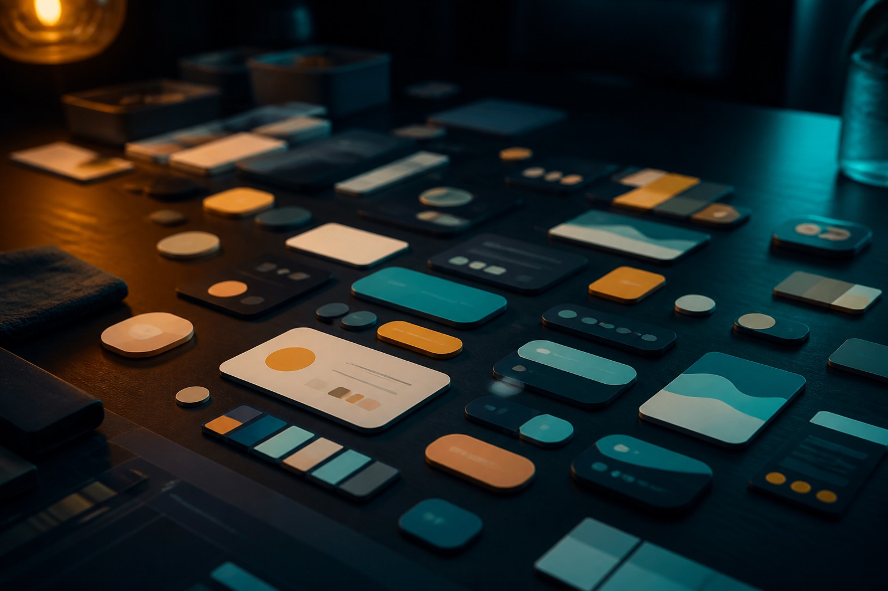

# Why AI-generated UI isn't shippable — and the combo that works

I recently used AI to generate UI and walked into a hole.

Google Stitch's screens really are pretty. Then I asked it for a second page, and a third:

**Every page had different button sizes, different spacing, different colors.**

If you are a developer, you know what that means:

- components cannot be reused
- every page needs its own CSS
- maintenance explodes
- the redundancy makes you want to swear

**AI-generated UI is beautiful and inconsistent.** That is the house disease of AI design tools.

## Why is it inconsistent?

Each generation is an independent act of creation. The model does not remember the last page's color, does not know how tall a button should be, does not know the spacing spec.

It is like asking ten designers to each design one page. Everyone has taste. Glued together it is a disaster.

**AI is good at inventing. It is bad at obeying a system.**

## The fix: Pencil + Stitch

I landed on a two-step combo.

### Step 1: let Pencil set the rules

Pencil is an AI prototyping tool. Its strength is not "pretty." It is **discipline**.

You can tell it:

- primary color is `#3B82F6`
- buttons are 40px tall
- card gap is 16px
- titles are 24px

Then have it generate a series of pages against that spec.

**Result:** every page lines up, like a formation.

**Cost:** not pretty enough. Little visual pull.

### Step 2: let Stitch dress it

The workflow:

1. Generate a disciplined prototype in Pencil (black-and-white is fine)
2. Export images
3. Import into Google Stitch
4. Ask Stitch to beautify *from those prototypes*

**The point:** Stitch is not inventing from zero. It is optimizing a skeleton you already set.

It cannot wander, because the frame is fixed. It only adds visual detail:

- better color
- finer shadows
- more modern icons
- more comfortable gradients

**Result:** you keep consistency *and* get beauty.

## Why this works

### 1. Separate the concerns

- **Pencil owns the system**: consistency
- **Stitch owns the finish**: visual lift

Like a house: foundation and frame first (Pencil), then interiors (Stitch).

### 2. Constrain the model's creativity

Creativity is a double edge:

- unconstrained, every screen is a new product (disaster)
- constrained, it invents *inside* the system (ideal)

Giving Stitch a prototype *is* giving it a constraint. It knows where the button is and what the layout is. It only has to make it look better.

### 3. Developer-friendly

What you hand engineering:

- one design system
- a consistent component set
- reusable code

Nobody rewrites styles per page. They reuse components.

## A real case

I used this on ten pages of a SaaS product.

**Stitch alone:**

- generate time: 2 hours
- engineering time: 3 days (every page needed adjustment)
- maintenance: high (change one thing, change it ten times)

**Pencil + Stitch:**

- generate time: 3 hours (the extra Pencil step)
- engineering time: 1 day (reuse)
- maintenance: low (change once, it applies)

**One extra hour of design, two days of engineering saved.**

## The same disease in other tools

This is not a Stitch-only problem. Almost every AI UI generator has a version of it.

### v0.dev

- fast, good-looking
- each generation is independent
- pages do not share a system

### Galileo AI

- text to UI
- no guarantee of design-system consistency

### Uizard

- sketch to UI
- same consistency problem

**The core is the same: the model does not remember context and does not obey a spec.**

## Three principles

When you design UI in the AI era, keep three:

### 1. System before pretty

Pretty without a system is a disaster. Set the system, then chase beauty.

### 2. Constrain the model's creativity

Give it a frame. Let it invent inside the frame, not in open air.

### 3. Design for the people who ship it

Design is not there to look good. It is there to land. Consistency beats beauty.

## Tool notes

**Pencil:** disciplined prototyping

- strength: consistency, you can define a system
- weakness: average visuals

**Google Stitch:** AI beautifier

- strength: looks good
- weakness: no consistency unless a prototype constrains it

**Together:** Pencil first, Stitch second — system + beauty.

## Bottom line

The biggest problem with AI-generated UI is not that it is ugly. It is that it will not stay consistent.

**The fix is simple:**

1. Pencil sets the system (skeleton)
2. Stitch beautifies (flesh)
3. Hand it to engineering (reusable)

**System before pretty — and you can have both.**

AI-era UI design is not "let the model run free." It is a frame, and invention inside the frame.

That is the right way to open these tools.

---

**Tools mentioned:**

- Pencil: disciplined prototyping
- Google Stitch: AI beautifier
- v0.dev: text to UI
- Galileo AI: AI UI design
- Uizard: sketch to UI

**The lesson:** one extra hour on the system saves two days of engineering.

## Related posts

- [[stitch-design-md-infrastructure|Why Stitch's DESIGN.md matters: from image tool to design infrastructure]]
- [[stitch-claude-ai-design-workflow|Google Stitch 2.0 + Claude Code: an AI design workflow]]
- [[design-without-designing|Design Without Designing: how engineers ship high-quality design with AI]]
