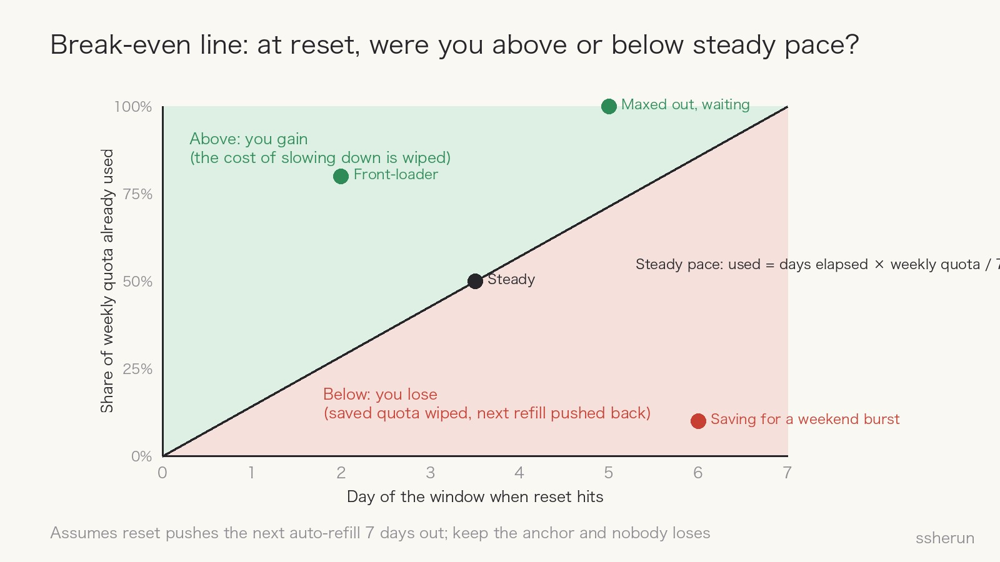
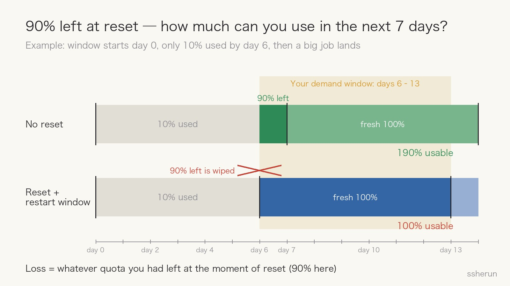
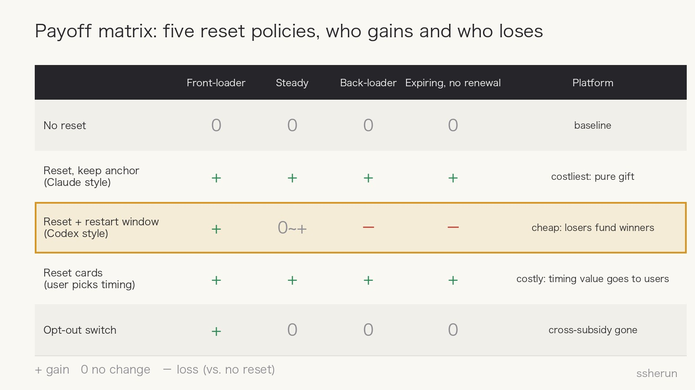

> Source: [I really can't understand the idea that resetting the cycle makes you lose](https://www.v2ex.com/t/1245140) (V2EX, 195 replies, 13.7k views)

Tibo, who leads OpenAI Codex, keeps resetting everyone's usage limits: compensation after an outage, a celebration when a new model ships. Free stuff should draw no complaints. Instead, one V2EX thread ran to 195 replies.

The OP's view was blunt: a reset only lets you resume early; at worst it changes nothing. How could you lose? His analogy: you ordered a set meal, and the owner swaps in a fresh one at any moment — where's the loss?

The replies pushed back almost unanimously. The fight came down to one detail: **after a Codex reset, the next automatic refill moves to seven days later.**

**A reset that keeps your refill date is a pure gift. A reset that restarts the window is a transfer.** A break-even line and a payoff matrix make the case.

## Do the math first: a break-even line

A weekly limit really caps your average burn rate: weekly quota ÷ 7 days. Within the window you can go light then heavy, or heavy then light, as long as the week adds up.

Reply #189 put it best:

- If you burned **faster than steady pace** before the reset, you owed a slowdown; the reset wipes that debt. **You gain.**
- If you burned **slower than steady pace**, planning to spend later, the reset wipes your savings and pushes the next refill back. **You lose.**

As a rule of thumb (#15, #144): **if usage at reset is below "days elapsed × weekly quota / 7," you lose.**

How much? Take a concrete case (#95). The window starts on day 0; you have used only 10% by day 6, when a job needing 80% lands:

Without a reset, days 6–13 give you the remaining 90% plus a fresh 100% on day 7. With the reset, you get 100%. **The loss equals exactly what you had left at the moment of reset.**

## Who actually loses

The damaged cases in the thread are not nitpicks:

| Case | What happens |
|------|-----------|
| Saving for a late burst (#95, #121) | You go light early to sprint at the end; the savings are wiped |
| Expiring, not renewing (#102, #111) | 40% left, you could use 140%; after reset, 100% |
| Work straddling the window boundary (#77, #116, #167) | A weekend release could draw on two windows; now one |
| Across a monthly subscription (#69, #53) | Four refills become three; one user's simulator shows late-window users can lose up to 25% of a month |
| Just used a reset card (#48, #76) | You restarted your own window, then a global reset hit — card wasted |

The OP's side has a point too (#24): over a long horizon, resets create more windows, so total supply rises.

**Both sides are right against different baselines.** The OP counts a month's total supply; the critics count what they actually have during the days they need it. When demand can't be deferred (#75), the latter is the real cost.

## Through game theory: not a gift, a mechanism

### Players and payoffs

Split users by pacing: front-loaders, steady, back-loaders, and expiring non-renewers. The platform has at least five policies:

Line them up:

- **Claude's approach** (refill quota, keep the refill date): everyone gains; costliest for the platform — a real gift.
- **Codex's approach** (reset and restart the window): front-loaders gain, back-loaders and expiring users lose. Much cheaper for the platform, because **losers fund winners**.

Reply #53 nailed it: "This isn't ingratitude. You gave my rice to someone else, and I'm supposed to thank the person who took it."

### The equilibrium: pacing gets punished

Normally, when future supply is uncertain, the rational move is to keep a buffer — economists call it **precautionary saving**.

Codex resets wipe exactly that buffer. So users' best response changes:

1. Saving has lower expected value; **burning early becomes the dominant strategy**.
2. Everyone shifts consumption forward and hits the cap sooner.
3. People who hit the cap are more likely to upgrade to a pricier plan (#171).

The platform doesn't need to persuade anyone to use more; it only needs to make pacing costly. And since it can time resets for idle server capacity (#14), it can steer load too.

That is mechanism design: **don't change the price, change the rules, and let users walk themselves into the equilibrium you want.**

### Why there's no opt-out switch

Some proposed a switch: people who think resets hurt can opt out (#126, #169). OP supporters liked it — opt out and stop complaining.

Reply #170 cut through: **OpenAI will never do it.** With a switch, everyone chooses what suits them: front-loaders opt in, back-loaders opt out. Nobody loses, and the cross-subsidy the platform relies on disappears.

It's adverse selection, as in insurance: let participants choose and the pooled pool unravels. Reset cards work the same way — they hand users the **option** of when to reset, and options have value the platform won't give away.

### A repeated game: lopsided voices, eroding trust

This game repeats, with two asymmetries:

- **Information:** the platform sees everyone's burn rate and can pick the timing that suits it; users can't even measure their true quota (#29).
- **Voice:** winners cheer loudly; losers stay quiet or get mocked as bargain-hunters (#151). The platform always hears a rosier crowd.

Worse, the same period brought quota cuts and model-quality swings (#25, #40, #43), stacked on random resets. Users can't untangle each effect and are left with one feeling: **this plan is unpredictable.**

Reply #186: users buy a plan for predictable quota and windows at a fixed price, not to pay for a lottery on when the next reset hits.

## The metaphor fight: good ones keep the anchor

The OP's set-meal analogy took the most heat, because it omits the key fact: **the refill date moves**. Better ones from the thread:

- **Electricity card (#51):** your landlord loads 100 kWh every Monday; you plan to run the dryer on the weekend. On Friday he force-refills you and announces the next top-up is now next Friday.
- **Water in the desert (#80):** one bucket lasts seven days. You ration for six to bathe on day seven; on the sixth night it's refilled — but the next refill is seven days out.
- **Tomorrow's dinner (#100):** halfway through dinner, the owner takes it and brings a new one — but it's tomorrow's.

All three keep the time anchor. Others warned (#49, #73): **metaphors explain; they don't prove.** Define "loss" against a baseline first, then do the math.

## For people building products

1. **Don't move users' anchors with perks or compensation:** refill dates, billing dates, expiry dates. Move an anchor and it's not a gift but a transfer.
2. **If you need to control cost, say so.** Cutting quota by way of random resets gets repaid in lost trust.
3. **The same action can pay off in opposite directions for different users.** Segment by usage rhythm before judging a policy; don't go by averages or the loudest group.
4. **Predictability is part of the product.**

## For users

Under these rules, the rational response is: **use early, save little**; don't plan big jobs across the window boundary; if you're expiring and not renewing, burn what's left now.

In the end, what the OP "couldn't understand" wasn't arithmetic. It was that **different people stand in different places under the same rule**. A rule that's a gift to you can be a cost to someone else.

## Related posts

- [[software-not-valuable-ai-era|Is Software Worthless Now? Even Custom Work Commoditizes]]
- [[ai-fatigue-truth-10x-workload|AI didn't 10x your output. It 10x'd the work.]]
- [[v2er-ai-math-failure-metaphors|Failure’s Worth, Through V2er Metaphors: Waterfall, Helicopter, Map]]
