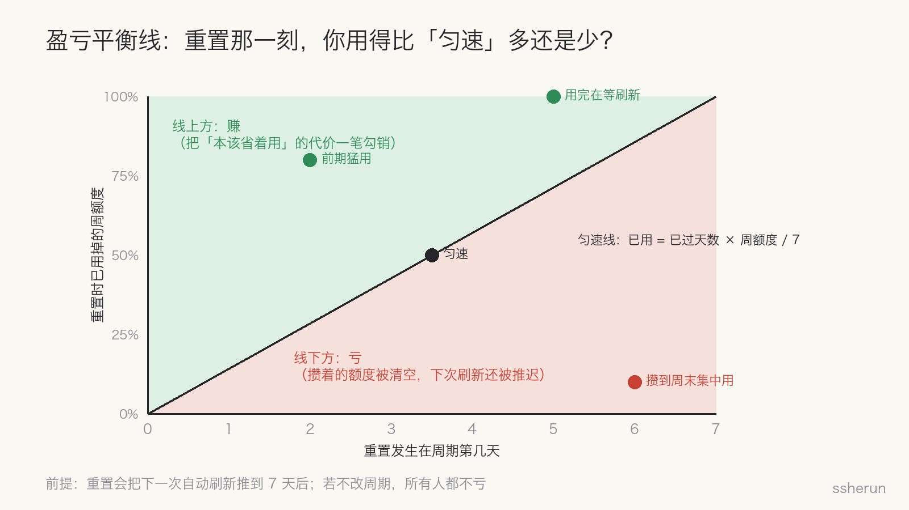
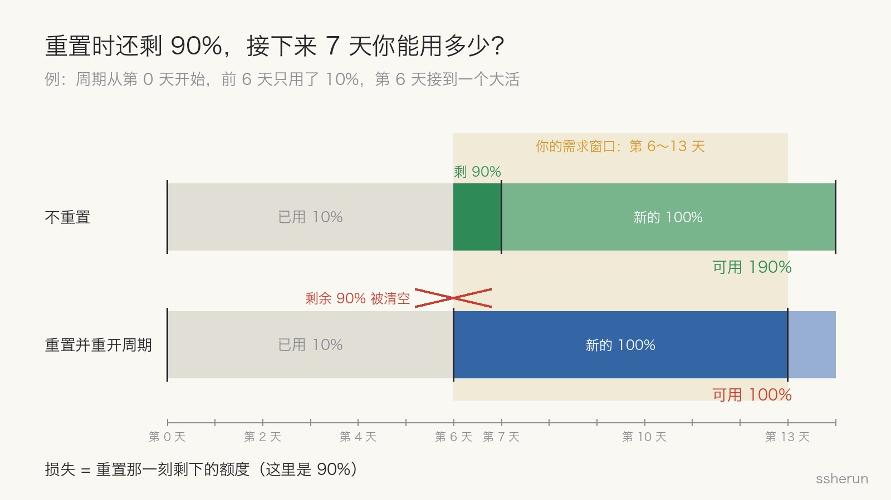
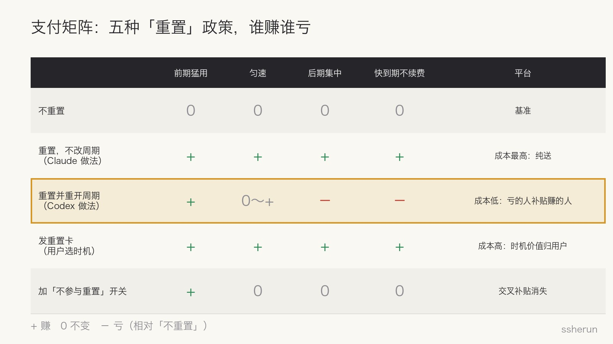

> 讨论来源：[我实在是无法理解认为重置周期时间会亏这种想法](https://www.v2ex.com/t/1245140)（V2EX，195 楼，1.37 万浏览）

OpenAI Codex 的负责人 Tibo 隔三差五给全体用户重置额度：服务出故障了补偿一下，新模型上线了庆祝一下。按理说白送的东西，没人会骂。结果 V2EX 上一个帖子吵了 195 楼。

楼主的观点很直接：重置只会让你提前续上，最坏也就是没影响，怎么可能亏？他打了个比方：去餐馆点了套餐，老板随时给你换一份新的，亏在哪里？

评论区几乎一边倒地反对。吵到最后，问题落在一个细节上：**Codex 重置之后，下一次自动刷新会推到 7 天后。**

**不改刷新日期的重置是纯福利；顺带重开周期的重置，是一次财富转移。** 下面用一条平衡线和一张支付矩阵把这件事算清楚。

## 先把账算清：一条盈亏平衡线

周限额的本质，是限制你一周的平均消耗速度：周额度 ÷ 7 天。周期内你可以前松后紧，也可以前紧后松，只要一周加起来不超。

评论区 #189 把这点说得最透：

- 重置前你用得**比匀速快**，本来接下来要减速还账，重置把这笔账一笔勾销，**赚**。
- 重置前你用得**比匀速慢**，本来打算后面集中用，重置把你攒着的额度清空，下次刷新还推迟了，**亏**。

换成一句好记的话（#15、#144）：**重置时已用量低于「已过天数 × 周额度 / 7」，就亏。**

亏多少？看一个具体例子（#95）。周期从第 0 天开始，前 6 天只用了 10%，第 6 天接到一个要用 80% 的大活：

不重置时，第 6～13 天你手上有剩下的 90%，第 7 天还会再来 100%；重置后，这段时间只有 100%。**损失正好等于重置那一刻剩下的额度。**

## 谁在真实地亏

评论区给出的受损场景，都不是抬杠：

| 场景 | 发生了什么 |
|------|-----------|
| 攒到后面集中用（#95、#121） | 前几天省着用，准备最后冲刺，攒的额度被清空 |
| 快到期、不续费（#102、#111） | 还剩 40%，本可用到 140%，重置后只剩 100% |
| 跨周期边界干活（#77、#116、#167） | 周末发版，原本能吃到两个周期的额度，变成一个 |
| 整个月订阅期（#69、#53） | 本可刷新 4 次变成 3 次；有人做了模拟器，后半周集中用的人最多亏整月 25% |
| 刚用了重置卡（#48、#76） | 自己用卡重开了周期，紧接着全员重置，卡白用了 |

楼主这边也有道理（#24）：把时间拉长，重置让周期变多，平台提供的总量是增加的。

**两边其实都对，只是比较的基准不同。** 楼主看的是一整个月的总供给；反对者看的是「我需要用的那几天，手上到底有多少」。当需求不能延期时（#75），后者才是真实的成本。

## 用博弈论看：这不是福利，是机制设计

### 参与者和支付矩阵

把用户按使用节奏分成四类：前期猛用、匀速、后期集中、快到期不续费。平台可以选的政策至少有五种：

对照一下就清楚了：

- **Claude 的做法**（只回满额度，不改刷新日期）：所有人都赚，平台成本最高，是真正的送。
- **Codex 的做法**（重置并重开周期）：前期猛用的人赚，后期集中和快到期的人亏。平台成本低很多，因为**亏的人在补贴赚的人**。

评论区 #53 的话很准：「这不是升米恩斗米仇，而是你把我的米拿给了其他人，我还得谢谢这个拿米的人。」

### 均衡：省着用被惩罚了

正常情况下，未来供给不确定，理性的做法是留一点余量，经济学叫**预防性储蓄**。

Codex 的重置恰恰会清空余量。于是用户的最优策略变了：

1. 攒着用的期望收益下降，**尽早用完成为占优策略**。
2. 所有人把消耗往前挪，更早撞到上限。
3. 撞到上限的人，更可能升级到更贵的套餐（#171）。

平台不需要说服任何人多用，只需要让「省着用」吃亏。再加上平台可以挑服务器空闲的时候重置（#14），负载也能顺势引向它想要的时段。

这就是机制设计：**不改价格，改规则，让用户自己走到平台想要的均衡上。**

### 为什么平台不给「不参与」开关

评论区有人提议：加个开关，觉得会亏的人不参与重置（#126、#169）。支持楼主的人说这正好：觉得亏的就关掉，别抱怨。

#170 一句话点破：**OpenAI 不会做的。** 有了开关，每个人都会按自己最有利的方式选：前期猛用的打开，后期集中的关闭。人人都不亏，平台依赖的交叉补贴也就没了。

这和保险里的逆向选择是同一个道理：让参与者自己选，混合在一起的池子就会瓦解。重置卡也一样，它把「什么时候重置」这个**期权**交给了用户，期权是有价值的，平台当然不愿意白给。

### 重复博弈：声量不对称，信任在流失

这场博弈还是重复进行的，有两个不对称：

- **信息不对称**：平台看得到每个人的消耗速度，可以挑对自己最划算的时机；用户连自己额度的真实值都测不准（#29）。
- **声量不对称**：受益的人大声叫好，受损的人要么沉默，要么被嘲「占便宜强迫症」（#151）。平台看到的舆论永远偏正面。

更麻烦的是，同一时期额度在缩水、模型质量有波动（#25、#40、#43），和随机重置叠在一起。用户分不清每一项的真实影响，只剩一个感受：**这个套餐不可预期。**

#186 说得好：用户买套餐，买的是固定价格下可预期的额度和周期，不是花钱参加「猜下一次什么时候重置」的抽奖。

## 比喻之争：好比喻要抓住「锚点」

楼主的「餐馆换套餐」被批得最狠，因为它漏掉了最关键的一点：**刷新时间被推迟了**。评论区给出了几个更贴切的：

- **电卡（#51）**：房东每周一给你充 100 度，你打算周末集中烘衣服。周五房东强制充满，并宣布下次充值改到下周五。
- **沙漠水桶（#80）**：一桶水用七天，你忍了六天想第七天洗个澡，第六天晚上给你灌满了，但下次灌满又得七天后。
- **明天的晚餐（#100）**：你晚餐吃一半，老板收走给你一份新的，但这份是明天的。

它们的共同点是都保留了「时间锚点」。也有人提醒（#49、#73）：**比喻适合解释，不适合证明。** 先定义「亏」是相对什么基准，再算账。

## 给做产品的人

1. **补偿和福利不要动用户的锚点**：刷新日期、账单日、到期日。动了锚点，就不是送，而是转移。
2. **想控制成本就明说。** 用随机重置变相降额，省下的钱会以信任的形式还回去。
3. **同一个动作，对不同类型的用户收益可能相反。** 先按使用节奏分群，再评估政策，别只看平均值或叫得最响的那群人。
4. **可预期性本身就是产品的一部分。**

## 给用户

在这套规则下，理性的应对是：**尽早用、少攒着**；大活不要规划成跨周期边界；快到期又不续费时，立刻把剩余额度用完。

说到底，楼主「理解不了」的并不是算术，而是**不同的人在同一条规则下处在不同的位置**。一条规则对你是福利，对别人可能正好是代价。

## 相关文章

- [[software-not-valuable-ai-era|AI 时代软件不值钱了？斩杀线以下会，定制也可能跟着贬]]
- [[ai-fatigue-truth-10x-workload|AI让你效率翻倍？醒醒吧，你的工作量已经是过去的10倍了]]
- [[v2er-ai-math-failure-metaphors|V2er 眼中的失败意义：瀑布、直升机与地图]]
