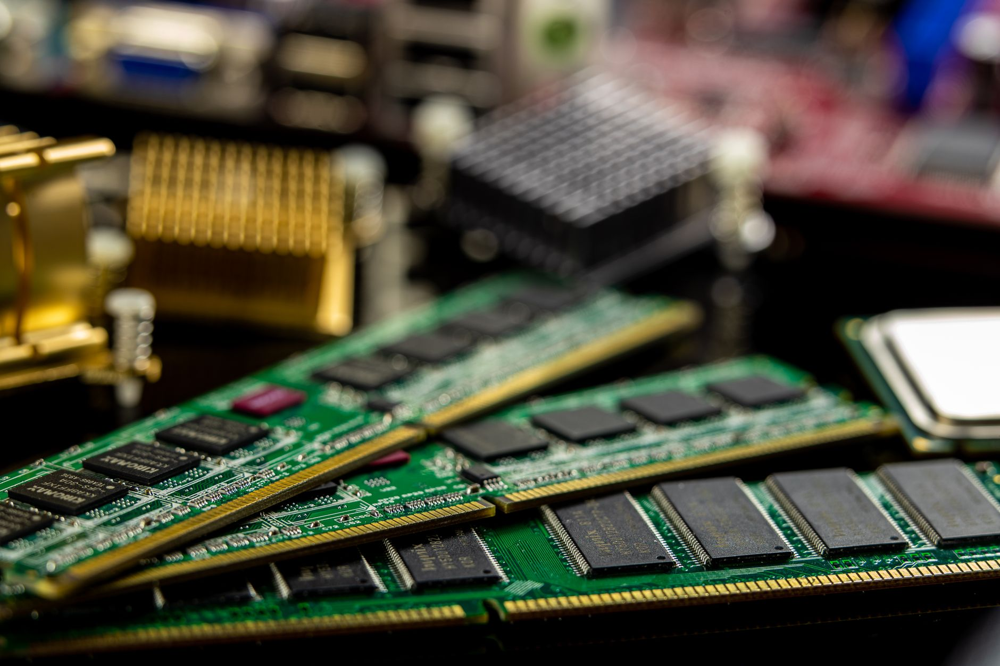

DeepSeek 这篇 [Engram](https://arxiv.org/abs/2601.07372) 把话说得很直：MoE 解决了「条件计算」，但 Transformer 还缺一个原生的「知识查找」原语——大量早期层在用算力假装查表。他们提出的 **条件记忆（conditional memory）**，就是补这条轴。

代码已开源：[deepseek-ai/Engram](https://github.com/deepseek-ai/Engram)。

## 语言其实是两件事

语言建模至少干两件不同的活：

1. **组合推理**：需要深层、动态计算  
2. **局部/静态模式**：实体名、套话、固定搭配——更像字典，不像微分方程

经典 N-gram 之所以还有效，是因为第二类模式本来就适合 **O(1) lookup**。标准 Transformer 没有 lookup 原语，只能堆 Attention/FFN 去做「运行时重建静态表」。贵，而且占深度。

Engram 的立场很清楚：

- **条件计算（MoE）**：按需激活专家  
- **条件记忆（Engram）**：按局部上下文查静态嵌入  

两者是互补，不是替代。

## Engram 怎么做

模块骨架可以概括成四步：

1. **Tokenizer 压缩**：归一化等价 token（大小写、NFKC 等），提高语义密度（文中称 128k 词表有效规模约降 23%）。  
2. **Multi-Head Hashing**：多阶 N-gram + 多 hash 头取 embedding，避免直接参数化组合爆炸。  
3. **上下文门控**：当前 hidden 当 Query，静态 memory 当 Key/Value；语义不对齐就关闸，抑制碰撞和多义噪声。  
4. **短因果卷积 + residual**：再融回主干；模块只插在特定层（实验里是第 2、15 层），同时给系统预取留出计算窗口。

关键设计点：**检索地址由 token ID 确定性决定**。不像 MoE 依赖运行时 hidden 做路由——这意味着推理侧可以把大表放在 Host 内存，异步预取，和前面几层计算重叠。论文称约 100B 参数表 offload，开销可做到 &lt;3%。这对「参数不一定全进 HBM」的成本叙事很重要。

## 稀疏预算怎么切：U 形定律

固定总参数和激活 FLOPs，问一个分配问题：闲置稀疏预算里，多少给 MoE 专家、多少给 Engram 表？

结果是稳定的 **U 形**：

- 全给 MoE（ρ=1）：模型被迫用计算重建静态模式  
- 全给记忆：缺动态推理能力  
- 最优大约在 **ρ ≈ 75%–80%**——约 20%–25% 稀疏预算挪给 Engram

在「内存可无限加」的设定下，表越大，验证 loss 呈 log-linear 下降：记忆本身是一条可独立缩放、几乎不增 per-token FLOPs 的轴。

## 大模型结果：反直觉的是推理涨更多

在 262B tokens、激活约 3.8B 的严格对照里：

| 模型 | 总参 | Engram | 备注 |
|------|------|--------|------|
| MoE-27B | 26.7B | - | 72 routed experts |
| Engram-27B | 26.7B | 5.7B | 专家 72→55，ρ≈74% |
| Engram-40B | 39.5B | 18.5B | 同激活、更大表 |

**Engram-27B 相对 MoE-27B（同参同 FLOPs）精选增益：**

- 知识：MMLU +3.0，CMMLU +4.0  
- 推理：BBH +5.0，ARC-Challenge +3.7，DROP +3.3  
- 代码/数学：HumanEval +3.0，MATH +2.4，GSM8K +2.2  

记忆模块按常理该「更会背」，但更大的涨幅出现在推理和代码——机制解释是：早期层卸掉静态重建负担，等价于给复杂推理 **加深有效网络**；局部依赖交给查表后，Attention 更能盯全局。

长上下文扩展到 32k 后，差距更刺眼：

- Multi-Query NIAH：84.2 → **97.0**  
- Variable Tracking：77.0 → **89.0**

## 对做产品的人，值得带走什么

1. **稀疏叙事升级**：下一代前沿稀疏模型，很可能是「专家 + 记忆表」双轴，而不只是更大的 MoE。  
2. **预算启发式**：同规模下，把约 1/5–1/4 的闲置参数预算给静态记忆，往往优于全砸专家。  
3. **查表必须可门控**：裸 N-gram 平均不够；上下文门控是质量关键。  
4. **长上下文不全是堆窗口**：把本地模式外置，是架构级减负，比单纯加 context length 更对症。  
5. **成本结构**：确定性地址 + Host 预取，让「大参数、不算力」可以长在 DRAM，而不必全进 GPU HBM。

注意边界：Engram 是 **模型内静态稀疏参数**，不是 RAG 文档库；两者可以共存，解决的问题层不同。Engram-40B 在同等 token 预算下也未必全面压过 27B，作者归因 under-training——内存轴仍要配够数据。

## 小结

Engram 的核心贡献不是「又一个 embedding 技巧」，而是把 **条件记忆** 提升成和 MoE 并列的建模原语，并用 U 形分配律给出可操作的容量切分。若你关注 Agent、长上下文和推理成本，这篇比纯刷榜模型发布更值得读。

- 论文：https://arxiv.org/abs/2601.07372  
- 代码：https://github.com/deepseek-ai/Engram

## 相关文章

- [[wideseek-ai-cp|AI界最强CP翻车了？4B小模型吊打671B巨无霸，秘密竟是...]]
- [[software-engineering-splits-three|软件工程正在分裂为三层：你在哪一层？]]
