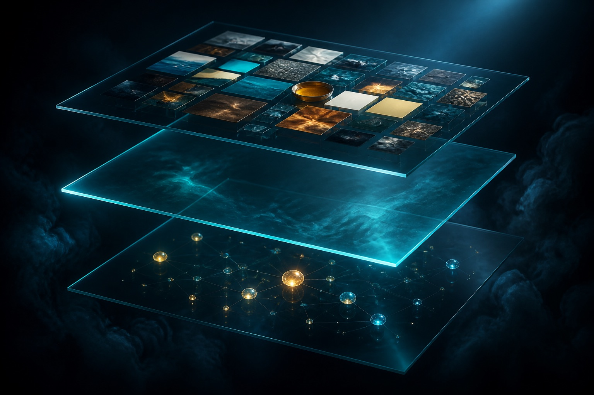

I am an engineer. Three months ago I had never touched UI/UX.

I now ship design every week.

Not because I suddenly "learned design." Because I built an agent harness for it — a three-layer toolkit that lets me deliver design end to end without becoming a designer.

## Agents change how much one person can cover

Engineer and designer used to be two jobs. Engineers wrote code. Designers designed.

Agents are moving that line.

I have been pushing myself into work I could not do before. Design was the largest gap.

Pixels, spacing, type, color — these things make people trust a product before they read a word.

I had none of those skills. So I built a harness: three layers that give me real design capability without making me a designer.

## The three-layer design harness

### Layer 1: Skills (other people's expertise)

Skills are instruction files you install into an AI agent. Claude Code, Cursor, Codex — they all work.

They move someone else's design expertise into your workflow. You are borrowing a working designer's taste.

#### Impeccable (@pbakaus, jQuery UI founder)

The Skill I use most. 20+ commands: `/audit`, `/polish`, `/animate`, `/typeset`, `/arrange`.

It captures the anti-patterns that make AI UI look obviously AI-made:

- too many fonts
- gray text on a colored background
- pure black
- nested cards

My favorite command is `/delight`. I use it a lot. Every time it introduces something that surprises me and lifts the whole feel of the product. That one command changed how my output looked overnight.

#### Emil Kowalski's Design Engineer Skill

Emil is a design engineer at Linear, previously Vercel, creator of Sonner and Vaul (15M+ weekly downloads).

His Skill encodes how he thinks about animation, UI polish, and detail.

I use the free version to borrow Emil's way of seeing, and occasionally apply it to my own work. The full version includes his animations.dev course.

#### Interface Design (@Dammyjay93)

This one fixes the most annoying problem in AI-assisted design: the agent forgets every design decision between sessions.

The Skill stores your spec — spacing grid, palette, depth strategy, component patterns — in a persistent `system.md` and loads it automatically.

#### UI Skills (@ibelick, founder of motion-primitives)

Created by Julien Thibeaut, who also built motion-primitives.

Fifteen open-source Skills covering foundational UI, accessibility, animation performance, and metadata.

I do not use it as often as Impeccable, but it is there when I need it.

### Layer 2: Agent canvas (the surface)

I also call these agent shells. They are design surfaces with no built-in agent. They use *yours* — Claude Code, Codex, whatever you run locally.

The canvas is the shell. Your agent is the kernel.

#### Paper (@paper)

I have been using this more lately. The canvas is real HTML and CSS, not a proprietary format.

What you design *is* the code. No translation layer. No "handoff."

It exposes MCP tools with full read/write. Because there is no format conversion, it works with local agents out of the box.

Most of the time I use Paper for the design system, tokens, and page iteration, then treat it as both source and design reference while I build the product.

Paper has a free tier with a limited MCP-call quota.

#### Pencil (@tomkrcha)

A different bet. It uses a JSON `.pen` format that can Git-diff; an agent can operate it over MCP.

My design files live in the repo and version like code.

Pencil also has a swarm mode: I can start several agents (up to six) on the same canvas —

- one on type
- one on layout
- one propagating the design system

The first time I watched a swarm work my canvas, I was stunned.

Pencil is free for now. I often run Pencil and Paper together.

### Layer 3: Inspiration and taste (the eye)

Skills give me expertise. Canvases give me a surface. I still have to train an eye that knows what "good" is before I can ask an agent to do it.

#### Variant (@variantui)

Type an idea, scroll infinite non-repeating interpretations.

The standout is Style Dropper: point at a design, it absorbs the visual DNA (palette, type rhythm, spatial density) and transfers it onto another design.

I spend about 20 minutes a day scrolling it. It has become how I warm up my eye before any design work.

Variant is more than inspiration for me. I pick things I like from the community, prompt variants, explore directions, and when I find one I like I can copy code, export React, or copy a prompt with an HTML reference straight into a coding agent.

From there I extract tokens or components and start building more views. It is a surprisingly smooth bridge from inspiration to a real product.

#### Mobbin (@mobbin) and Awwwards (@awwwards)

These have been known in design for a long time. I use them to absorb the best curated work and learn taste from it.

Mobbin covers mobile apps and sites. When I need to see how a top app handles onboarding, settings, or checkout, that is where I go.

Awwwards is jury-scored and sits at the edge of web craft. They also run conferences and an academy.

#### Cosmos (@thecosmos)

This is where I collect every inspiration and idea, and browse other people's collections.

Web design, interiors, type, photography, architecture — anything that catches my eye.

I keep finding things through hex-color search or even a fuzzy description. It finds what I am looking for in ways that still surprise me.

I use it to build visual-reference clusters that slowly reshape how I think about design.

## The pattern

Three layers. Skills for expertise. Canvases for agents to work on. Inspiration to train the eye.

I am not a designer. I do not have years of trained intuition. My taste is still forming. I learn every day.

But I unlocked myself. I went from fundamentally unable to design, to shipping design every week and being okay with the output. Three months ago there was nothing.

## The takeaway

**You do not need to become a designer. You need the right harness.**

The same three layers apply to any field:

- Find the expertise (Skills)
- Find the working surface (Canvas)
- Train your eye (Inspiration)

Then you can deliver in that field even without years of background.

Agents change how much one person can cover. Do not stay inside the old role lines.

---

**Original:** https://x.com/i/status/2034786360356204934

## Related posts

- [[stitch-design-md-infrastructure|Why Stitch's DESIGN.md matters: from image tool to design infrastructure]]
- [[ai-ui-design-workflow|Why AI-generated UI isn't shippable — and the combo that works]]
- [[stitch-claude-ai-design-workflow|Google Stitch 2.0 + Claude Code: an AI design workflow]]
