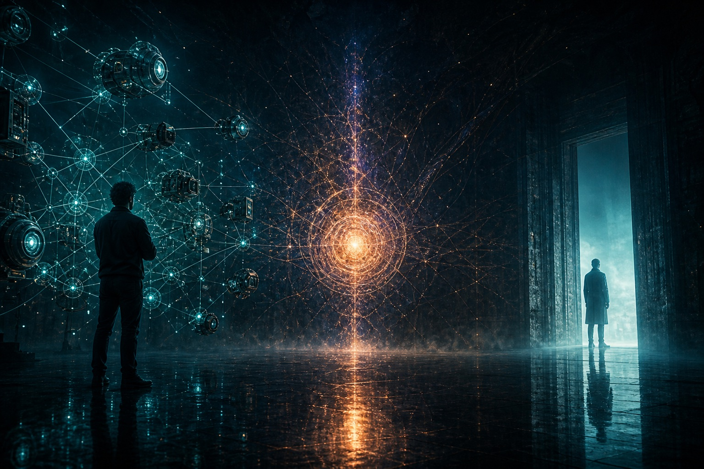

I saw a claim yesterday that product people should take seriously:

Products in the AI era may need two entrances — one for humans, one for agents.

Not a fork in the road. Not "UI dies, Skills win." Two paths at once, each for its own user, both draining into the same capability core.

LibTV is the first product I have seen that actually does this.



## Two entrances, one capability set

LibTV is Liblib's AI video tool. It has two completely different doors:

For humans: an infinite canvas. Node-based, with wires and parameters, covering script, image, video, and audio. How professional? A real camera UI (aperture, focal length), multi-angle 3D preview, one-click relighting (even rim light), grid splits, script-to-storyboard. It looks complex. For a working creator, that complexity is a weapon.

For agents: a Skill. One-line install, works with Claude Code, Codex, OpenClaw. You say "make a 10-second video of a ballet dancer." The agent calls the Skill; the backend handles storyboard, model choice, parameters, and generation; the result comes back.

Same product. Same underlying capability. Two different doors.

## Open the interface, protect the brain

LibTV's Skill design is clever: the user-side Skill only triggers and talks. The real work runs on a backend agent.

That means:

- you ship an interface, not a brain
- core prompts, model-routing strategy, and storyboard logic stay invisible
- you can iterate the backend and users upgrade without noticing

Why bother? A lot of Skills today are fully open. The know-how walks out the door. No moat, no protection; no protection, no room to commercialize; no commercial ecosystem, the flywheel never starts.

The agent ecosystem needs openness. Openness is not the same as giving away the core.

## Agents draft; humans finish

Another detail I like: every agent job becomes a project on the canvas, nodes already wired.

The workflow looks like this:

1. A regular user says one sentence to an agent
2. The agent calls LibTV and produces a 70-point draft
3. If it is good enough, they ship it
4. If they want to refine, they open the canvas — assets and nodes are already there

Agents go from 0 to 70. Humans go from 70 to 100. The two doors are not silos. They connect.


## What this means if you ship product

A few practical takeaways:

First, design an agent-friendly interface from day one. Bolting on an agent door after the product is "done" often means the architecture cannot support it.

Second, atomize the underlying capabilities. Generate image, edit image, generate video, edit video, generate audio — each is an independent atom. UI and Skills are just different callers.

Third, pro users and casual users are no longer a forced choice. Pros use the UI; complexity is their weapon. Casual users use an agent; one sentence is enough. One product serves both.

Fourth, a Skill is an interface, not a brain. Open trigger and transport; protect core logic. That is how commercialization stays possible in an agent ecosystem.

## The product shape I keep coming back to

This is starting to look like the default architecture for agent-era products:

```
┌─────────────────────────────────┐
│     Atomic capabilities         │
│  (image / video / audio / script)│
└──────────┬──────────┬───────────┘
           │          │
    ┌──────┴───┐ ┌────┴─────┐
    │  UI door │ │ Agent door│
    │ (canvas) │ │ (Skills) │
    └──────────┘ └──────────┘
         │            │
    Power users    Casual users
    Fine control   One sentence
```

Behind the two doors is a recombination of atomic capabilities. Humans and agents coexist and take what they need.

If you are building desktop software, this belongs in the architecture on day one — not as a later "AI feature."

## References

- [Original post](https://x.com/i/status/2034121715811553657)
- Author: 数字生命卡兹克 (@Khazix0918)
- Product: [LibTV](https://libtv.liblib.art) (Liblib)

## Related posts

- [[agent-skills-five-design-patterns|Five design patterns for Agent Skills]]
- [[agent-skills-hub|Agent Skills Hub: finding and managing good Skills]]
- [[hello-world|An agent-friendly blog]]
- [[anthropic-skills-lessons|Lessons from hundreds of Skills inside Anthropic]]
