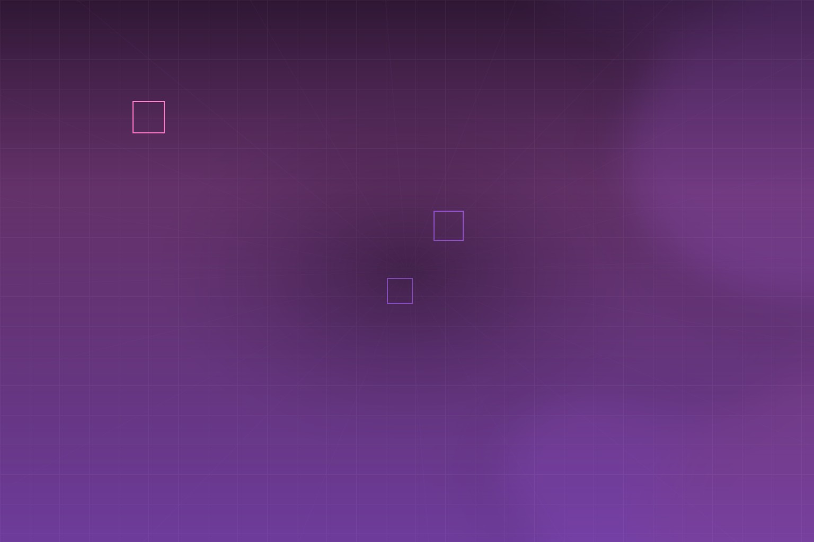

[ezindie 独立开发变现周刊第 153 期](https://www.ezindie.com/weekly/issue-153) 的标题很直白：**一个网站 UI 组件库，每月收入 8 万美元。**

本期五条产品里，最值得拆解的是 **Aceternity UI** 创始人 Manu 的完整路径——其余四条当作行业雷达。

## 本期雷达（四条速览）

| 产品 | 一句话 |
|------|--------|
| **Marblism** | 提示词生成完整 SaaS（DB、API、设计系统、前端），5 万开发者，约 30 分钟微调 |
| **Robopost** | 社媒发帖自动化与排期，2 万+ 用户，一年内月收入 **$5.5 万** |
| **Tattoon App** | AI 在人体照片上逼真叠加纹身（角度、体积、光晕），iOS/Android |
| **formbricks** | 开源问卷平台，应用内/网站/链接/邮件调查，无代码，可自托管 |

如果你在做工具选型，formbricks 和 Robopost 分别对应「用户反馈」和「内容分发」两个常见痛点。

## 主角：Aceternity UI 怎么从爱好做到月入六位数

Manu 是开发者，也经营网页设计工作室 **Aceternity**，帮创始人把想法做成网站。组件库最初只是个人项目的副产品。

### 关键转折：没人读博客，人人要复制粘贴

他先写博客解释「这些漂亮组件怎么做」。数据告诉他：**读者不想学过程，只想拿走代码。**

于是策略变了：

- 不再做「教程的廉价替代品」
- 周末用 Next.js + Tailwind + Framer Motion 搭站
- **只放 7 个组件**就上线——过去过度优化导致没人用的教训，让他选择快速验证

托管成本：**Vercel 每月约 $20。**

### 增长飞轮

1. **Product Hunt + Twitter/X** 拿第一批用户  
2. **Fireship** 等频道报道后，全球客户涌入  
3. 约 4 个月后：网站成为稳定分发渠道，Twitter **2 万粉丝**  
4. 在这个基础上推出 **Aceternity UI Pro**——摩擦更低  
5. 主渠道始终是 **口碑**：用户在公司和社媒里主动推荐

第一个客户上线几天就来了；早期客户 John Shahawy 合作两年多，带来大量推荐，也为后续品牌打底。

### 收入与团队（上月）

| 项目 | 金额 |
|------|------|
| UI Pro 订阅 | **~$4 万** |
| 定制建站服务 | **~$3 万** |
| 月总收入 | **$6–10 万** |
| 月支出 | **~$5000** |

团队 **6 人**（2 前端、1 全栈、1 设计、1 社媒、1 PM）。Manu 曾同时接 **7 个客户**到极限，先雇全职分担交付，再扩编；现在重心放在 **UI Pro**、SEO 和内容（YouTube + X）。

Pro 版上线仅 **两个月** 收入已超 **8 万美元**——这就是本期标题的来源。

## 五条可带走的做法

1. **分发优先于完美**——7 个组件够测需求，验证后再堆量。Manu 的原话：写糟糕的代码好过过度思考，客户不关心代码质量。  
2. **内容形态对齐用户行为**——教程没人看，就给可粘贴的代码。  
3. **免费层养口碑，Pro 收钱**——定制服务可以并行，但规模化靠可复制产品。  
4. **公开、真实、脆弱**——分享成败和过程，社区会推你一把。  
5. **雇佣信号**——当你同时扛不住客户数量时，就是该委托的时候了。

## 目标与边界

Manu 给 Pro 的明年目标是 **$10 万 MRR**，同时在试广告和 YouTube。对想复制这条路径的独立开发者来说，难点通常不在「会不会写组件」，而在 **敢不敢先上线 7 个、敢不敢持续在 X 上露面、敢不敢把服务收入逐步换成产品收入**。

---

*来源：[ezindie 周刊第 153 期](https://www.ezindie.com/weekly/issue-153)*
