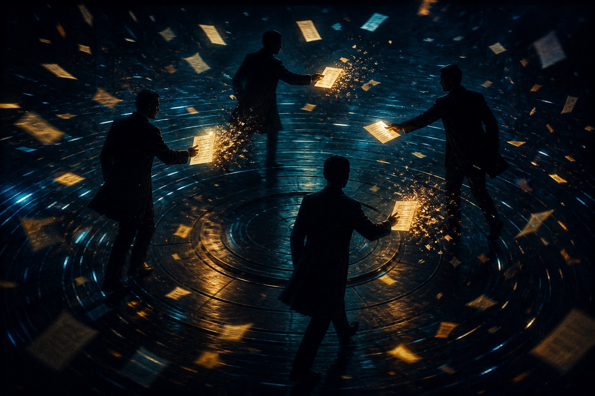
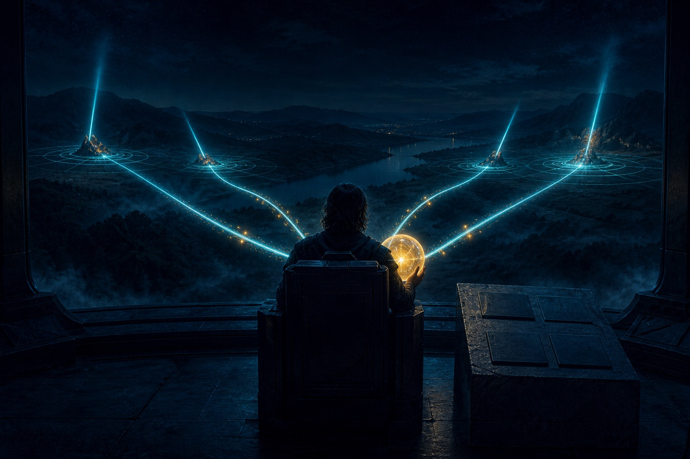
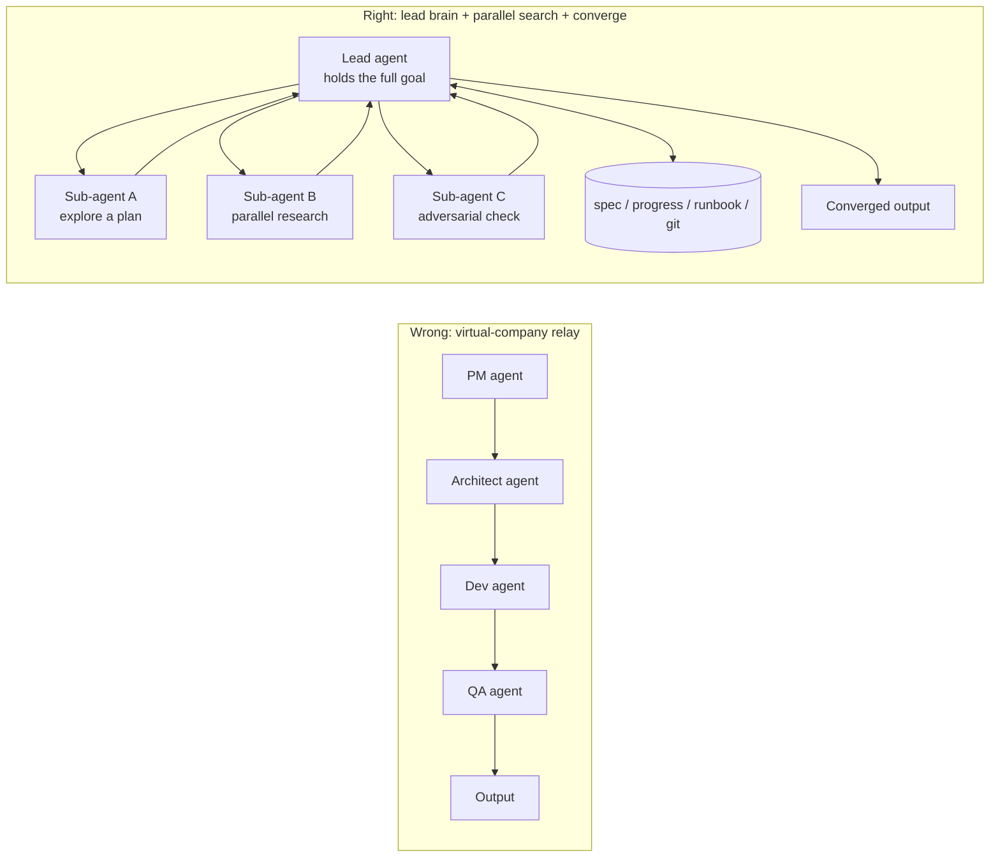
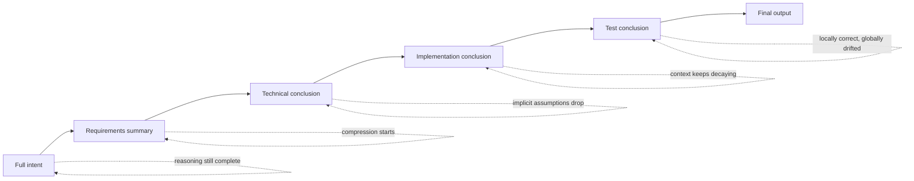
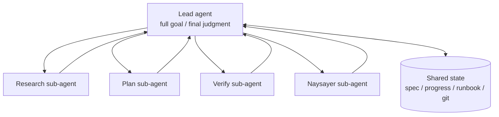

I recently read a hard, long essay. The title is long. The claim fits in one line:

> **The most common multi-agent failure is not a weak model. It is a system designed wrong from the first box.**

A lot of teams start here:

- a PM agent owns requirements
- an architect agent owns the technical plan
- a Dev agent implements
- a QA agent tests

Then they pass documents, conclusions, and tickets like departments.

The design is intoxicating.

It is easy to explain, easy to demo, easy to draw. Especially in a slide for management: look, we already have an "AI team."

That is also the problem.

**Looking like an organization is not the same as being an efficient problem-solving system.**

I would put the usual ending in four Chinese characters — 力大砖飞 — *so much force the bricks fly off*:

# Force the system hard enough and it flies apart

Stack more agents, split finer roles, draw a more complete process, and you do not get more stability. You get distortion, drift, and loss of control.

Not because you lack compute. Because you designed a system heavy with *organizational hallucination*.

---



## 1. Why "virtual company" multi-agent is so easy to misread

It matches human intuition.

Human companies actually work this way:

- product writes the need
- architects draw the boundary
- engineering implements
- QA accepts
- the process walks layer by layer

So when people design a multi-agent system they think:

> If this collaboration works for a company, why wouldn't it work for agents?

Sounds airtight.

The category error:

> **A human bottleneck is not a model bottleneck.**

Humans divide labor because:

- attention is finite
- knowledge has edges
- switching is expensive
- many people need interfaces to connect

An LLM is not that.

The same model can write a spec, write code, write tests, summarize, and review. Its problem was never "unclear job boundaries." It is:

- is the reasoning deep enough?
- is the information complete?
- is the context continuous?
- did intermediate state get dropped?

**What a model actually fears is not overlapping roles. It is information loss.**

And a virtual-company multi-agent system is *excellent* at manufacturing information loss.

---

## 2. The fatal problem: information dies in the handoff

This is the most valuable sentence in the original piece.

In a PM → architect → Dev → QA pipeline, what agents pass is usually not full reasoning. It is a compressed conclusion.

For example:

- the PM agent writes a requirements summary for the architect
- the architect re-understands that summary and writes a technical plan
- the Dev agent re-understands the plan and generates an implementation
- QA validates from the implementation

Each hop looks reasonable.

Each hop does this:

- original intent is compressed
- implicit assumptions are omitted
- the reasoning path is cut
- background context is lost

You get a strange result:

> **Every baton, taken alone, is defensible. The whole thing has quietly left the original goal.**

Locally correct. Globally wrong.

Teams think the system is stable because every node "has output" and every step "looks normal."

The system has already started to drift.

It does not explode. It distorts slowly.

That is why *bricks flying off* is the right phrase:

- you think you are strengthening the system
- you are adding rotational inertia
- when complexity rises, the whole thing slings off

---

## 3. What the labs actually do is not a role relay

The original essay's strongest move is not the critique. It is the contrast with production practice at Anthropic, OpenAI, and Google.

The conclusion is clean:

> **Production agent systems at the major labs are almost never a role pipeline.**

### Anthropic: a lead brain + external state + parallel exploration

Keywords:

- context engineering
- `progress.txt`
- git history
- orchestrator–worker

The logic is not "hand the baton to the next role." It is:

- one lead agent holds the full goal
- sub-agents explore different directions in parallel
- all results flow *back* to the lead for synthesis
- critical progress is written to an explicit state file so the next session can continue

The shape:

> **One brain sends probes to cast a net, then pulls the information back into the same brain to judge.**

### OpenAI: spec / runbook / compaction

More direct:

- freeze the goal in a spec so the task cannot drift
- record the trail in a runbook
- use compaction to keep a long job continuous
- use skills as stable operating norms

The key is not division of labor. It is **continuity**.

> **A long task survives not because of role-play, but because the goal is frozen, state is externalized, and the thread stays continuous.**

### Google: huge context + persistent spec files

Google has enormous context windows and still does not bet that "the model will remember everything."

They also settle project intent into persistent spec / plan files.

An important fact:

> **No matter how large the window, critical state should still live outside the model.**

Three labs, not identical routes, the same principles:

- the main intent must stay continuous
- critical state must be external
- sub-calls should be parallel supplements, not a role relay

---

## 4. Multi-agent value is not division of labor. It is parallel search

This is the line to keep.

A lot of people think the value is:

- one thinks
- one does
- one checks
- one verifies

The real answer:

> **Most of the value of multi-agent is a larger search surface, not a finer org chart.**

Multi-agent is a poor fit for work that *must* pass a long context down a chain. It is a good fit for work that can explore several directions at once.

For example:

- research ten competitors at once
- search five implementation paths at once
- run three adversarial critiques of one plan
- map several modules' current state and dependencies at once

What those jobs share:

- subproblems are relatively independent
- no long relay
- you only need to converge on one judgment at the end

So the better shape is not:

```text
PM agent → architect agent → Dev agent → QA agent
```

It is:

```text
Lead agent
  ├─ sub-agent A: search plan 1
  ├─ sub-agent B: search plan 2
  ├─ sub-agent C: find counterexamples
  └─ sub-agent D: verify
        ↓
    all results return to the lead to converge
```

Not a relay race. A parallel net.

---



## 5. The best identity for a verifier agent: the naysayer, not the next baton

One more practical reminder.

If you introduce a second or third agent, do not make all of them "continue the work."

A better use: let some of them play **naysayer**.

That is:

- hunt holes
- hunt edge cases
- hunt logical conflicts
- audit implicit assumptions

Their job is not to take the baton. It is to oppose.

This matters.

If every agent inherits the previous agent's direction and pushes on, the system amplifies upstream error.

If some agents exist only to look the other way, the system gets more stable.

> **A verifier agent should be a naysayer, not the next station on the line.**

---

## 6. A more reliable multi-agent baseline

If I compress the essay into operating principles:

### 1. Judge the information-dependence of the task before you count agents

Do not start with "how many agents." Start with:

- does this need continuous reasoning?
- are the subproblems tightly coupled?
- can it split into independent search branches?

### 2. Continuous-reasoning work: prefer one agent + strong context engineering

Examples:

- a complex design
- a long implementation plan
- a cross-module architecture call
- a problem with deep dependencies

These jobs die when information fractures.

### 3. Parallel-exploration work: *then* use multiple agents

Examples:

- multi-competitor research
- multi-plan search
- multi-angle risk scan
- multi-draft generation

### 4. You must have an explicit state layer

At least:

- spec (frozen goal)
- progress (the trail)
- runbook (how we operate)
- git history / the filesystem (an objective anchor)

### 5. The lead agent must hold the final, complete goal

All information flows back to a subject that *knows the whole intent*. It does not keep passing the baton.

---

## 7. Why this matters now

A lot of teams will fall into the "multi-agent org hallucination" in the next stretch.

Why:

- the diagram looks great
- the concept sells
- the structure looks like an "advanced system"

A real problem-solving system does not win by looking like a company. It wins by:

- not losing information
- not drifting intent
- making state traceable
- making verification adversarial
- being able to converge

If you cannot do those, more agents only pile complexity.

So *bricks flying off* is a good reminder word.

It punctures the hallucination in one hit:

> **More agents, finer roles, a more company-like org chart — that is not a stronger system.**

Often the opposite.

---

## Close

The next time I see a row of "AI PM, AI architect, AI Dev, AI QA," my first reaction will not be "advanced."

I will ask four questions:

1. Are these agents passing full reasoning, or compressed conclusions?
2. Who holds the final complete goal?
3. Is state explicitly externalized?
4. Are sub-agents searching in parallel, or relaying on a line?

If you cannot answer, the system is probably:

> **Looking busy. Actually drifting.**

And when complexity keeps rising, it starts to —

**force so hard the bricks fly off.**

## Diagrams

### Figure 1: the wrong architecture vs the right one



### Figure 2: how information dies in the handoff



### Figure 3: a more reliable multi-agent baseline



## References

- Original: <https://x.com/i/status/2043898494818410731>
- Related: Anthropic context engineering, OpenAI Codex long-horizon tasks, Google context-driven development

## Related posts

- [[agent-skills-five-design-patterns|Five design patterns for Agent Skills]]
- [[ai-multi-advisor-decision-system|Put Drucker, Munger, and Jobs into an AI decision system]]
- [[wideseek-ai-cp|Wide + Deep: why a 4B model can punch up]]
- [[gstack-yc-ceo-factory|gstack: the Claude Code factory YC's CEO uses]]
