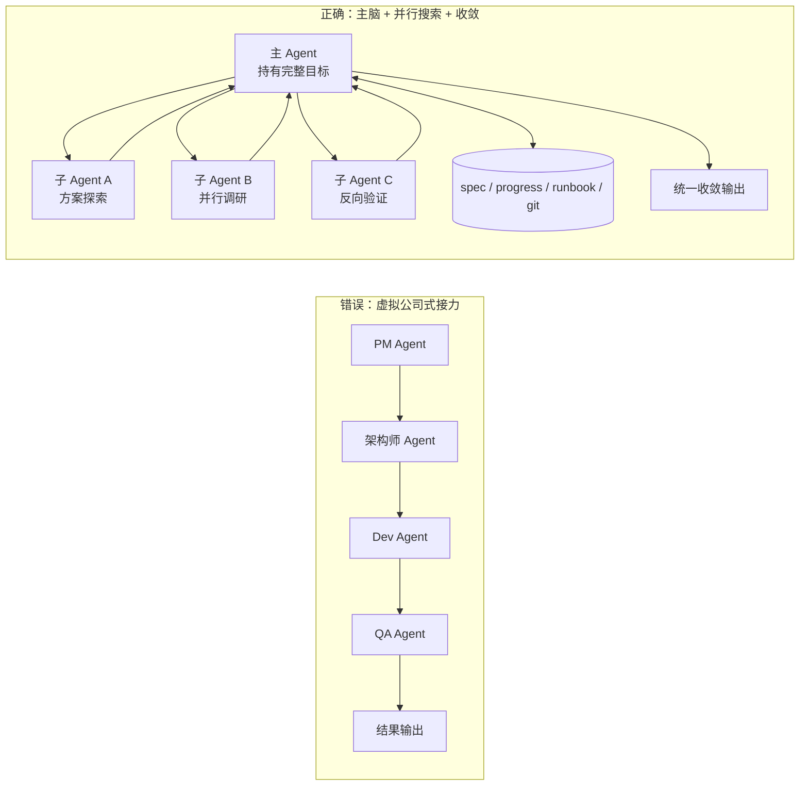
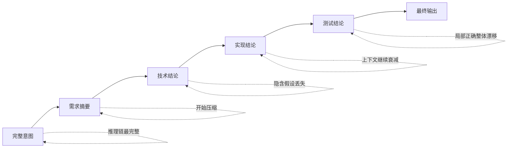
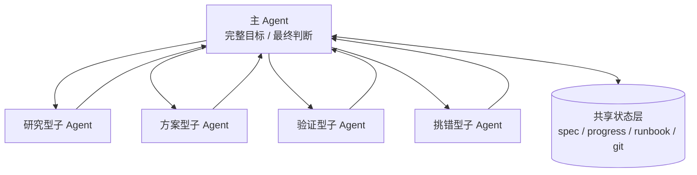

最近看到一篇很硬的长文，标题很长，但核心判断一句话就够了：

> **多 Agent 最常见的错误，不是模型不够强，而是系统设计一开始就建错了。**

很多团队一上来就会这么设计：

- PM Agent 负责需求
- 架构师 Agent 负责技术方案
- Dev Agent 负责实现
- QA Agent 负责测试

然后让这些 Agent 像公司部门一样，一棒一棒传文档、传结论、传任务。

这套方案特别容易让人上头。

因为它好解释、好展示、好画图。给管理层讲的时候尤其顺手：看，我们已经有一支“AI 团队”了。

但问题也正出在这里。

**它看起来像一家组织，不代表它真的是一个高效的问题求解系统。**

我更愿意用四个字概括这类系统的结局：

# 力大转飞

Agent 越堆越多，角色越分越细，流程越设计越完整，最后不是更稳，而是更容易失真、漂移、失控。

不是因为算力不够，而是因为你把它设计成了一个“组织幻觉”极重的系统。

---

## 一、为什么“虚拟公司式多 Agent”这么容易让人误判？

因为这类设计特别符合人的直觉。

人类公司本来就是这么运转的：
- 产品提需求
- 架构师定边界
- 开发实现
- 测试验收
- 流程层层推进

所以当大家开始设计多 Agent 系统时，很自然就会想：

> 既然公司这样协作有效，那 Agent 也这样协作不就行了？

听起来毫无问题。

但这里有一个根本性的误区：

> **人的瓶颈，不等于模型的瓶颈。**

人类需要分工，是因为：
- 注意力有限
- 知识边界有限
- 切换成本高
- 多人协作必须通过接口来衔接

但 LLM 不是这样。

同一个模型可以写需求、写代码、写测试，也能做总结和审查。它的问题从来不是“职业边界不清”，而是：

- 推理深度够不够
- 信息完整性够不够
- 上下文是否连续
- 中间状态有没有丢

也就是说，**模型真正怕的不是职责重叠，而是信息损耗。**

而“虚拟公司式多 Agent”最擅长制造的，恰恰就是信息损耗。

---

## 二、最致命的问题：信息在交接中死亡

这是我看完全文之后觉得最值钱的一句判断。

在“PM → 架构师 → 开发 → 测试”这种流水线里，Agent 之间传递的通常不是完整推理，而是压缩后的结论。

比如：
- PM Agent 写完需求摘要交给架构师 Agent
- 架构师 Agent 基于这份摘要重新理解一遍，再写成技术方案
- Dev Agent 基于技术方案再理解一次，再生成实现
- QA Agent 再根据实现结果补一轮验证

每一次交接，看起来都很合理。

但每一次交接都在发生一件事：

- 原始意图被压缩
- 隐含假设被省略
- 推理路径被裁断
- 背景上下文被遗失

最后你会得到一种很诡异的结果：

> **每一棒单独看都说得过去，但整体已经悄悄偏离了最初目标。**

这就是典型的“局部正确，整体错误”。

很多团队做多 Agent 系统，会误以为系统正在稳定运行，因为每个节点都“有输出”、每一步都“看起来正常”。

但其实系统已经开始漂了。

问题不是突然爆炸，而是缓慢失真。

这就是为什么我觉得“力大转飞”这个词特别贴切：

- 你以为自己在增强系统
- 实际上是在增加旋转惯性
- 直到复杂度上来，系统整个甩飞出去

---

## 三、大厂真正的做法，根本不是“角色接力”

这篇文章最有说服力的地方，是它没有停留在批评，而是直接拿 Anthropic、OpenAI、Google 的工程实践做了对照。

结论很清楚：

> **主流厂商的生产级 Agent 系统，几乎都不是“角色流水线”。**

### Anthropic 的思路：主脑 + 外部状态 + 并行探索

Anthropic 的关键词是：
- Context Engineering
- `progress.txt`
- Git history
- orchestrator-worker

核心逻辑不是“让不同角色接棒”，而是：

- 一个主 Agent 持有完整目标
- 子 Agent 并行探索不同方向
- 所有结果重新回流主 Agent 综合
- 关键进度写入显式状态文件，供下一个 session 继续

这个结构更像：

> **一个主脑带多个探针出去撒网，然后把信息重新收回大脑统一判断。**

### OpenAI 的思路：spec / runbook / compaction

OpenAI 的路线更直接：

- 用 spec 冻结目标，防止任务漂移
- 用 runbook 记录工作轨迹
- 用 compaction 维持长任务连续性
- 用 skills 提供稳定操作规范

这里的关键不是分工，而是**continuity**。

也就是说：

> **长任务能跑下去，靠的不是角色扮演，而是目标冻结、状态外化和线程连续。**

### Google 的思路：大上下文 + 持久规范文件

Google 虽然有超大上下文窗口，但他们也没有把希望全押在“模型会记得一切”上。

他们同样把项目意图沉淀到持久化的 spec / plan 文件中。

这说明一个很重要的现实：

> **上下文窗口再大，关键状态依旧应该外化。**

所以你会发现，三家路线虽不完全一样，但背后的共同原则非常一致：

- 主意图必须连续
- 关键状态必须外化
- 子调用应该是并行补充，而不是角色接力

---

## 四、多 Agent 的真正价值，不是分工，而是并行搜索

这是我觉得最值得记住的一条。

很多人以为多 Agent 的价值在于：

- 一个负责想
- 一个负责做
- 一个负责查
- 一个负责验

但更真实的答案是：

> **多 Agent 的价值主要来自更大的搜索覆盖面，而不是更细的分工。**

换句话说，多 Agent 最适合的，不是那种必须层层传递上下文的任务，而是那些可以并行探索多个方向的任务。

比如：
- 同时调研 10 个竞品
- 同时搜索 5 条实现路径
- 同时对一个方案做 3 种反向质疑
- 同时拆多个模块的现状和依赖

这类任务的共同点是：
- 子问题相对独立
- 不需要长链路接力
- 最终只需要收敛回一个统一判断

所以更好的结构不是：

```text
PM Agent → 架构师 Agent → Dev Agent → QA Agent
```

而是：

```text
主 Agent
  ├─ 子 Agent A：搜方案 1
  ├─ 子 Agent B：搜方案 2
  ├─ 子 Agent C：找反例
  └─ 子 Agent D：做验证
        ↓
    统一回流主 Agent 收敛
```

这不是接力赛，而是并行撒网。

---

## 五、验证 Agent 最好的身份：否定者，而不是接棒者

这篇文章还有一个特别实用的提醒。

如果你真的要在系统里引入第二个、第三个 Agent，不应该让它们都来“继续做”。

更合理的方式是让其中一部分 Agent 扮演**否定者**的角色。

也就是：
- 专门找漏洞
- 专门找边界问题
- 专门找逻辑冲突
- 专门审查隐含假设

这类 Agent 的职责不是接棒，而是对抗。

这一点很重要。

因为如果每个 Agent 都默认继承前一个 Agent 的方向继续推进，系统会不断放大上游错误。

而如果其中一部分 Agent 专门负责“反着看”，系统就会更稳。

所以：

> **验证 Agent 应该是否定者，不是流水线上的下一棒。**

---

## 六、什么才是更靠谱的多 Agent 基本盘？

如果把这篇文章压缩成一套更适合实操的架构原则，我会写成下面这几条。

### 1. 先判断任务的信息依赖结构，而不是先数 Agent 个数
不要先问“我需要几个 Agent”，先问：
- 这个任务需要连续推理吗？
- 子问题之间高度耦合吗？
- 是否适合拆成独立搜索分支？

### 2. 连续推理任务优先单 Agent + 强 context engineering
比如：
- 写复杂设计方案
- 生成长链路实现计划
- 做跨模块架构决策
- 处理依赖极深的问题

这种任务最怕信息断裂。

### 3. 并行探索任务才适合多 Agent
比如：
- 多竞品研究
- 多方案搜索
- 多视角风险扫描
- 多版本草案生成

### 4. 必须有显式状态层
至少要有：
- spec（冻结目标）
- progress（记录过程）
- runbook（说明操作规程）
- git history / 文件系统（作为客观锚点）

### 5. 主 Agent 必须持有最终完整目标
所有信息最终都要汇回一个“知道整体意图”的主体，而不是一棒接一棒地继续传。

---

## 七、为什么这件事对现在特别重要？

因为接下来一段时间，很多团队都会掉进“多 Agent 组织幻觉”的坑。

原因很简单：
- 这种图最好看
- 这种概念最好卖
- 这种结构最像“高级系统”

但真正的问题求解系统，不是靠像公司，而是靠：

- 信息不丢
- 意图不漂
- 状态可追踪
- 验证可对抗
- 结果能收敛

如果这些做不到，Agent 再多也只是在把系统复杂度堆高。

所以我觉得，“力大转飞”很适合做这类系统的提醒词。

它能一下点破那个幻觉：

> **不是你加得越多、分得越细、组织得越像公司，系统就越强。**

很多时候，恰恰相反。

---

## 结语

以后再看到那种“AI PM、AI 架构师、AI 开发、AI QA”排成一列的多 Agent 架构图，我第一反应不会再是“这好高级”。

我会先问四个问题：

1. 这些 Agent 之间传递的是完整推理，还是压缩结论？
2. 谁持有最终完整目标？
3. 状态有没有显式外化？
4. 子 Agent 是在并行搜索，还是在流水线接力？

如果这些问题答不上来，这套系统大概率只是：

> **看起来很忙，实际上在漂。**

而一旦复杂度继续上升，它就会开始——

**力大转飞。**

## 配图

### 图 1：错误架构 vs 正确架构



### 图 2：信息如何在交接中死亡



### 图 3：更靠谱的多 Agent 基本盘



## 参考

- 原文：<https://x.com/i/status/2043898494818410731>
- 相关思路：Anthropic Context Engineering、OpenAI Codex long-horizon tasks、Google Context-driven Development
