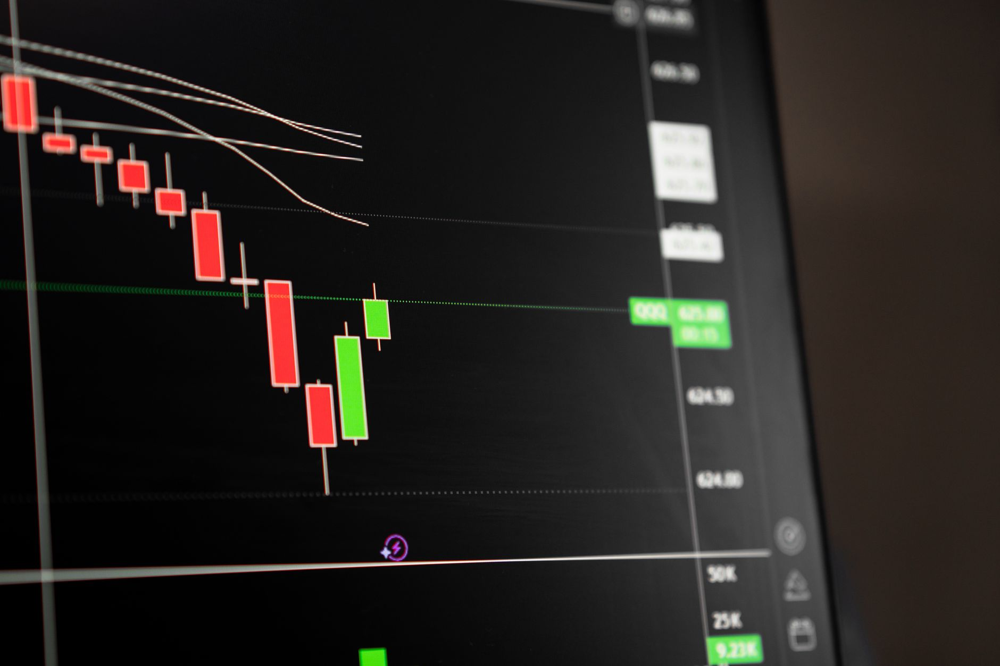
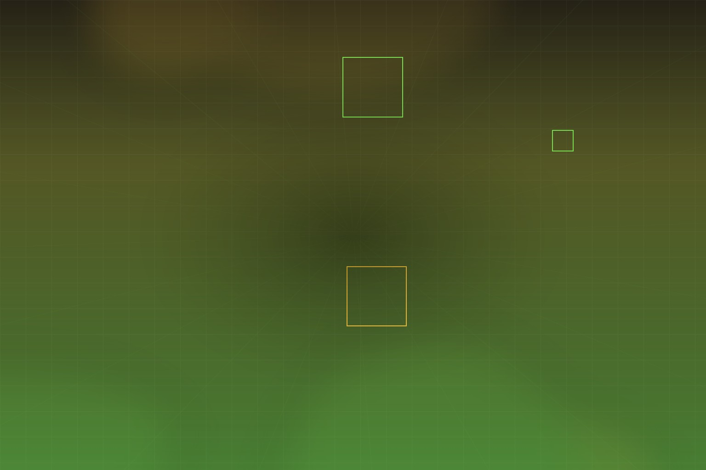
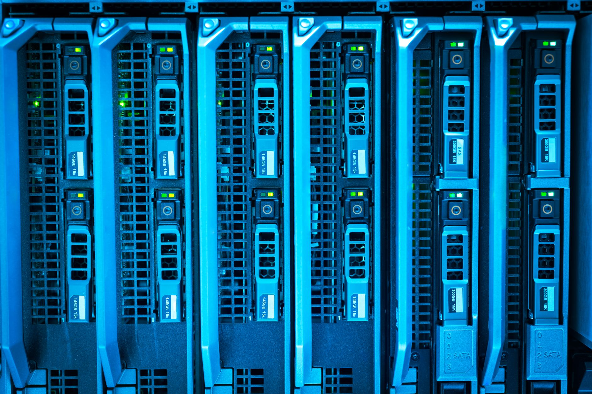

AI 基建的钱从哪来？过去一年，答案从「自由现金流」一路滑到「债务」，再滑到「股权」，现在轮到「养老金和保险浮存金」。

[Ben Thompson 在 Stratechery 的最新文章](https://stratechery.com/2026/nvidias-risky-business/) 用 **1870 年代铁路债券** 做镜子，照出今天 Nvidia、Google 和一众 hyperscaler 正在玩的 **Risky Business**。Satya Nadella 在微软财报电话会上点名《1873》不是随口一提 —— 当 CapEx 规模按经济体倍数折算已逼近 **每年约 $6000 亿** 时，融资结构本身就成了风险。

## 1873：零售债券如何引爆恐慌

1864 年，美国国会特许 Northern Pacific 铁路，用沿线 4000 万英亩土地换建设。六年筹不到钱，直到金融家 Jay Cooke 接下承销：**12% 债券佣金**，每卖出 $1000 债券再送 $200 股票。

机构不买，Cooke 就搞零售：1500 名销售、1300 家报纸、爱国主义叙事 —— 和当年卖战争债券同一套打法。1873 年 9 月全球信用收紧，Cooke 公司破产，触发 **1873 恐慌**：铁路连环破产、多年通缩。铁路后来还是建完了（多次破产重组），最终并入 BNSF；2009 年 Berkshire Hathaway 买下 BNSF 母公司。

Ahamed 新书《1873》的换算很刺眼：1870 年代流入美国铁路债券的每年约 $5 亿，按经济体规模倍数放到 2026，约 **$6000 亿** —— 与 2026 年科技巨头 AI 投资预测同量级。

## 融资阶梯：每一层都比上一层更险

一年前，「大厂 AI CapEx 不靠债务」还算说得通。现在：

| 层级 | 现状 |
|------|------|
| **自由现金流** | 微软上季 FCF **$196 亿**，仍是少数不靠债支撑的 hyperscaler |
| **投资级债务** | 2025 年 Oracle/Meta/Alphabet/Amazon 合计发债 **$1080 亿**；2026 年截至 7 月已 **$1940 亿**；86% 新债收益率高于发行时 |
| **股权** | Google 2026 年 6 月宣布 **$850 亿** 股权融资，含 Berkshire **$100 亿** |
| **长期安全资产** | Nvidia 与六大资管合作，目标撬动 **$5000 亿+** 第三方资本建 AI 基建 |

花掉全部 FCF 是一回事；发债是另一回事；动用股权和养老金，是 **全新的神经紧绷区**。

## Google：输掉前沿，赢得基建？

SemiAnalysis 的标题很狠：**Gemini is Cooked, but GCP is Cooking**。DeepMind CEO Demis Hassabis 升董事长、Jeff Dean 等核心研究员离开，SemiAnalysis 认为 DeepMind **已非前沿 lab**。

但内部算力争夺战里，**Thomas Kurian 的 GCP 赢了**。Gemini 和 GCP 不再抢同一块 TPU；云收入增速有望加快。

Thompson 此前写过：Hassabis 押 **world models** 而非纯文本/代码，可能是 Gemini 编码能力（尤其长上下文）相对 Anthropic/OpenAI 偏弱的原因之一。Google 在 ChatGPT 一年前就有聊天机器人，却因怕冲击搜索而不敢发 —— 官僚与战略怯懦是更深的问题。

**基建层 Google 依然凶猛：**

- Kurian 定位 GCP 为 **platform player**：TPU 租给 OpenAI、Anthropic 等，变现整条技术栈
- TPU 可能比 Nvidia GPU **更便宜** —— Anthropic 已在自建数据中心直购 TPU（把边际成本变成资本成本）
- Google 愿意分享算力、甚至发股权融资 —— Thompson 类比 Berkshire：See's 糖果利润 vs BNSF 铁路（高资本、高利润）。目标是 **绝对利润**，不是利润率

## Nvidia：$5000 亿融资平台与 25% 残值担保

Jensen Huang 在 X 上宣布与 Apollo、BlackRock、Blackstone、Brookfield、Goldman Sachs、KKR 合作，建立独立融资平台，动员 **$5000 亿+** 第三方资本。

核心叙事：**Nvidia AI Factory 正在成为可投资资产类别** —— 能产生收入、服务广市场、随 CUDA 迭代提升性能、可重新部署。

许多 AI 公司、企业和云有算力需求，但拿不到足够规模或成本的融资。新平台想接的就是这批人。

**和 Google 股权的本质区别：**

- 股权稀释的是股东 upside，不增加公司自身风险
- Nvidia 的结构是 **保留利润率**，把风险转给新资本池
- **代价：** Nvidia 以最多 **25% 残值** 为项目担保 —— 说明市场对「可投资资产」叙事的信心不足，相当于 **隐性降价**
- 若下游资本受限，builder 可能选 ** upfront 更便宜的 TPU/Trainium**，而非 token 效率更高的 Nvidia

## CUDA 护城河：压力比 2024 更大

Thompson 2024 年写过：ChatGPT 前 CUDA 护城河清晰但用例不明；现在用例清晰，但发生在 **模型层之上**，替代 Nvidia 的压力与可能性同步上升。

2026 更严峻：Anthropic 多年不依赖 CUDA；OpenAI 推理侧也在远离 CUDA。若前沿 lab 继续拉开差距，Nvidia 利润会被挤压 —— 残值担保已是信号。Huang 先发 **开源模型辩护信**，再推融资平台，逻辑连贯。

## 危险区：AI 必须在「太晚」之前兑现

Thompson 的收束很干脆：

- 若 AI 收入真爆发 → 债务市场重开 → 回归 FCF 投资，Nvidia 担保可能无损
- **当下是危险区：** hyperscaler 快烧穿债务市场，Google 开始股权，Nvidia 拉保险和养老金入场
- Cooke 的零售债券创新在崩盘时 **扩散了痛苦**
- 花 FCF → 发债 → 股权 → 安全寻求型长期资本：**每一层风险更高**
- **AI 必须在太晚之前交付真实收入**

对做产品的人来说，这不是芯片股八卦。大厂基建狂飙不等于应用层立刻有钱；算力成本结构（TPU 自建 vs Nvidia 租用）正在重塑 lab 选型；当养老金开始为 GPU 买单，说明 **债务层已经不够** —— 这是宏观层面的风险定价。

---

**原文：** [Nvidia's Risky Business — Stratechery](https://stratechery.com/2026/nvidias-risky-business/)  
**相关：** [The Google Capital Company](https://stratechery.com/2026/the-google-capital-company/) · [Nvidia Waves and Moats](https://stratechery.com/2024/nvidia-waves-and-moats/)
