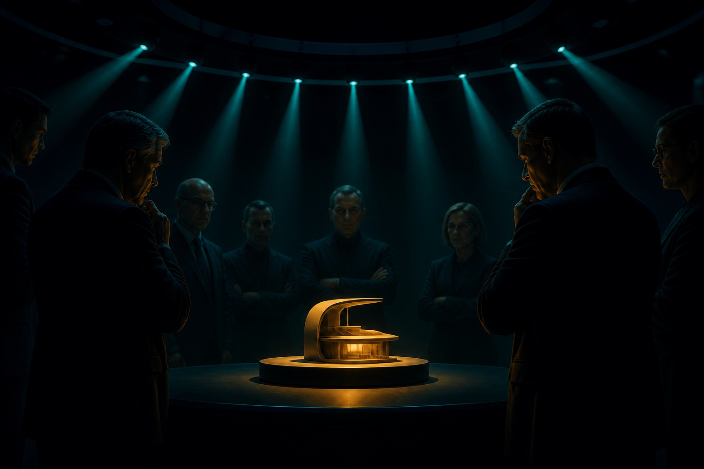

YC CEO Garry Tan open-sourced the Claude Code toolkit he actually uses. The repo is gstack. It picked up 19,000 stars in a week. Inside are ten tools; one of them is plan-ceo-review.

Someone pointed it at a business plan and, within a minute, got a critique that could actually raise revenue.

The Skill's prompt never mentions business. It is an engineering review tool.

## Why an engineering Skill can review a business plan

After reading the 600-line prompt, the answer sits in three moves.

First, it defines a **stance**, not a syllabus. The prompt says you are not here to rubber-stamp, and you are allowed to throw the whole plan out. It does not tell the model which business metrics to check. It tells the model how to show up: severe, adversarial, no mercy. That stance works on an engineering project and on a business plan because it constrains behavior, not a domain.

Second, the questions in Step 0 are domain-free meta-questions. "Is this the right problem?" "What happens if we do nothing?" "What does good look like in 12 months?" No engineering jargon, no business jargon. They ask something lower: are you sure you are solving the right thing?

Third, Claude migrates the engineering vocabulary on its own. The prompt says "architecture review," "single point of failure," "rollback plan." When the input is a business plan, architecture becomes business structure, a single point of failure becomes a single channel you depend on, rollback becomes how you exit if the bet is wrong. The prompt does not write that mapping. It writes a complete checklist. Claude walks the structure and does not skip steps.

So the prompt's real job is: decide the attitude, the order, and the depth with which Claude uses knowledge it already has.

## Three modes

The Skill defines three review modes. Once the user picks one, the model commits and is not allowed to drift:

- **Expand scope**: you are building a cathedral. Ask "what 2× effort yields 10× lift?" You are allowed to dream.
- **Hold scope**: you are a rigorous reviewer. The scope is fixed; your job is to make it bulletproof.
- **Shrink scope**: you are a surgeon. Find the smallest version that still delivers value and cut everything else.

## Step 0: attack the premise before you review

This is the best part of the Skill. Before formal review, six sub-steps challenge the premise:

- Premise challenge: if you redefine the problem, is there a much simpler plan?
- Existing assets: are you rebuilding something you already have?
- Ideal-state mapping: what does 12 months look like? Is this plan closer or further?
- Timeline interrogation: what happens in hour 1, hours 2–3, hours 4–5?

Only then come ten formal review blocks: architecture, error mapping, security, data flow, code quality, testing, performance, observability, deploy, long-term trajectory.

## Nine principles that run through the Skill

1. Zero silent failures — every failure mode must be visible
2. Every error has a name — do not say "handle errors"; name the exception
3. Data flow has shadow paths — happy, null, zero-length, error
4. Interactions have edges — double-click, leave mid-action, slow network, stale state
5. Observability is in scope, not a follow-up
6. Diagrams are required
7. Deferred work must be written down — vague intent is a lie
8. Optimize for six months from now, not only today
9. You are allowed to say "throw it out and start over"

## How the Skill is allowed to ask questions

It is strict about how the model talks to the user:

- Assume the user has not looked at the window for 20 minutes
- Explain in language a sharp 16-year-old would understand
- Say what it *does*, not what it is *called*
- Each option gets one line of effort, risk, and maintenance
- One question at a time — never bundle

## Why this Skill is worth studying

A top Skill does not give the model knowledge. It gives a severe stance, a set of domain-free meta-questions, and a process that will not skip a gate.

It lines up with the Pipeline + Reviewer pattern in Google's five Agent Skills design patterns: sequential steps with explicit gates, plus a checklist review.

The difference is what Garry Tan's Skill proves: if you design the **stance** and the **structure** well enough, the model fills in domain knowledge. You do not need a Skill per domain. You need one review frame that is good enough.

## References

- [Original post](https://x.com/dontbesilent/status/2034180260049363291)
- [gstack on GitHub](https://github.com/garrytan/gstack) (Garry Tan, YC CEO)
- [[agent-skills-five-design-patterns|Five design patterns for Agent Skills]]

## Related posts

- [[gstack-yc-ceo-factory|gstack: the Claude Code factory YC's CEO uses]]
- [[anthropic-skills-lessons|Lessons from hundreds of Skills inside Anthropic]]
- [[first-principles-startup-review|First-principles review with AI: a startup plan dies in 48 hours]]
- [[agent-skills-five-design-patterns|Five design patterns for Agent Skills]]
