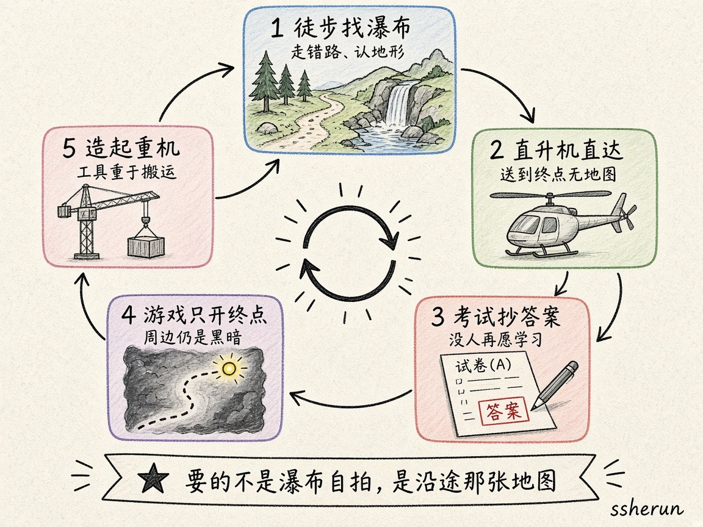

Someone on V2EX wrote: Fields medalists including Terence Tao warned that AI solving hard math problems might be harmful—why is human breakthrough celebration, while AI breakthrough raises alarms?

The OP later corrected the title: not “oppose AI,” but “be wary of AI.” The useful part isn’t the press release. It’s how the thread turned an abstract worry into **pictures**—waterfall, helicopter, copying answers, opening a game map, inventing a crane. Below is a metaphor-first cut of that discussion.

## Five metaphors on one loop

This hand-drawn ring is not a policy brief. It’s the five sayings that kept showing up:

1. **Hike to the waterfall** — wrong turns, learn the terrain, find side paths  
2. **Helicopter direct** — efficient, but the along-the-way map doesn’t appear automatically  
3. **Copy exam answers** — if answers are free, who still wants to learn?  
4. **Game map: only open the destination** — surroundings stay dark; no systemic understanding  
5. **Invent the crane** — moving the load vs inventing the device; tools beat brute force  

The cleanest banner line: **What you want is not a selfie at the waterfall, but the map made along the way.**

## Metaphor map

| Metaphor | Intensity | What it tries to say |
|------|------|--------------|
| Hike to waterfall vs helicopter (Tao) | Very high | Efficiency rises; the map doesn’t auto-appear; wrong turns are part of the haul |
| Exams that allow copying | High | Failure is how learning happens; easy answers kill motivation |
| Sell tech cheap to kill rival R&D | High | Make self-build costlier than buying—same demotivation pattern |
| Apple vs watermelon (answer vs new tools) | High | AI gives the apple; humans may get apple + watermelon; under uncertainty, take both |
| Game map: only light the destination | Medium-high | Fog of war remains; no systemic picture |
| Ten people lift vs invent a crane | Medium-high | Fear of stacking more cranes instead of inventing better machines |
| Elevator on Mount Tai | Medium | “You can still train” vs “humans lack super willpower; environment matters” |
| Bring both knife and gun | Medium | OP: grow AI *and* math; critics: you’re banning the gun |
| Journey vs selfie at the destination | Medium | Process memory > endpoint check-in |
| Ten thousand monkeys on keyboards | Medium-low | Brute traversal vs understanding then directing AI |
| Spinning jenny / Luddites | Medium-low | Cynical read: fear of losing the job |
| Post-AlphaGo Go | Medium-low | Stronger play, weaker aura; whether math research is analogous is contested |

## The most useful pictures

### 1. Hiking vs helicopter

Tao’s metaphor got quoted on loop: classic research is hiking to a waterfall—you take wrong turns, learn terrain, find forks, maybe notice another landscape worth exploring. AI is a helicopter that drops you at the falls. Throughput rises; the along-the-way **map** does not appear for free.

Someone compared it to opposing elevators on Mount Tai. The OP: if the mountain is fine being domesticated, it won’t object; some mountains now say they want to learn how to *build* elevators. The other side: transit doesn’t stop you from training—only laziness does. OP again: humans don’t have infinite willpower; Mencius’s mother moved three times—choose the environment that doesn’t kill motivation.

### 2. Copying answers and “stubborn heads”

OP’s line: failure is the best path to learning—maybe the only path. If exams let you copy answers, who still studies?

Extended to math: the prize isn’t the answer; it’s the **new tools** forged while failing. Monopoly tech → rivals invent alternatives; sell tech cheap → trap them where self-research costs more than buying. AI “procurement of answers” gets mapped onto that demotivation machine.

### 3. Apple and watermelon

OP’s frame: if the answer is an apple, the new tools from human struggle are a watermelon. AI gets the apple; humans may get apple + watermelon. Under uncertainty, take both.

Critics: strong AI may not need new math tools; weak AI may invent tools anyway—don’t turn speculation into a ban.

### 4. Fog-of-war maps

Someone said classic research is clearing the whole neighborhood to open the map; AI lights only the destination while surroundings stay dark. Another possibility: get the conclusion with AI first, then explore backward—which is better for the species has no measuring stick yet.

### 5. Invent the crane, or stack more lifters

Ten people can move the load; inventing a crane matters more. The worry: later we only stack more cranes instead of inventing better machines.

A parody swapped every “math” for “programming”: vibecoding flies, old-school coding gets crushed—the isomorphic fear becomes instantly readable. Others said: once you swap to programming, the conclusion is obvious.

## The sharpest dialogue cuts

### Following ≠ understanding

“Being able to follow an answer step by step doesn’t mean you understand why it goes that way.” Verifying a proof and inventing tools are different jobs.

### Millions of Lean lines vs trusting the checker

One camp: if humans can’t read it, they can’t call it correct. The other: if Lean is trustworthy, humans needn’t read the whole chain; control drifts away and brains retire into entertainment.

### Path A / B frame fight

OP: AI-led hard-problem solving → no help to AI + hurts math; don’t let AI lead → math keeps growing and AI still grows.  
Critics: you’re the one banning AI; high gun efficiency hurting knife motivation ≠ ban the gun. “Bring both” ≠ “forbid guns.”

### Title correction

Someone noted Tao has long used LLMs as assistants; the real worry is companies hyping “answer proofs” and turning top mathematicians into answer validators. OP admitted the V2EX title was wrong and changed the blog to “be wary of AI.”

## One-line takeaway

**AI can drop you at the waterfall; what math often wants is the map drawn while hiking—new tools, new questions, community, and newcomers. The fight isn’t “do we want answers,” it’s “will the helicopter make people stop walking.”**

Source: [V2EX #1241637](https://www.v2ex.com/t/1241637)

## Related

- [[v2er-distillation-metaphors|Distillation Through V2er Metaphors]]
- [[ai-economy-jobs-demand|Will AI Shrink Total Jobs?]]
- [[when-average-people-feel-ai|When Will Average People Feel AI’s Impact?]]
