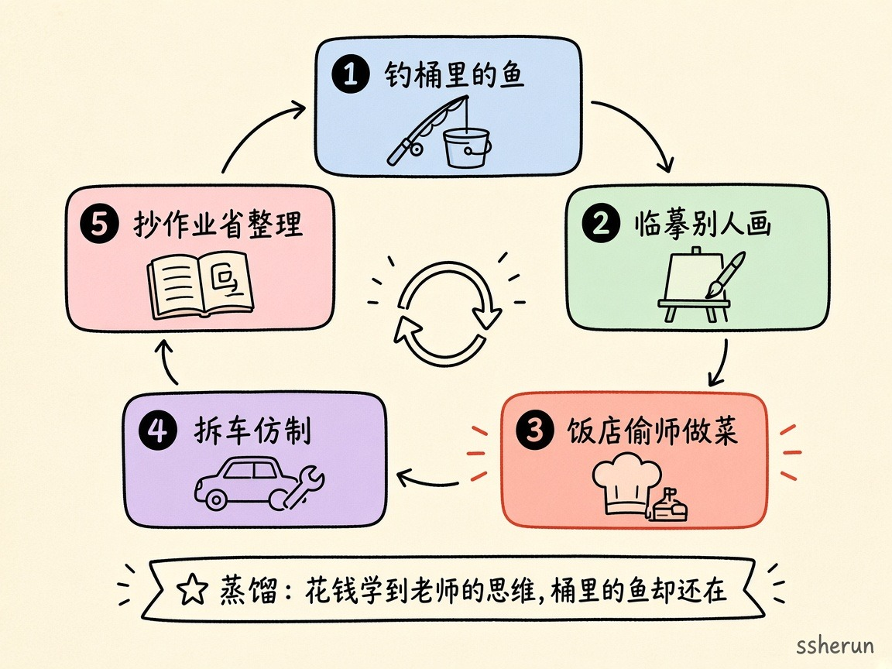
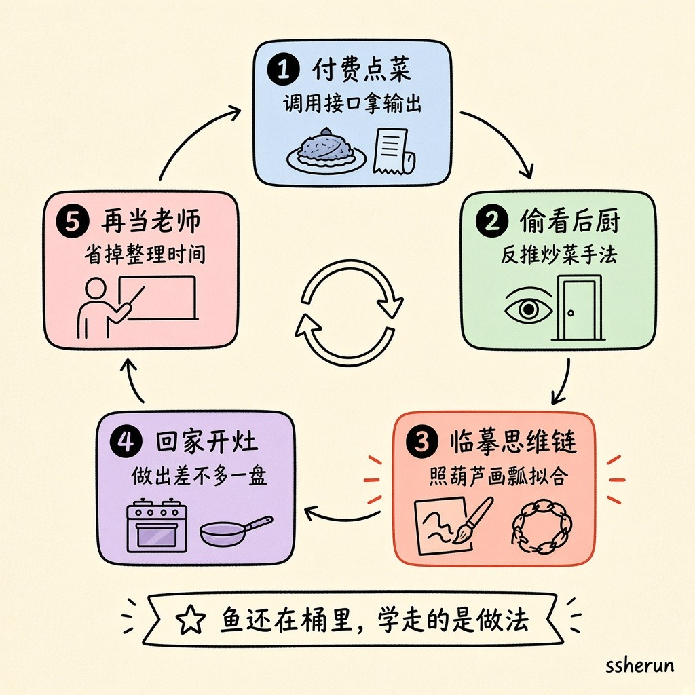
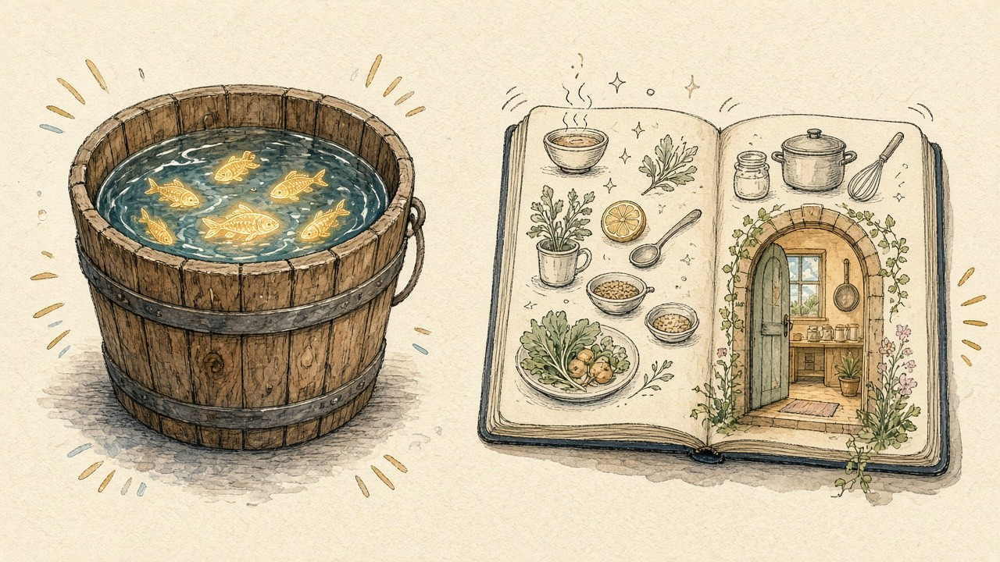

V2EX 有人问：AI 圈天天说的「蒸馏」，是不是就像钓别人鱼桶里的鱼？

技术定义其实不难查。真正值钱的，是评论区把抽象词砸成的那堆**画面**——鱼桶、后厨、临摹、拆车、抄作业、奶茶配方。下面按讨论密度蒸馏一版（不点名具体厂商），方便以后引用。

## 五张比喻钉在一张图上

这张手绘环不是技术流水线，而是评论区反复出现的**五种说法**：

1. **钓桶里的鱼**——楼主原喻；有人说更像「用网捞」  
2. **临摹别人的画**——输出还在对方手里，你带走的是模仿  
3. **饭店偷师做菜**——付费点菜，再偷看后厨反推做法  
4. **拆车仿制**——只租不卖的车，开到工厂拆开学习  
5. **抄作业省整理**——省掉清洗与试错，直接抄「已经学好的同学」  

底栏那句是共识里最干净的一句：**蒸馏：花钱学到老师的思维，桶里的鱼却还在。**

## 比喻图谱

| 比喻 | 强度 | 它想说明什么 |
|------|------|--------------|
| 鱼桶：钓 / 用网捞 / 鱼还在 | 很高 | 学走能力，原模型通常还在；「捞」比「钓」更强调批量 |
| 顶级饭店点菜 → 反推菜谱 / 偷看后厨 | 高 | 付费拿成品，再反推做法 |
| 临摹别人的画 / 依葫芦画瓢 / 有样学样 | 高 | 更像模仿与拟合，不是物理偷走 |
| 老师教课 / 交学费再当老师 | 中高 | 「学习」阵营爱用；反对方强调老师主动教 vs 违 ToS |
| 租车不卖 → 开到工厂拆开学习 | 中 | 只租不卖的商业模式 vs 逆向学习 |
| 抄作业 / 考试抄答案 | 中 | 省掉清洗与试错，直接抄「已经学好的同学」 |
| 百科全书词条拖走再印刷 | 中 | 原书也非全原创，但编纂成本被跳过 |
| 奶茶配料比例被分析走 | 中低 | 辛苦调配的秘密配方被还原 |
| 买车拆开仿制（无专利时代） | 中低 | 仿制本身也要能力；法律未必禁止 |
| 花钱让你把鱼拿出来拍照 | 低 | 付费拿到快照 ≠ 拿到桶 |
| 问卷报告被做成新平台再卖 | 低 | 付费看报告 → 再做成竞品平台 |
| 桶里可能是蜜罐 | 低 | 去别人桶里「钓」有风险 |

## 最有用的几句画面

### 1. 鱼还在桶里

楼主原喻的破绽，被多人直接点破：蒸馏通常不是把鱼偷走。你学走的是**做法与模式**，对方服务还在——「可是桶里的鱼仍然在」。

也有人说更像「用网直接捞」——强调批量、高效，而不是一根竿一根竿地钓。另有人补刀：桶里的鱼也可能是**蜜罐**；还有人说「花钱让你把鱼拿出来拍照」——付费快照 ≠ 拿走整桶。

### 2. 临摹，不是搬家

「临摹别人的画」「依葫芦画瓢」「有样学样」比「钓鱼」更被认同：输出还在对方手里，你得到的是一份可迁移的模仿结果。有人纠正：钓鱼举例不对，因为蒸馏是「你的还在，我把你的学来了」。

### 3. 饭店点菜 + 偷看后厨

高频金句：上顶级饭店吃饭，反推做菜方式；或点了盘菜，趴在后厨门上看厨师怎么炒，回家照葫芦画瓢做一盘差不多的。

补刀也很重要：厨师自己的菜也未必全原创——可能看过烹饪宝典再结合实际。这把「来路不正」的互相指责，也写进了比喻里。

奶茶版同构：你辛辛苦苦调出的配方，对方分析出配料比例直接抄走。

### 4. 租车拆解 vs 只开不拆

有人用「只租不卖的车 → 开到工厂拆开学习」讲商业模式冲突；立刻有人拆穿：按严格类比，未必拆开了，只是在各种场景下开了几十万公里——更接近**行为蒸馏**，不是偷权重。

买车拆开仿制的版本则强调：仿制本身也要能力；只是当下未必有「不准蒸馏」的法案。

### 5. 技术侧的一句话

监督学习：同样输入，拿教师模型输出当「标准答案」去拟合。真正值钱的往往是 **CoT**——只学最终答案，成效有限；各种骚操作是为了还原中间推理。

另一条：早期大模型靠大量人工标注；蒸馏等于让「已经学好的模型」来标注，省掉那一层人力。还有人说：蒸馏拿不到目标函数的权重；更狠的是做中继，直接调用别人的 API。

## 争议不在比喻，在许可边界

评论区真正吵起来的，不是画面像不像，而是四派：

- **付费即可派**：我花钱拿到的输出，使用权归我，再训练是我的事。  
- **许可派**：付费也要遵守 ToS；没许可的蒸馏，逮到就是你的问题。  
- **双标派**：大家都从网上爬数据；只许我抢、不许你从我抢来的东西里再学，说不过去。  
- **复杂派**：稳定争议本身说明问题复杂，别急着当判官。

百科全书比喻把「抄袭」说得很硬：原书也非全原创，但编纂成本被跳过——你上来直接拿结果。反对方则抬出「交学费学完再当老师」：只要花钱买过知识，再教别人是不是也算偷老师？

## 一句话沉淀

**蒸馏 ≈ 付费（或违规）拿到教师输出，再拟合其行为与思维链；鱼往往还在桶里，争论的是「学走做法」算学习、算抄袭，还是算违约。**

来源：[V2EX #1241338](https://www.v2ex.com/t/1241338)

## 相关文章

- [[ai-economy-jobs-demand|AI 会不会让总岗位变少？一张表讲清生产力与需求]]
- [[warp-self-improving-agents|Agent「自我改进」到底改进什么？]]
- [[kdc-knowledge-engineering-not-files|KDC：知识工程不是文件]]
- [[ai-era-clarity-matters|AI 时代最稀缺的能力：把话说清楚]]
