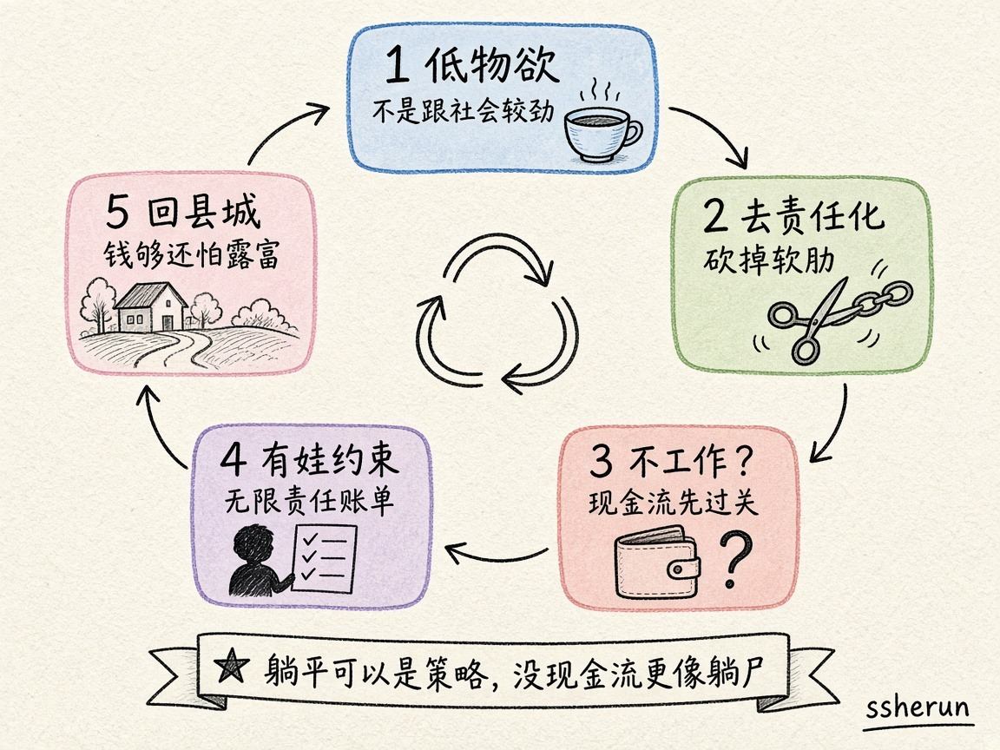

两则 V2EX 帖叠在一起看，比单帖清楚：

1. [躺平是不是版本答案？](https://www.v2ex.com/t/1241205)——不工作、不婚、不买房、不生娃  
2. [回老家县城躺平是否可行？](https://www.v2ex.com/t/1241455)——存约 200 万、已婚一娃、农村有房、夫妻都宅  

口号帖吵定义；案例帖吵约束。下面按评论区密度整理。

## 先把「躺平」拆开

楼主列了「四不」。评论区几乎立刻拆成几派：

| 说法 | 它在主张什么 |
|------|--------------|
| 低物欲才是答案 | 不工作不婚不买房不生娃，是在跟社会较劲，不是躺平 |
| 去责任化 | 2/3/4 是社会责任；1（不工作）是生存底线，争议最大 |
| 躺平 ≠ 不工作 | 降低物欲、不当奋斗逼、不透支健康；有人戏称「双休纳税」才叫躺 |
| 资格论 | 有钱躺着叫躺平，憋屈躺着叫躺尸；先存够初始资金 |
| 围城 | 楼主已婚有娃还问版本答案——想躺但已上车 |
| 润 | 「版本答案是润」；社会会千方百计让你躺不平 |

## 「四不」里，哪条最吵

**不工作**是唯一被反复追问现金流的项：「不工作哪里来的钱租房？」有人说程序员省几年回老家能躺到死；更多人说可以 gap、做保安跑滴滴，但不能脱离社会。也有人把「三和大神」抬出来：干一天躺六天——加强版只是多存了几年工资。

**不婚 / 不买房 / 不生娃**争议少得多。高频句：孩子 = 无限责任；生了娃，所有问题会复制成更难的版本。也有人反杀：已经有娃还觉得养娃是坑，可能是夫妻关系被 PUA，不同经济层级有不同轻松养娃方式。

体验派补刀：人生不是直线冲向死亡；婚姻和孩子带来的滋味，只有体验过才知道。围城派补刀：不要因为现在不幸福，就对没走过的路抱幻想。

## 200 万回县城：可行，但账单在别处

案例帖数字更硬：存款约 200 万，一线年支出不超过 10 万，回家会更低；双方父母健康且有存款，预计十年内不用操心；媳妇支持；孩子佛系养。

评论区的顾虑清单：

| 顾虑 | 要点 |
|------|------|
| 钱够不够 | 多数人觉得「自己这辈子够」；有人提美债利息、种点菜 |
| 孩子 | 最大撕裂：佛系不鸡娃 vs「生了就难躺、生态位低」 |
| 教育医疗 | 县城长期走低；可接受才行，后面进城买房另算 |
| 露富 | 穷山恶水惦记钱包；对外说考公/远程；连父母都别说实话 |
| 买哪 | 不少人劝别急着买县城房；二三线郊区 / 一线郊区更稳 |
| 无聊 | 完全睡觉会与世隔绝；养花种菜、闲鱼小单、摆摊当填充 |

楼主自己的澄清很关键：**躺平更偏向不上班，但不是什么都不做。**

## 两边合起来的读法

口号帖容易把「躺平」说成反抗叙事；案例帖把它拽回家庭资产负债表。

共识最干净的一句：

**低物欲与去责任化可以是策略；没有现金流的「不工作」，往往不是躺平，是躺尸。有娃之后，躺平从个人决策变成代际取舍——教育、生态位、对外叙事，账单会一起到来。**

来源：

- [V2EX #1241205](https://www.v2ex.com/t/1241205)
- [V2EX #1241455](https://www.v2ex.com/t/1241455)

## 相关文章

- [[indie-product-promotion-hard-truths|独立产品推广难在哪]]
- [[ai-economy-jobs-demand|AI 会不会让总岗位变少？]]
- [[when-average-people-feel-ai|普通人何时能感受到 AI 冲击]]
