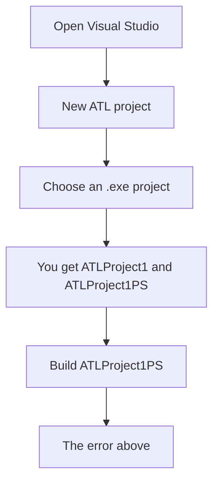
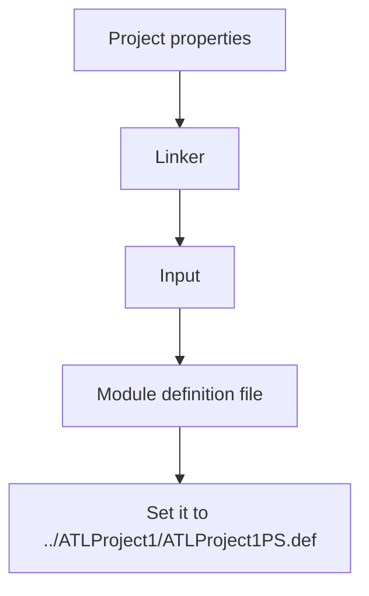

# The error

The build reports:

```
EXEC : error : MIDL will not generate DLLDATA.C unless you have at least 1 interface in the main project.
```

And the pre-build echo looks like this:

```
if exist dlldata.c goto :END
echo Error: MIDL will not generate DLLDATA.C unless you have at least 1 interface in the main project.
Exit 1
:END
```


## How you get here



## What is actually wrong

The message sounds like you forgot an interface. A stock Visual Studio template should generate that for you, so an "interface problem" is the wrong first guess.

Look at `if exist` — this is a **pre-build event**. If `dlldata.c` is not next to the project that checks for it, the check fails even when MIDL already wrote the file.

The proxy/stub (PS) project has a pre-build event that tests for `dlldata.c`. That file does not live in the same folder as the proxy/stub `.vcxproj`, so the check cannot see it. Change the pre-build event for every configuration/platform so it looks in the parent (main) project folder.

Linking the proxy/stub project has the same shape of bug: the linker cannot find `ATLProject1ps.def` because it lives under `ATLProject1`.


## The fix

### Step one

Point the pre-build event at the parent folder:

```
if exist ../ATLProject1/dlldata.c goto :END
echo Error: MIDL will not generate DLLDATA.C unless you have at least 1 interface in the main project.
Exit 1
:END
```

### Step two

Fix the module-definition path:



After both changes, the PS project can see `dlldata.c` and the `.def` file, and the MIDL error goes away.

## Related posts

- [[windows-c-drive-cleanup-guide|A complete guide to cleaning a Windows C: drive]]
- [[winpe-pecmd-commands|PECMD commands in WinPE]]
