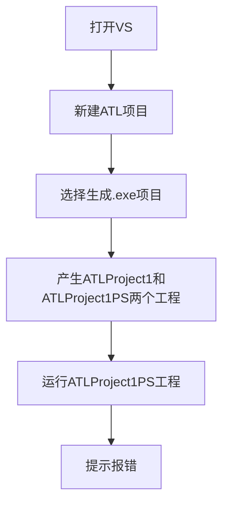
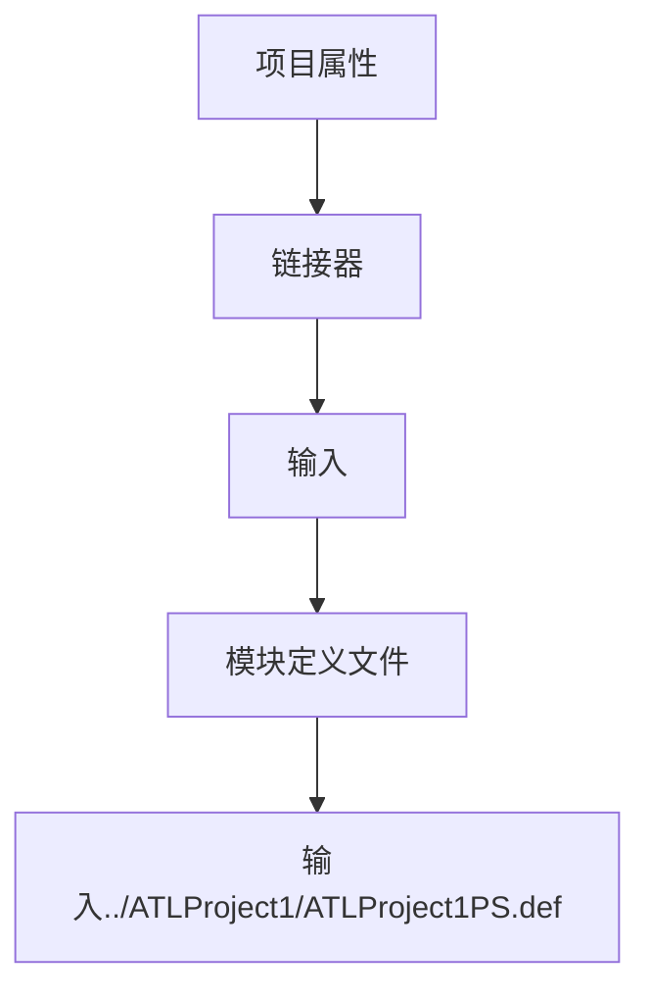

# 问题

报错信息：

```
EXEC : error : MIDL will not generate DLLDATA.C unless you have at least 1 interface in the main project.
```

提示信息：

```
if exist dlldata.c goto :END
echo Error: MIDL will not generate DLLDATA.C unless you have at least 1 interface in the main project.
Exit 1
:END
```

## 操作过程



## 错误原因

看似是说没有留接口，但是反过来仔细一想，VS 自带的模板应该不会这么麻烦，应该会自动生成才对，因此错误并不可能是接口问题。

再注意提示信息`if exist `，这很明显就是一个生成前事件，因此如果修改`dlldata.c`文件位置就应该能解决问题。

代理/存根（PS）项目有一个预构建事件，用于检查`dlldata.c`的存在。但是，由于此文件与代理/存根项目`.vcxproj`不在同一文件夹中，因此找不到该文件。更改所有配置/平台的 Pre-Build 事件，以便它在父文件夹中查找`dlldata.c`

其次在链接代理/存根项目时，由于相同的原因，链接器将找不到`ATLProject1ps.def`,因为它位于`ATLProject1`文件夹中。
## 解决方法

### setp one

修改预构建事件

```
if exist ../ATLProject1/dlldata.c goto :END
echo Error: MIDL will not generate DLLDATA.C unless you have at least 1 interface in the main project.
Exit 1
:END
```

### setp two

修改模块定义文件的位置



## 相关文章

- [[windows-c-drive-cleanup-guide|Windows C盘清理完全指南：安全释放系统空间]]
- [[winpe-pecmd-commands|WinPE下的PECMD命令详解]]
- [[vs-atl-exe-cannot-generate-dll|VS ATL的exe模板无法生成dll的解决方案]]
