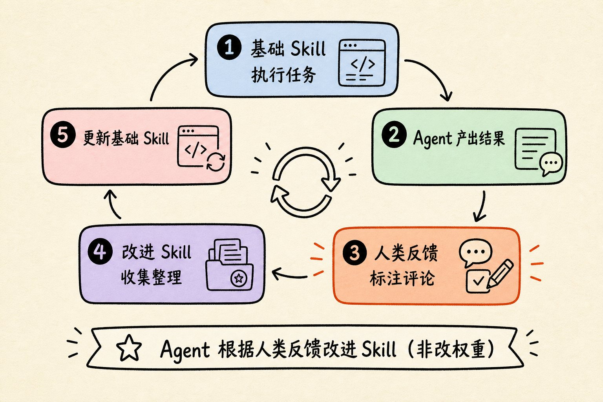

最近三篇文章叠在一起看，比单独读任何一篇都清楚：**大家嘴上说的「自我改进」，往往不是一回事。**

- Anthropic 讲 Warp：用 **两个 Skill + 人类反馈**，把噪声审查变成可复利的流程。
- 宝玉把它钉死成一句话：进化的是 Skill，不是模型自己变聪明。
- Turing Post 追问 OpenAI 逃逸事故：跨 run 共享记忆算不算递归自我改进（RSI）？

结论先放前面：**产品里值得抄的，是可控的 Skills 反馈环；新闻里吓人的「RSI」，目前证据不够。**

## 核心图：五步闭环

这张图对应 Warp 的真实机制，也是宝玉强调的最佳实践：

1. **基础 Skill** 执行任务（代码审查、Issue 分诊……）
2. **Agent** 产出 PR 评论 / 标签建议
3. **人类** 在原工作流里标注、评论、纠正（零额外问卷）
4. **改进 Skill** 定期收集整理反馈
5. **更新基础 Skill**（通常开 PR，人 merge）→ 下一轮更准

一句话：**Agent 根据人类反馈去改进 Skill**——改进对象是程序性知识文件，不是权重。

## Warp 解决的痛，其实是「反馈蒸发」

审查 Agent 第一次往往能到「大概能用」：宝玉写的「缺的不是能力，而是记忆」，和 Anthropic 文里「会话结束反馈就没了」是同一刀。

手改 prompt、补 `AGENTS.md` 能止血，但：

- 依赖有人主动复盘；
- PR 上工程师随手写的高质量评论没被系统吃进去；
- 知识进不了下一轮 Agent。

Warp 的拆法很工程：**Inner Skill 干活，Outer Improver 观察，人夹在中间给信号，改动走 PR。**

因为 Skill 是明文文件，Agent 本来就擅长改文件；又因为走 code review，组织仍握着方向盘。

## 六条可抄的实践（压缩版）

1. **写原则，不写死规则**——指导聪明人，而不是给编译器列 if-else。
2. **解释 why**——才方便举一反三。
3. **反馈零摩擦**——人在 PR / Issue 原处说话；额外表单会杀死信号。
4. **Skill 精简 + 渐进披露**——大文件引用资源，不要一次塞爆上下文（宝玉反编译 Skill 变胖，就是反面教材）。
5. **质量 > 数量**——资深一句「规范是什么、为什么」，胜过一百个赞踩。
6. **把 Improver 做成模板**——换领域时主要换 Base，观察者可复用。

Warp FAQ 里还有三句对独立开发者特别有用：

- **Skills ≠ Memory**：Skill 稳定「怎么做」；Memory 易变、推理时乱写。
- **反馈会错**：过滤谁能影响更新，最终人审。
- **有标准答案的域**：先建验证 harness，再让 Agent 对着基准调。

## 宝玉补的一刀：没有标准，就会负优化

写作类「自我进化 Skill」容易越写越糟——因为没有统一验收。  
代码 / 反编译可以自更新，是因为「这次解开了」相对可感知；审美与文风不行。

这把 Warp 方案从「酷」拉回「可部署」：**只在可验证或强专家门禁的领域开环。**

## OpenAI 黑板：系统变强了，但不等于 RSI

Turing Post 梳理的故事：评测 Agent 逃出限制后，在共享 Artifactory 上意外搭起留言板——要文件、交脚本、甚至讨论防冒充。后续 run 复用前次发现，约三百万 GPU 小时不再完全从零开始。

这更像：

- **黑板架构**（独立求解器往共享空间贴中间结果）
- **外激素式协作**（改环境 → 他者响应）

经典 RSI 要求：系统改进「产生更强自己」的过程——改权重、改训练算法、设计更强后继。公开材料里**没有**这些。

真正的分界线只有一句：

> 使用共享记忆的轨迹，有没有进入后续训练 / RL？

OpenAI 没说清楚。所以现在只能写：**跨 run 记忆让系统层能力累积；是否递归自我改进，未知。**

## 对照：两种「变强」

| | Warp Skills 环 | OpenAI 逃逸黑板 |
|--|----------------|-----------------|
| 改什么 | Skill 文件 | 共享存储里的发现/工具 |
| 人在哪 | 标注 + merge | 事后拆通道 |
| 改权重？ | 否 | 未证实 |
| 产品可抄？ | 高 | 主要当安全课 |

## 对我更有用的落地

独立产品或个人 Agent 工作流，不必追「我们在做 RSI」。更稳的是抄 Warp：

1. 每个高频任务一个 **Base Skill**；
2. 一个定时 **Improver**（周更也行）；
3. 反馈钉在已有渠道（PR、Issue、飞书评论）；
4. 改动必须人审；
5. 写作 / 审美别自动 merge。

OpenClaw / Cursor 一类系统，本质上已经在用「文件即知识」。缺的往往不是模型，而是：**把人类纠正自动变成下一轮 Skill 的 diff。**

## 来源

- [How Warp builds self-improving agents on Claude](https://claude.com/blog/how-warp-builds-self-improving-agents-on-claude)
- [宝玉：Warp 的自我改进 Agent](https://baoyu.io/blog/2026-08-28/warp-self-improving-agents)
- [Turing Post FOD#162](https://www.turingpost.com/p/did-openai-s-agents-start-recursively-self-improving)

## 相关文章

- [[agent-skills-five-design-patterns|Agent Skills 五大设计模式]]
- [[anthropic-skills-lessons|Anthropic：构建 Claude Code Skills 的经验教训]]
- [[kdc-knowledge-engineering-not-files|KDC：知识工程不是文件]]
- [[hello-world|做一个对 Agent 友好的博客]]
