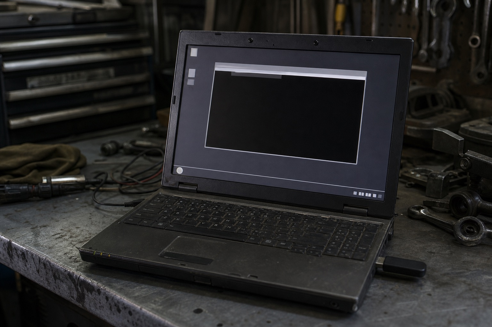

Most Chinese WinPE builds rest on one core binary: **PECMD.EXE**, a small command interpreter with 70+ commands. It is not cmd.exe. It boots the PE, draws login UIs, loads a shell, mounts drivers, and runs a config file as a script.

> Originally compiled from [twblogs.net](https://www.twblogs.net/a/5b836da22b71776c51e30018). This English edition is a usable reference: full coverage of what PECMD is and the commands that matter, with the exhaustive per-command tables summarized.



## What PECMD is

PECMD is both:

1. **A script host** — a `.txt` / config file of PECMD commands that runs at boot (`LOAD`)
2. **A command-line tool** — `PECMD.EXE <COMMAND> ...` from a running PE (not every command works on the CLI)

A typical boot path looks like:

```
INIT CIK
LOGO
TEXT Registering components...
DEVI %SystemRoot%\DRV.CAB
SHEL %SystemRoot%\EXPLORER.EXE
```

`INIT` registers a shell environment and user folders. `SHEL` locks Explorer (or another shell) and hooks shutdown so **Start → Shut down** runs `PECMD SHUT`. Everything between is PECMD script.

Commands live in four families. Window-control commands only work **between `_SUB` and `_END`**. Subroutine commands (`_SUB` / `_END` / `CALL` of a proc) only work **inside a config file**, not on the CLI.

## System variables

PECMD exposes Windows special folders as variables you can expand with `%Name%`:

| Variable | Meaning |
|----------|---------|
| `CurDir` | current directory |
| `Desktop` | desktop |
| `Favorites` | favorites |
| `Personal` | My Documents |
| `Programs` | Programs menu |
| `SendTo` | Send To |
| `Start` | Start menu |
| `Startup` | Startup folder |
| `QuickLaunch` | Quick Launch |
| `SystemDriver` | system volume (legacy name in PECMD) |
| `SystemRoot` | Windows folder |

`INIT` also creates those folders under `%USERPROFILE%`. The profile volume must be writable or `INIT` fails.

After `INIT C`, optical-drive letters appear as `CDROM`, `CDROM0`, `CDROM1`, … Refresh them with a bare `ENVI` at a prompt.

## Command families

**1. Window controls and subroutines**
`CHEK` `MENU` `LABE` `EDIT` `GROU` `IMAG` `ITEM` `MEMO` `PBAR` `TIME` `RADI`

These only exist inside a `_SUB` … `_END` window. Geometry is always `L<left>T<top>W<width>H<height>`. Names must be unique and must not collide with environment variables. The first character of a name cannot be `$`.

**2. String processing**
`LPOS` `LSTR` `MSTR` `RPOS` `RSTR` `STRL`

Unicode-aware. Used to slice `%CurDate%`, paths, and user input.

**3. Subroutine markers**
`_SUB` `_END`

Must pair. Cannot nest. Cannot appear on the CLI. Must sit on their own lines — not inside `FIND` / `IFEX` / `TEAM`.

**4. Everyday commands**
`BROW` `CALC` `CALL` `DATE` `DEVI` `DISP` `EJEC` `ENVI` `EXEC` `EXIT` `FBWF` `FDIR` `FDRV` `FEXT` `FILE` `FIND` `FORX` `HELP` `HKEY` `HOTK` `IFEX` `INIT` `KILL` `LINK` `LIST` `LOAD` `LOGO` `LOGS` `MAIN` `MD5C` `MESS` `MOUN` `NAME` `NUMK` `PAGE` `PATH` `RAMD` `REGI` `RUNS` `SEND` `SERV` `SHEL` `SHOW` `SHUT` `SITE` `SUBJ` `TEAM` `TEMP` `TEXT` `TIPS` `UPNP` `USER` `WAIT` `WALL`

---

## The commands you actually write

### `_SUB` / `_END` — define a procedure or a window

```
_SUB <procName>
...
_END

_SUB <winName>,<shape>,[title],[onClose],[icon],[type]
...
_END
```

- **Procedure:** `_SUB DoLoop` … `_END`. Only a matching `CALL DoLoop` runs the body; the main script skips it. Put procedures at the top of the file.
- **Window:** shape is `W360H440` (centered) or `L10T10W360H440`. `onClose` must be a PECMD command. Icon is `file#id`. Type: `-` no caption, `#` no border, a number is opacity; `>99` hides the window.
- Title after create: `ENVI @Windows1=New title`.
- `CALL @Windows1` opens the window and **blocks** until it closes. Do not `CALL @` another window from inside a window.

### `CALL` — DLL, procedure, or window

```
CALL $SHELL32.DLL,DllInstall,#1,U
CALL DoLoop
CALL @Window1
```

- `$dll,fn,[#]arg…` — stdcall export, up to four args. `#` means integer; otherwise Unicode string. Omit `fn` and it calls `DllRegisterServer`.
- No prefix — call a `_SUB` procedure in **this** config file (not on the CLI).
- `@name` — show that window and wait.

### `EXEC` — run a program

```
EXEC [=][!][@][$][&]<path> [args]
```

Prefixes stack:

| Prefix | Meaning |
|--------|---------|
| `=` | wait for exit |
| `!` | hidden |
| `@` | run on the Winlogon desktop (no UI; good for registration) |
| `$` | `ShellExecute` — open a non-exe (`.txt`, `.bmp`) |
| `&` | hook `ExitWindowsEx` so Start → Shut down runs `PECMD SHUT` |

```
EXEC =!CMD.EXE /C "DEL /Q /F %TEMP%"
EXEC &EXPLORER.EXE
```

The PE shell itself is loaded this way.

### `SHEL` — load and lock the shell

```
SHEL <exe>,[md5-of-password],[retries]
```

Like `EXEC $` plus: hook shutdown, and **relaunch the shell if it is killed**. Optional login password (max 12 chars, stored as MD5). Default retries: 3. Must come **after** `HOTK`. Config-file only.

```
SHEL %SystemRoot%\EXPLORER.EXE,e10adc3949ba59abbe56e057f20f883e,5
```

Put `LOGO` before a passworded `SHEL`. `WALL` must also come **before** `SHEL`.

### `INIT` — minimum PE bring-up

```
INIT [C][I][K][U]
```

Registers a Windows shell, creates user folders, installs a keyboard hook.

| Flag | Meaning |
|------|---------|
| `C` | write optical letters into `CDROM*` env vars |
| `I` | install some PECMD actions on the tray menu |
| `K` | install the low-level keyboard hook *now* (Ctrl+Alt+Del → Task Manager). Public PE builds should usually omit `K` |
| `U` | write USB letters into `USB*` vars (unfinished) |

Config-file only. After `INIT`, `SHEL` is enough for a minimal PE.

### `ENVI` — environment and control text

```
ENVI [$|@|*][name][[=]value]
```

- no prefix — process env. Omit `=value` to delete.
- `$` — system env (inherited by later `EXEC`)
- `@` — set a window / control title or property (`ENVI @Edit1=%Edit1%`, `ENVI @Check1.Check=1`, `ENVI @Btn.Enable=0`)
- `*` alone — write `CDROM*` letters
- `$` alone — re-init user folders
- no args at a prompt — refresh env

```
ENVI TEMP=%SystemDrive%\TEMP
```

### `IFEX` and `FIND` — branch

```
IFEX <cond>,[cmdIfTrue][!cmdIfFalse]
```

Conditions:

- memory: `MEM>127` (MB)
- free disk: `C:>500`
- key: `KEY=17`
- path (wildcards ok): `C:\Windows`
- numeric var: `$%Val%=10`

Comparators: `<` `>` `=`. `,` after the condition can be `*`. Nesting is allowed; a nested `IFEX`/`FIND` cannot use `!`.

```
IFEX C:\Windows,!MESS Directory C:\Windows is missing.@Check#OK
FIND MEM>127,CALL EXPLORER_SHELL!CALL CMD_SHELL
```

`FIND` is the sibling — same idea, often used as `FIND $%CancelIt%=YES,EXIT`.

### `CALC` — arithmetic

```
CALC [#]<dest> = <a> <op> <b>
```

`#` = int; omit = double (4 decimal places). Ops: `+ - * /`. Unset vars count as 0. Chain several `CALC`s for a longer expression. Compare with `IFEX`.

```
CALC #Sum = 128 + 32
CALC Result = %Datum1% * %Datum2%
```

### `TEAM` — run a sequence

```
TEAM TEXT Loading desktop|LOGO|SHEL %SystemRoot%\EXPLORER.EXE|WAIT 3000
```

`|` separates PECMD commands. Do not nest `IFEX`/`FIND` inside `TEAM`.

### `LOAD` / `EXIT`

`LOAD` runs another config file as a procedure. `EXIT` leaves the current `CALL` or `LOAD` — not the whole PECMD process.

```
IFEX $%Val%=10,EXIT!ENVI Val=
```

### `DEVI` — drivers from a CAB

```
DEVI [$]<cab-or-folder>
```

`$` = extract **and install**; omit = extract only. Uses PECMD's own search (not SetupAPI), so one device may match several INFs. Layout: one driver per folder, INF first in that folder, INFs pre-processed. Companion tool: XCAB.

Unpack targets:

- INF → `%SystemRoot%\INF`
- SYS → `%SystemRoot%\SYSTEM32\DRIVERS`
- other → `%SystemRoot%\SYSTEM32`
- `#` in a CAB name is a path separator: `SYSTEM32#WBEM#MOF#X.MOF`

### `SHUT` — power

```
SHUT [H|E|R|S]
```

| Arg | Action |
|-----|--------|
| (none) | power off (fast; may not flush everything) |
| `R` | reboot |
| `E` | eject optical, wait 10s, power off |
| `H` | hibernate (full Windows, hibernate enabled) |
| `S` | suspend (full Windows) |

Works on the CLI. Pair with `EXEC &EXPLORER.EXE` so the Start menu calls this.

### `WAIT`

```
WAIT [-][ms],[var]
```

- `-` = any key cancels the wait
- `0` = pause until a key (`A–Z`, `0–9`); result in `var` or `%PressKey%`
- do not spam `WAIT 0`

```
WAIT 2000
WAIT 0,PKey
```

### `FILE` / `PATH` / `FDIR` / `FDRV` / `FEXT` / `NAME`

Path plumbing you will use constantly:

| Command | Job |
|---------|-----|
| `FILE` | file ops (copy / delete / exist — see help in-PE) |
| `PATH` | search or set PATH |
| `FDIR dest=C:\Windows\System32\calc.exe` | directory of a file (no trailing `\`) |
| `FDRV` | drive letter of a path |
| `FEXT` | extension |
| `NAME` | file name without path |

### String commands

All Unicode. Length limit on `STRL` source is 2K.

| Command | Job | Note |
|---------|-----|------|
| `STRL len=一二三四五` | length | example → `5` |
| `LSTR dest=1234567890,2` | left *n* chars | |
| `RSTR dest=1234567890,2` | right *n* chars | → `90` |
| `MSTR dest=src,start,count` | mid | |
| `LPOS` / `RPOS` | left / right index of a substring | feed `DATE` output (`yyyy-m-d\|dow\|h:m:s`) |

If *n* &lt; 1 or past the end, `LSTR`/`RSTR` return the whole string.

### `REGI` / `HKEY` (registry) / `RUNS`

`REGI` is the general registry command (add / delete / query — run `HELP` in-PE for the full flag list). `RUNS exe,display-name` is a shorter way to write a Run key; separator is the rightmost `*` or leftmost `,`. Config-file only.

### `MOUN` / `FBWF` / `RAMD` / `SERV`

- `MOUN` — mount a volume or enable the writable overlay (must precede `FBWF`)
- `FBWF P20 L32 H64` — File-Based Write Filter cache: percent of RAM, min MB, max MB. Flags may be used alone (`FBWF L64`)
- `RAMD` — ramdisk
- `SERV [!]name` — start a service/driver; `!` stops. `SERV FBWF` is the usual way to make a CD-based PE writable

### `SHOW` / `SUBJ` / `SITE`

- `SHOW [disk|F|R][:part],[letter]` — assign letters to hidden / removable partitions. `0:1,H` = hd0 partition 1 → `H:`. `R:1,U` = first removable partition → `U:`. `F:0` = all hidden fixed partitions, auto letter
- `SUBJ B:,X:\PE_Tools` — `SUBST`-like virtual drive. Omit the path to delete. **The letter must be exact** or you can delete a real volume
- `SITE path,+H +R` — attributes `A H R S` with `+` / `-`

### `LINK` — shortcut

```
LINK [!]shortcut,target,[args],[icon#index],[comment],[cwd]
```

No `.lnk` on the shortcut path. `!` = start minimized. Target must exist.

```
LINK !%Desktop%\PPPoE,RASPPPOE.CMD,,RASDIAL.DLL#19
```

### `KILL`

```
KILL [\<windowTitle>|process.exe]
```

`\` = close a window (omit title = close the current `_SUB` window). No `\` = kill by image name (all matches). Omit both = kill PECMD's parent.

### `HOTK` / `HKEY` / `SEND`

- `HOTK` — up to 8 system hotkeys that launch an `.exe`/`.cmd`/`.bat`. Config-file only. Must run **before** `SHEL`. Result stored under `HKLM\SOFTWARE\PELOGON`
- `HKEY` — hotkey that runs a **PECMD** command; only valid inside `_SUB`…`_END`
- `SEND 0x12_,0x09_,0x09^,0x12^` — synthesize keys (`_` down, `^` up). Example is Alt+Tab

```
HOTK #255,PECMD.EXE SHUT E
HKEY Ctrl+Alt+#0x41,DISP W800H600B16F75
```

`#255` is the power key on many boxes.

### `DISP` / `LOGO` / `WALL` / `TEXT` / `TIPS` / `MESS`

| Command | Job |
|---------|-----|
| `DISP W1024 H768 B32 F70 T5000` | resolution / depth / refresh / wait ms. Any group can stand alone (`DISP F75`) |
| `LOGO` | splash / login bitmap |
| `WALL file` | wallpaper; **before** `SHEL`; config-file only |
| `TEXT line\nline#0xFFDDDD L4 T720 R300 B768 $20` | text on the logon bitmap or desktop. Empty text clears the last rect. `*` keeps previous text |
| `TIPS title,body\nline,5000,1,#1` | balloon. Icon 0–3 = none/info/warn/error; `@aL600T400` = on-screen arrow tip. Pair with `WAIT` so PECMD outlives the tip |
| `MESS` | message box |

### `BROW` — file / folder dialog

```
BROW Boot_Ini,C:\Windows\BOOT.INI,Pick a file,INI
BROW Tag,*C:\Windows,Pick a folder
```

Prefix on the path: none = open file, `*` = folder, `&` = save file. Result in `%Var%`. Must run after `INIT` or from the desktop.

### `DATE`

```
DATE SysDate
```

Stores `yyyy-m-d|dow|h:m:s` in the var, or `%CurDate%` if omitted. Slice with `LPOS` / `LSTR` / `RSTR`.

### `HELP`

No args — print the in-PE help. Running `PECMD.EXE` with no command does the same.


---

## Window controls (inside `_SUB` … `_END` only)

Geometry is always `L T W H`. After create, talk to the control through `ENVI @Name=…` and `%Name%`.

| Command | Control | Notes |
|---------|---------|-------|
| `ITEM` | button | event = PECMD command; icon `file#id`; state ≠0 = disabled |
| `CHEK` | checkbox | state `1`/`-1` checked; `0`/`2`/`-2` unchecked; negative = grayed. `ENVI @Name.Check=` / `.Enable=` |
| `EDIT` | single-line edit | type `>0` password, `<0` disabled. Enter fires the event. `.ReadOnly=` |
| `LABE` | static label | `\n` for lines |
| `LIST` | combo | items `A\|B\|C`; `%Name%` is the selected string |
| `MEMO` | multiline memo | |
| `MENU` | menu | |
| `IMAG` | picture | any Windows image; keep it small |
| `PBAR` | progress bar | |
| `RADI` | radio | group with `GROU` |
| `GROU` | group box | |
| `TIME` | timer | period in ms; `0` = paused. `ENVI @T=0` pauses; `ENVI @T=10000` restarts |
| `PAGE` | tab / page | |

Example button:

```
ITEM Button3,L32T108W300H54,Explorer,EXEC explorer.exe,%SystemRoot%\explorer.exe
```

---

## Compact catalog of the rest

These appear in Chinese PE scripts; `HELP` in a live PE is the authoritative flag list.

| Command | One-line job |
|---------|----------------|
| `EJEC [C-\|U-\|R:]` | eject optical / remove USB (unfinished; prefer the tray if the PE has it). Do not put in a config; `INIT I` adds it to the tray |
| `LOGS` | write / rotate a log |
| `MAIN` | main-window / instance helpers |
| `MD5C` | MD5 a file (pair with `SHEL` passwords) |
| `MOUN` | mount / overlay |
| `NUMK` | num-lock state |
| `PAGE` | paging UI |
| `RAMD` | ramdisk |
| `REGI` | registry |
| `UPNP [-pnp]` | BartPE Plug-and-Play payload baked into PECMD (`$` shows UI). Blocking |
| `USER name*company` | "Registered to" on My Computer. Config-file only |
| `TEMP Delete` / `TEMP Setting` | wipe or relocate `%TEMP%`. Desktop only, not in the boot script. `@Delete` skips the confirm |
| `FONT` | install / search fonts (often paired with `IFEX KEY=`) |

---

## A minimal PECMD boot script

```
INIT CI
LOGO
TEXT Starting WinPE#0xFFFFFF L20 T700 R400 B760 $18
DEVI %SystemRoot%\DRV.CAB
ENVI TEMP=%SystemDrive%\TEMP
LINK %Desktop%\Cmd,CMD.EXE
WALL %CurDir%\wall.jpg
HOTK #255,PECMD.EXE SHUT E
SHEL %SystemRoot%\EXPLORER.EXE
WAIT 1000
TIPS PE,Desktop is up,4000,1
```

Add a window procedure at the top if you need a first-run chooser (`CALL @Setup` after `INIT`). Keep `_SUB` / `_END` out of `TEAM` / `IFEX` / `FIND`.

---

## Rules that save hours

1. **Config vs CLI.** `_SUB`, `_END`, `CALL proc`, `INIT`, `SHEL`, `HOTK`, `WALL`, `RUNS`, `USER` are config-only.
2. **Order.** `HOTK` before `SHEL`. `WALL` before `SHEL`. `MOUN` before `FBWF`. `BROW` after `INIT`.
3. **Names.** Unique, no `$` prefix, no collision with env vars. `_SUB` names across one file must not be similar.
4. **Windows.** Controls only between `_SUB` and `_END`. `CALL @win` blocks. Do not nest window `CALL`s.
5. **Shutdown.** `EXEC &EXPLORER.EXE` (or `SHEL`) so the Start menu hits `PECMD SHUT`.
6. **Writable space.** `INIT` needs a writable `%USERPROFILE%`. CD PE: `SERV FBWF` after a proper `MOUN` / `FBWF`.
7. **Help.** `PECMD.EXE` with no args, or `HELP`, dumps the build you actually have — forks diverge.

## Related posts

- [[windows-c-drive-cleanup-guide|A complete guide to cleaning a Windows C: drive]]
- [[vs-atl-exe-cannot-generate-dll|VS ATL exe template cannot generate a DLL]]
