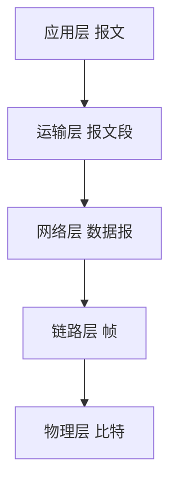

## 本章要义

网络是互连的自治计算机。因特网是网络的网络：边缘是主机上的进程，核心是路由器做分组转发。分层让「主机 1 怎么把数据交给主机 2」变成各层各管一段。

下行封装、上行解封。对等层靠水平协议对话，相邻层靠垂直服务。

## 源笔记勘误

- 「主机 1 向主机 2 发送数据」重复了十一遍，全是空的。
- 「三种交换的比较」「TCP/IP 的体系结构」是空标题。
- 「是非国际标准 TCP/IP」应为**事实上的**国际标准。
- 时延与利用率写了 \(D\) 和 \(D_0\)、\(U\)，公式没写出来：\(D=D_0/(1-U)\)。
- 带宽单位里把计算机的 \(K=1024\) 和通信的 \(k=10^3\) 搅在一起。谈速率时，\(1\ \mathrm{kb/s}=10^3\ \mathrm{b/s}\)。
- RFC 四阶段里的「草案标准」后来取消了，现在是建议标准 → 因特网标准。了解即可。
- 「仅次于全球电话网的第二大网」过时。

## 组成与交换

边缘：端系统，真正通信的是**进程**。核心：路由器存储转发。

- **电路交换**：建立 → 通信 → 释放。独占通路，适合连续话音，突发数据时线路浪费。
- **分组交换**：报文切成带首部的分组，逐段占用。高效、灵活、迅速（可无连接）、可靠靠协议。代价：排队时延 + 首部开销。
- **报文交换**：整报文存储转发，节点缓存大、时延大，考点里常和前两种对比。

C/S：客户主动、须知服务器地址；服务器被动、常驻。P2P：每个主机既是客户又是服务器。

## 性能

总时延 = 发送（传输）+ 传播 + 处理 + 排队。

发送时延 = 帧长 / 发送速率。传播时延 = 距离 / 电磁波速。二者不是一回事。

时延带宽积 = 传播时延 × 带宽，是「管道里的比特数」。利用率升高，排队时延按 \(D_0/(1-U)\) 涨。吞吐量受带宽限制，通常小于标称速率。

## 体系结构

协议三要素：语法、语义、同步。协议水平（对等实体），服务垂直（下层向上，经 SAP）。

教学用五层：应用 / 运输 / 网络 / 数据链路 / 物理。TCP/IP 四层把下面叫网络接口。OSI 七层是法律标准，失败于复杂和周期；TCP/IP 是事实标准。

internet（互连网，泛称）≠ Internet（因特网，TCP/IP 那张全球网）。

## 408 易错点

- 路由器根据分组**首部地址**转发，输入输出端口之间没有直连线。
- 客户程序必须知道服务器地址，反过来不成立。
- 「带宽」在本题里多半指最高数据率，不是模拟频带。

## 考研题精练

**题 1（时延计算）**  
主机甲向乙发送一个 1000 字节的分组。链路带宽 \(10\,\mathrm{Mb/s}\)，甲乙相距 \(200\,\mathrm{km}\)，电磁波速 \(2\times 10^8\,\mathrm{m/s}\)。发送时延和传播时延分别是（ ）。

A. \(0.8\,\mathrm{ms}\)，\(1\,\mathrm{ms}\) B. \(0.8\,\mu\mathrm{s}\)，\(1\,\mathrm{ms}\) C. \(800\,\mu\mathrm{s}\)，\(1\,\mu\mathrm{s}\) D. \(0.1\,\mathrm{ms}\)，\(1\,\mathrm{ms}\)

**解答：** 发送时延 \(=8000/(10\times 10^6)=0.8\,\mathrm{ms}\)。传播时延 \(=2\times 10^5/(2\times 10^8)=1\,\mathrm{ms}\)。二者单位都是时间，但公式完全不同。**选 A。**

**题 2**  
主机 H1 经两台路由器到 H2（共 3 段等速链路），每段 \(50\,\mathrm{Mb/s}\)，分组长 \(800\,\mathrm{B}\)，忽略传播与处理。H1 连续发送 10 个分组，从开始发送到 H2 收完的最短时间是（ ）。

A. \(1.280\,\mathrm{ms}\) B. \(1.536\,\mathrm{ms}\) C. \(3.840\,\mathrm{ms}\) D. \(0.384\,\mathrm{ms}\)

**解答：** 一段发送时延 \(\tau=6400/(50\times 10^6)=128\,\mu\mathrm{s}\)。存储转发可流水：\(T=(N+k-1)\tau=(10+3-1)\times 128=1536\,\mu\mathrm{s}\)。把 3 段串成 \(10\times 3\times\tau\) 会多算中间重叠。**选 B。**

**题 3**  
五层模型里，自下而上第一个提供端到端通信的是（ ）。

A. 网络层 B. 运输层 C. 数据链路层 D. 物理层

**解答：** 网络层是主机到主机的数据报转发；进程到进程从运输层开始。链路层和物理层只覆盖一跳。**选 B。**

## 继续阅读

比特怎么上媒体：[[cn/02-physical|物理层]]。
