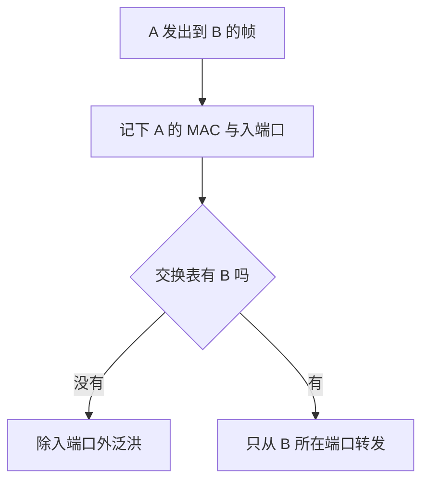

## 本章要义

链路层把不可靠的点到点或广播媒体变成「帧」的交付。三个基本问题：成帧、透明、检错。广播网上还要解决谁先说话（MAC）。

## 源笔记勘误

- 透明传输写成「透明的内容是转义字符」。透明的是**用户数据**，转义字符是实现手段，用户看不见。
- 极限信道利用率 \(S_{max}\) 公式空着。理想情况下 \(S_{\max}=T_0/(T_0+\tau)\)。
- 以太网帧格式缺前导码、目的/源地址、最小 64 字节。
- 交换机自学说「主机 A 就发送广播帧」——是**交换机**在表中没有目的项时**泛洪**，不是主机改发广播。
- CRC 例题是对的；「CRC 是方法，FCS 是冗余码」这句也要保住。

## 点对点：三个问题 + PPP

成帧：首尾定界。透明：数据里出现定界符就插入转义（字节填充）。差错：CRC 算 FCS，链路层通常只检不纠，错了丢帧。

PPP：F 定界，A/C 现已无用，信息 ≤1500，FCS 用 CRC。拨号入 ISP：物理接通 → LCP 谈参数 → NCP 分配 IP → 用完反向拆。

## 广播：CSMA/CD 与以太网

争用期 \(2\tau\)。碰撞后截断二进制指数退避：第 \(k=\min(重传次数,10)\) 次从 \(\{0,\ldots,2^k-1\}\) 取 \(r\)，等 \(r\cdot 2\tau\)。

MAC 48 位，一块网卡一个。以太网帧：目的 6 + 源 6 + 类型 2 + 数据 46–1500 + FCS 4，加上前导。最短 64 字节是为了发完之前还能听到碰撞。

Hub 在物理层，一个碰撞域，不隔离、不缓存、不能混速。网桥/交换机在链路层，按 MAC 转发，隔离碰撞域，自学习交换表，未知则泛洪。VLAN 用 802.1Q 标签划广播域。

百兆以上全双工不再用 CSMA/CD。源笔记最后「集线器不检测媒体、网桥转发前做 CSMA/CD」：半双工共享媒体时，网桥的输出端口仍要按以太网规则发送。

信道利用率（源笔记公式空着）：理想、无碰撞、帧发完立刻轮到下一站，\(S_{\max}=T_0/(T_0+\tau)\)。\(T_0\) 是发一帧时间，\(\tau\) 是单程传播。电缆越长或帧越短，利用率越差——这就是最小帧 64 字节、冲突域不能无限拉长的定量原因。

## 高速以太网与扩展（源提纲后半章）

| 名称 | 介质/要点 | CSMA/CD |
|---|---|---|
| 10BASE-T | 双绞线，集线器星型 | 半双工要 |
| 100BASE-T | 百兆，两对或四对 UTP | 全双工可关 |
| 吉比特以太网 | 光纤或 4 对五类线；半双工曾用载波延伸/分组突发把有效帧拉到 512 字节当量 | 几乎只用全双工 |
| 10 吉比特 | 只全双工，只光纤，面向骨干 | 无 |

**物理层扩展**：光纤 + 中继器/光纤调制，延长距离，**仍是一个碰撞域**，中继器有个数限制（5-4-3 一类经验）。  
**链路层扩展**：网桥/交换机隔离碰撞域，每个端口自己是一个域，站点可全速。自学习 + 泛洪 + 生成树防环。

宽带接入（链路相关、常和本章一起考）：ADSL 电话线高频上网；HFC 有线电视改造；FTTx。它们下面仍可能跑 PPP/PPPoE 或以太网。

以太网帧字段：前导 7 + 帧起始定界 1 + 目的 MAC 6 + 源 MAC 6 + 类型 2 + 数据 46–1500 + FCS 4。最短 64 从目的地址数到 FCS（不含前导）。类型 0x0800 是 IPv4。

## 408 易错点

- CRC 能检错，不保证纠错；无差错 ≠ 可靠（可靠还要确认重传，那是运输层或 LLC）。
- 交换机隔离碰撞域，默认不隔离广播域；VLAN 才隔离广播。
- 最小帧、争用期、电缆长度绑在一起，改一端要改另一端。

## 考研题精练

**题 1（CRC）**  
生成多项式 \(G(x)=x^3+x+1\)（比特 1011），数据 1010。CRC 余数是（ ）。

A. \(001\) B. \(011\) C. \(101\) D. \(111\)

**解答：** 数据后补 3 个 0 得 1010000，模 2 除以 1011，余数 \(011\)。发出 1010011 再除应以能除尽为验。CRC 是算法，FCS 才是那几位冗余。**选 B。**

**题 2**  
以太网规定最短帧 64 字节，主要是为了（ ）。

A. 让 CRC 够算 B. 发送期间仍能检测到碰撞 C. 对齐 IP 最小长度 D. 填满交换机缓存

**解答：** 争用期 \(2\tau\)。帧太短会发完才听到碰撞，发送方误以为成功。最小帧、电缆长度和争用期绑在一起。**选 B。**

**题 3**  
交换机收到目的 MAC 不在交换表中的单播帧时，正确做法是（ ）。

A. 主机改发广播 B. 丢弃该帧 C. 除入端口外向其余端口泛洪 D. 一律交给默认网关

**解答：** 未知单播由**交换机**泛洪，不是主机改发广播。同时把源 MAC 写入入端口，供回程单播。**选 C。**

## 继续阅读

帧里的 IP 数据报怎么跨网：[[cn/04-network|网络层]]。
