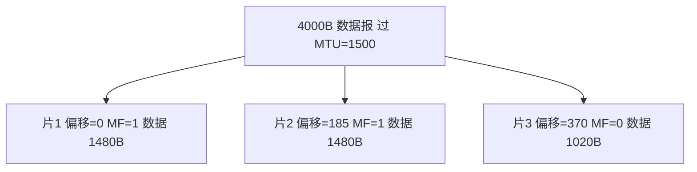

## 本章要义

因特网网络层向上只提供**无连接、尽最大努力交付**的数据报服务。路由器按最长前缀匹配转发。IP 配套 ARP、ICMP、IGMP（RARP 基本退役）。

片偏移以 8 字节为单位：\(1480/8=185\)。标识相同，MF 标明后面还有没有。

## 源笔记勘误

- 虚电路 vs 数据报对照表是空的。
- 结尾写成「尽最大努力**交互**」，应为**交付**。同一句还复制了两遍。
- IP 首部没写 DF/MF 标志、源/目的地址。片偏移单位 8 字节这句对。
- 「划分子网 / 使用子网转发 / CIDR」三节空，内容其实写在分类地址那一段，阅读时不要以为没讲。
- ICMP 源点抑制现代不用了。
- 多播几乎为空。

## 两种服务（补表）

| | 虚电路 | 数据报 |
|--|--------|--------|
| 连接 | 先建立 | 不建立 |
| 地址 | 建立时完整，之后用 VC 号 | 每分组带完整地址 |
| 路由 | 同一虚电路路径相同 | 每分组独立选路 |
| 故障 | 虚电路全断 | 其它路还可走 |
| 顺序 | 通常保序 | 不保证 |

因特网选数据报，把可靠留给运输层。

## IP

首部固定 20 字节起。版本、首部长度（单位 4B）、总长度、标识、**标志（DF/MF）**、片偏移（单位 8B）、TTL、协议、首部检验和、源/目的 IP。分片：标识相同，MF=1 表示后面还有。

地址：分类 → 子网（掩码）→ CIDR（前缀，路由聚合 / 超网，最长前缀匹配）。专用地址：10/8、172.16/12、192.168/16。

转发：直接交付 / 特定主机路由 / 网络前缀 / 默认路由。ARP：本网广播问 MAC，缓存映射。IP 跨链路不变，MAC 每跳都变。

ICMP 在 IP 里：差错（不可达、超时、参数、重定向）和询问（回送、时间戳）。Ping 用 Echo；Traceroute 用 TTL 递增 + 超时报告，最后用「端口不可达」。

## 路由

AS 内部 IGP：RIP 距离向量，跳数 ≤15，只和邻居换表，故障收敛慢（好消息传得快、坏消息传得慢）。OSPF 链路状态，洪泛，Dijkstra，变化才发，收敛快。

AS 之间 BGP：策略路径向量，发言人之间走 TCP，找「比较好」的路不是数学最短。

## NAT 与 VPN

NAT/NAPT 用端口把许多专用地址共享少数全球地址。VPN 在公网上加密隧道，两端用专用地址通信。

## 多播与 IGMP（源笔记几乎空白，按 408 最小集补）

单播一对一，广播一对「本网所有人」，多播一对「一组」。IPv4 多播地址是 D 类 `224.0.0.0/4`。`224.0.0.0/24` 是链路本地，路由器不转发（如 `224.0.0.1` 全主机、`224.0.0.2` 全路由器、`224.0.0.5/6` 给 OSPF）。

**IGMP**（Internet 组管理协议）跑在主机与**本网**多播路由器之间，让路由器知道「这个网段上哪些组还有组员」。它不负责跨网选路。

典型过程（IGMPv2 口径，408 够用）：

1. 主机加入组：向该组地址发 Membership Report。
2. 路由器周期性发 Membership Query（目的常为 `224.0.0.1`）。
3. 组员用 Report 应答；同一组只需一人应答（延迟随机，别人先答则抑制）。
4. 主机离开：发 Leave Group（`224.0.0.2`），路由器再发一次特定组查询确认是否还有人。

跨网靠**多播路由**（如 PIM、DVMRP 了解即可）：转发树随**组成员**变，不只随拓扑变。源笔记只写了后半句，缺协议名和 IGMP 范围。

IPv6 没有 IGMP，改用 MLD（组播监听发现），思路同类。

## 408 易错点

- 检验和只覆盖 IP 首部。
- RIP「距离加 1」是跳数，不是带宽。
- NAT 对「纯 IP、无传输层端口」的协议不友好。
- TTL 是跳数，不是秒（现代实现按跳减）。

## 考研题精练

**题 1（子网划分）**  
网络 \(192.168.10.0/24\) 用掩码 \(255.255.255.240\) 划分子网。子网个数和每个子网可用主机数分别是（ ）。

A. 16 和 14 B. 16 和 16 C. 14 和 14 D. 8 和 30

**解答：** \(240=11110000_2\)，在 /24 上再借 4 位，子网 \(2^4=16\)。主机位 4，可用 \(2^4-2=14\)（全 0 网址、全 1 广播不用）。**选 A。**

**题 2**  
一个 4000 字节的 IP 数据报（含 20 字节首部）经过 MTU=\(1500\) 的链路。各片片偏移依次是（ ）。

A. 0，185，370 B. 0，1480，2960 C. 0，1500，3000 D. 0，186，372

**解答：** 每片最多 \(1500-20=1480\) 字节数据，且须为 8 的倍数。偏移单位是 8 字节，故 0、185、370。最后一片数据 \(3980-2960=1020\)，MF=0。**选 A。**

**题 3**  
关于 RIP，下列说法正确的是（ ）。

A. 距离是带宽倒数 B. 距离是跳数，最大 15 C. 故障时坏消息传得比好消息快 D. 与所有路由器广播完整链路状态

**解答：** RIP 是距离向量，度量是跳数，16 表示不可达。好消息传得快、坏消息传得慢。链路状态是 OSPF。**选 B。**

## 继续阅读

进程之间可靠与否：[[cn/05-transport|运输层]]。
