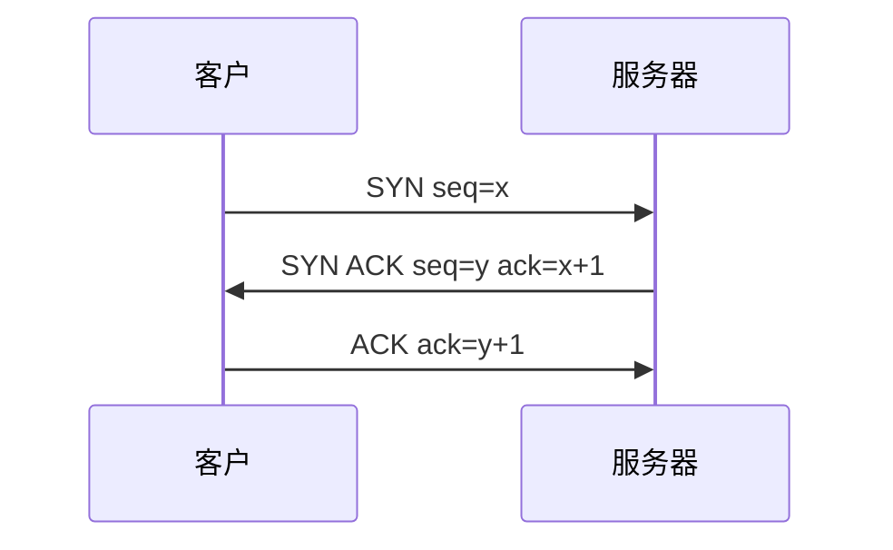

## 本章要义

运输层是端到端：端口标识进程。UDP 报文、尽最大努力；TCP 字节流、连接、可靠、流量、拥塞，只能一对一。

第三次 ACK 可捎带数据。发送窗口还受 \(\min(rwnd,cwnd)\) 约束。

## 源笔记勘误

- UDP 首部、停止等待、连续 ARQ、SACK、RED、流量控制举例全空。
- RTT 公式写了「如下」却没有：\(\mathrm{RTTs}=(1-\alpha)\mathrm{RTTs}+\alpha\mathrm{RTT}\)，\(\mathrm{RTO}=\mathrm{RTTs}+4\mathrm{RTTd}\)。
- 慢开始「收到确认后将 cwnd 加倍」：按报文段确认，一个 RTT 内若窗口里的都被确认，窗口加倍。不是「一个 ACK 就整窗乘 2」一种写法到底——王道按轮次加倍。
- 运输层与网络层区别只有标题：网络层主机到主机，运输层进程到进程。

## UDP

无连接、不保证、无拥塞控制、保留报文边界，支持一对多。首部 8 字节：源端口、目的端口、长度、检验和。检验和把伪首部（含 IP 地址）算进去。

## 可靠传输原理（补）

停等：发一帧等确认，超时重传。信道利用率 \(T/(T+RTT)\)。连续 ARQ + 滑动窗口：发窗口内都可以发，累计确认，回退 N 或选择重传。SACK 告知乱序块，少重传已经到的。

## TCP

套接字 = (IP, 端口)。序号按字节。确认号 = 期望的下一个字节。窗口做流量控制。发送窗口还受拥塞窗口约束：\(\min(rwnd,cwnd)\)。

超时：RTO 略大于 RTTs。三个重复 ACK → 快重传。

拥塞：

1. 慢开始：`cwnd` 从 1 个 MSS 按 RTT 指数增，到 `ssthresh` 改加法。
2. 拥塞避免：每 RTT +1。
3. 超时：`ssthresh=cwnd/2`，`cwnd=1`，再慢开始。
4. 快恢复：三个重复 ACK 时 `ssthresh=cwnd/2`，`cwnd=ssthresh`（或 ssthresh+3，看版本），进入避免。

慢/快指的是 **cwnd 初值**，不是增长速度。

RED：队列未满就按概率丢，逼 TCP 提前降速。了解。

## 连接与状态机

三次握手防滞留的 SYN 让服务器空开连接。四次挥手因为 TCP 全双工，一边 FIN 只关一个方向。TIME-WAIT 等 2MSL：确认最后的 ACK 能到，并让旧报文死干净。

主动打开（客户）主路径：

`CLOSED → SYN-SENT`（发 SYN）→ `ESTABLISHED`（收到 SYN+ACK，回 ACK）

被动打开（服务器）主路径：

`CLOSED → LISTEN` → `SYN-RCVD`（收到 SYN，回 SYN+ACK）→ `ESTABLISHED`（收到 ACK）

释放主路径：

- 主动关闭：`ESTABLISHED → FIN-WAIT-1`（发 FIN）→ `FIN-WAIT-2`（收到 ACK）→ `TIME-WAIT`（收到对方 FIN，回 ACK）→ `CLOSED`
- 被动关闭：`ESTABLISHED → CLOSE-WAIT`（收到 FIN，回 ACK）→ `LAST-ACK`（应用也关，发 FIN）→ `CLOSED`（收到 ACK）
- 同时关闭：两边都进 `CLOSING`，再汇合到 `TIME-WAIT`

同时打开（两边都发 SYN）会经过 `SYN-SENT ↔ SYN-RCVD`，也能到 `ESTABLISHED`，考试少见但状态图上有。

`RST` 用于拒绝、半开复位：对不存在的端口或不匹配的序号，直接拆连接，不走四次挥手。

## 408 易错点

- 流量控制看接收方，拥塞控制看网络。
- ACK=1 在连接建立后必须一直置 1。
- 半关闭时被动方还能发数据。
- UDP 检验和为 0 表示不检验（IPv4）。

## 考研题精练

**题 1（TCP 窗口）**  
甲乙已建立 TCP 连接。甲始终以 \(\mathrm{MSS}=1\,\mathrm{KB}\) 发送，且不受拥塞窗口限制；乙的接收缓存为 \(32\,\mathrm{KB}\)。单向传播时延 \(2\,\mathrm{ms}\)，忽略处理。甲能达到的最大吞吐约为（ ）。

A. \(8\,\mathrm{MB/s}\) B. \(16\,\mathrm{MB/s}\) C. \(4\,\mathrm{MB/s}\) D. \(32\,\mathrm{MB/s}\)

**解答：** 有效窗口等于接收窗口 \(32\,\mathrm{KB}\)，\(\mathrm{RTT}=4\,\mathrm{ms}\)。吞吐 \(\approx 32\,\mathrm{KB}/4\,\mathrm{ms}=8\,\mathrm{MB/s}\)。带宽时延积填不满窗口时，吞吐由窗口/\(\mathrm{RTT}\) 决定。**选 A。**

**题 2**  
TCP 三次握手的主要目的是（ ）。

A. 协商 IP 地址 B. 防止旧的重复 SYN 让服务器空开连接 C. 交换拥塞窗口初值 D. 把 UDP 升级成可靠传输

**解答：** 滞留的 SYN 若只握两次，服务器会为已死的请求占着资源。第三次 ACK 让双方确认序号都新鲜。MSS 可在选项里谈，但不是握手存在的首要理由。**选 B。**

**题 3**  
TCP 发生超时重传后，拥塞控制会（ ）。

A. 只把 \(cwnd\) 减半并进入拥塞避免 B. \(ssthresh=cwnd/2\)，\(cwnd=1\)，再慢开始 C. 窗口减 1 个 MSS D. 立即进入 TIME-WAIT

**解答：** 超时当作严重拥塞：阈值减半，窗口回到 1 个 MSS，重新慢开始。三个重复 ACK 才走快重传/快恢复（窗口通常降到 \(ssthresh\)）。**选 B。**

## 继续阅读

端口上跑的应用：[[cn/06-application|应用层]]。
