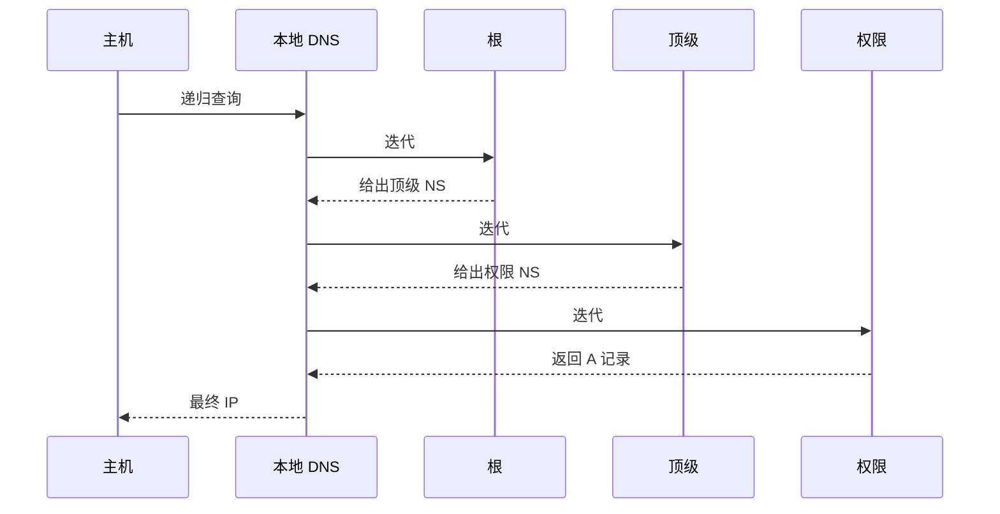

## 本章要义

应用层协议规定进程怎么对话。DNS 把名字变成 IP，HTTP 取文档，邮件是 SMTP 送、POP/IMAP 取，DHCP 自动配地址。

## 源笔记勘误

- DNS 写了区，没写递归查询 / 迭代查询，也没写高速缓存。
- 「电子邮件最主要的组成构件」「系统调用」是空的。
- HTTP「协议本身无连接」容易误解：每次事务常新建 TCP（1.0），1.1 默认持久连接；HTTP 仍是无状态的。
- DNS over UDP 512 字节是老限制，EDNS0 已放大；考试仍可能按 512 说。
- FTP 被动模式「服务器端口随机」：服务器在协商后的**高端口监听**，不是每次完全无范围。

## DNS

层次：根 → 顶级 → 二级……区是权限范围，一个区一台或多台权限服务器。端口 53，一般 UDP，区传送和超长响应用 TCP。

**递归 vs 迭代**（源笔记空着）：

1. 主机 → 本地域名服务器：通常**递归**（「你帮我查到底」）。
2. 本地域名服务器 → 根 / 顶级 / 权限：通常**迭代**（「我不知道，去问这位」）。
3. 任一层都可以有缓存；缓存命中就不再往上走。

例：解析 `www.example.com`。本地下问根，根给 `.com` 的 NS；再问 `.com`，得到 `example.com` 的 NS；再问权限服务器，得到 A 记录。下一次同学查同一名字，本地直接答。

根服务器不该被全世界做成递归服务器，否则会先被打垮。

## FTP / TFTP / TELNET

FTP 控制连接 21，数据连接主动（服务器 20 连过来）或被动（客户连服务器高端口）。TFTP 走 UDP，512 字节一块，自己做确认。TELNET 把键盘显示器虚到远地主机，明文，现多用 SSH。

## WWW / HTTP

URL：`协议://主机:端口/路径`。HTML 描述页面。静态文档预先放好，动态文档请求时生成。信息检索：爬虫 + 索引 + 排序，408 了解「搜索引擎不在 HTTP 协议内部」。

HTTP 报文：请求行（方法 路径 版本）+ 首部 + 空行 + 可选正文。响应：状态行（版本 状态码 短语）+ 首部 + 正文。

| 版本 | 连接 | 含义 |
|---|---|---|
| 1.0 | 默认非持久 | 一对象一 TCP，慢启动多次 |
| 1.1 | 默认持久 | 同一 TCP 拉多个对象，可 pipeline |

状态码：200 成功，301/302 重定向，304 缓存未过期，403 禁止，404 没有，505 版本不支持。Cookie：Set-Cookie 下发，以后请求带上，在无状态协议上仿会话。

应用进程跨网：套接字 API（`socket/bind/listen/connect/send/recv`）。协议本身不管，OS 提供系统调用。源笔记「系统调用」空标题指这个。

## 邮件

三构件：用户代理、邮件服务器、协议（SMTP 发，POP3/IMAP 收）。

一封信的路径：A 的 UA —SMTP→ A 域邮件服务器 —SMTP→ B 域邮件服务器 ←POP3/IMAP/HTTP— B 的 UA。服务器之间永远 SMTP（推）。Web 邮箱只是 UA 到自家服务器改走 HTTP。

SMTP：25 端口，命令是 ASCII（HELO/MAIL FROM/RCPT TO/DATA/QUIT），要求 7 位。**MIME** 不改 SMTP，只规定正文如何编码附件、多部分、字符集（`Content-Type`、`Content-Transfer-Encoding`）。没有 MIME 就只能发英文纯文本。

POP3 默认取走并可删服务器副本；IMAP 在服务器上保留文件夹，适合多设备。

## DHCP 与 SNMP

DHCP：Discover（广播 67/68）→ Offer → Request → ACK，可经中继跨子网。配 IP、掩码、网关、DNS。

SNMP：管理站 ↔ 代理，对象在 MIB，SMI 规定怎么命名和编码。基本操作 get / set，另有 trap 上报。

## 408 易错点

- 邮件从 A 到 B：UA→本域 SMTP→对域 SMTP→对方用 POP/IMAP/HTTP 取。
- DNS 和 DHCP 都可能用广播，但层次和目的不同。
- HTTP 无状态 ≠ 不用 TCP。
- 区（zone）≠ 域（domain），一个域可分成多个区。

## 考研题精练

**题 1（DNS）**  
主机向本地域名服务器查询时通常采用（ ）；本地域名服务器向根 / 顶级 / 权限查询时通常采用（ ）。

A. 递归，递归 B. 递归，迭代 C. 迭代，递归 D. 迭代，迭代

**解答：** 主机对本地是「你帮我查到底」（递归）。本地对上层是「告诉我下一位」（迭代）。根若对全世界做递归会先被打垮。缓存命中可少问几跳。**选 B。**

**题 2（HTTP）**  
关于 HTTP，正确的是（ ）。

A. 协议无连接，因此不使用 TCP B. HTTP/1.1 默认持久连接，协议仍是无状态的 C. Cookie 使 HTTP 变成有连接、有状态的运输协议 D. 状态码 304 表示服务器内部错误

**解答：** HTTP 跑在 TCP 上；无状态指服务器不靠协议本身记住上次请求。1.1 默认持久，只少建几次 TCP。Cookie 是应用层仿会话。304 是缓存未过期，500 才是服务器错。**选 B。**

**题 3**  
用户 A 发信给用户 B，两台邮件服务器之间使用的协议是（ ）。

A. POP3 B. IMAP C. SMTP D. HTTP

**解答：** 服务器之间永远 SMTP（推）。POP3/IMAP/HTTP 是 B 从自己的服务器取信。Web 邮箱只改 UA 到本域那一段。**选 C。**

## 继续阅读

这些应用都坐在 [[cn/05-transport|运输层]] 的端口上。跨网寻址回 [[cn/04-network|网络层]]。
