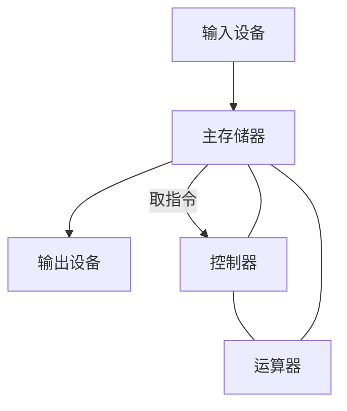
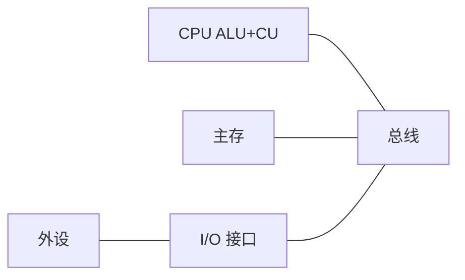

## 本章要义

计算机系统 = 硬件 + 软件。硬件回答「能不能算」，软件回答「算什么」。408 开篇要能画出冯诺依曼五大部件，并说明**现代机器已经改成以存储器为中心**。

现代机器以存储器为中心：I/O 可经 DMA 直通主存，不必再绕运算器。CPU = 运算器 + 控制器。

## 源笔记勘误

- 五大特点写完就停，没有「指令和数据都是二进制、地址访问」这条常考表述。
- 「区别以运算器还是存储器为中心」只写了一句。判断标准对，但没说现代计算机为什么改。
- 整份笔记**没有第二章总线**。总线放到 [[co/08-io|I/O 与总线]] 补。
- 软件分类把「网络软件」单列可以，但 408 更常考系统软件 vs 应用软件，以及编译 / 解释 / 操作系统的位置。

## 冯诺依曼型计算机

经典五点：

1. 五大部件：运算器、控制器、存储器、输入、输出。CPU = 运算器 + 控制器。
2. **存储程序**：程序和数据放在同一存储器，都用二进制。
3. 指令 = 操作码 + 地址码。
4. 指令按序存放，**PC** 指出下一条；可按运算结果或外设请求改变（转移、中断）。
5. 早期以**运算器**为中心：I/O 与存储器交换数据都要经过运算器。

现代机器：I/O 可以直接和主存打交通（DMA），变成以**存储器为中心**。判断口诀：输入设备能否不经运算器连存储器。

主机 = CPU + 主存。外设和接口不算主机。辅存在系统结构课里常划到存储层次，不在「主机」里。

## 主要技术指标

- **机器字长**：CPU 一次能处理的二进制位数，通常等于通用寄存器宽度、ALU 宽度。它影响精度、速度和指令能直接处理的数据宽度。
- **存储容量**：MAR 位数决定寻址单元数，MDR 位数是存储字长。容量 = 单元数 × 存储字长。注意「1M×8 位」和「1MB」在按字节编址时是一回事。
- **运算速度**：早期用 MIPS（百万条指令/秒）。不同指令耗时不同，所以有平均 CPI、主频 \(f\)：

\[
\text{IPS} = \frac{f}{\text{CPI}},\quad \text{CPU时间}=\text{指令数}\times\text{CPI}\times\text{时钟周期}
\]

源笔记只写了 MIPS，没写 CPI。这是后面流水线、cache 命中率题的入口。

## 软件层次

系统软件管理整机：OS、语言处理程序（编译 / 汇编 / 解释）、数据库、网络协议栈、服务性程序。应用软件面向具体任务。

一条高级语言语句 → 编译成多条机器指令 → 每条指令再被控制器拆成微操作。越往下越「硬」。

## 408 易错点

- 控制器和运算器一起才叫 CPU；「CPU = 控制器」是错的。
- 存储程序不是「程序只能存在磁盘上」，而是「运行时指令和数据在存储器里按地址取」。
- 字长、存储字长、指令字长三个概念别混：可以相等，也可以指令字长是存储字长的整数倍。

## 考研题精练

**题 1**  
下列关于冯诺依曼计算机的叙述中，正确的是（ ）。

A. 指令存放在存储器中，数据只能存放在寄存器中  
B. 早期机器以存储器为中心，现代机器改成以运算器为中心  
C. 程序和数据都以二进制形式存放在同一存储器中，按地址访问  
D. 主机包括 CPU、主存、辅存和全部 I/O 设备

**解答：** 存储程序的要点是指令与数据同存、二进制、按地址取。早期以运算器为中心，现代因 DMA 改为以存储器为中心。辅存和外设不算主机。**选 C。**

**题 2**  
某 CPU 主频 \(f=2\,\text{GHz}\)，程序平均 CPI 为 1.5，执行 \(4\times 10^9\) 条指令所需的 CPU 时间约为（ ）。

A. 1.5 s B. 2.0 s C. 3.0 s D. 6.0 s

**解答：** \(T=\text{IC}\times\text{CPI}/f=4\times10^9\times1.5/(2\times10^9)=3\,\text{s}\)。**选 C。**

**题 3**  
关于机器字长、存储字长和指令字长，下列说法正确的是（ ）。

A. 三者必须相等，否则无法取指  
B. 机器字长通常等于通用寄存器和 ALU 的宽度  
C. MAR 的位数等于存储字长  
D. 指令字长只能等于存储字长，不能是其整数倍

**解答：** 机器字长看一次能处理多少位。MAR 决定寻址单元数，MDR 才对应存储字长。指令字长可以是存储字长的整数倍。**选 B。**

## 继续阅读

数在机器里怎么放：[[co/02-data|数据表示]]。CPU 内部再展开：[[co/06-cpu|中央处理器]]。
