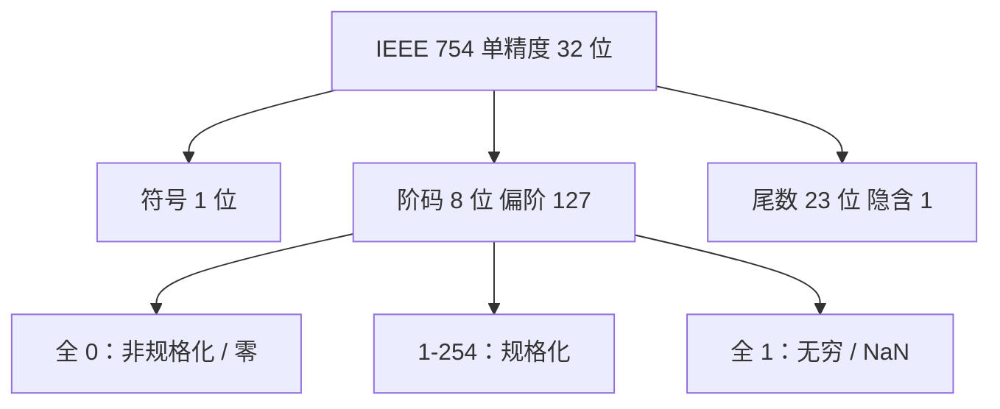

## 本章要义

机器里的「数」先解决两件事：符号怎么编码、小数点约定在哪。加减主要用补码；浮点的阶码用移码；传输再加校验。

双精度改为 1+11+52，偏阶 1023。不要把符号算进尾数字段。

## 源笔记勘误

- 原码整数范围写成「－(2n－1)——2n－1」，指数没写清楚。\(n+1\) 位原码整数范围是 \([-(2^n-1),\,2^n-1]\)。
- IEEE 754 写成「单精度 = 8 位阶码 + 24 位尾数」「双精度 = 11 + 53」，还把符号算进尾数。标准格式是 **1 符号 + 8 阶 + 23 尾**（隐含 1 后尾数有效 24 位），双精度 **1 + 11 + 52**。
- 单精度范围写成 \(-2^{127}\sim(1-2^{-23})\cdot2^{127}\)，漏了规格化、偏阶、阶码全 0 / 全 1 的保留值。偏阶 127 时最大阶码真值是 127，不是随便写 127 就完。
- 「海明码码距为 4」只对 **SECDED**（再加一位总校验）成立。只纠 1 位的海明码码距是 3。
- 余三码、格雷码、8421 有电路修正口诀，但缺「BCD 不是权 8421 就都能直接加减」的提醒。

## 机器数与 BCD

真值带正负号；机器数把符号数值化。常用 BCD：

- **8421**：权 8,4,2,1。和 > 1001 时 +6 修正。
- **余三**：8421 再加 0011。两码相加无进位则减 0011，有进位则本位再加 0011。
- **格雷**：相邻码只变 1 位，适合抗毛刺，不适合直接算术。

## 原码、补码、反码、移码

设符号位 1 位、数值 \(n\) 位，共 \(n+1\) 位。

| | 零 | 正数码值随真值 | 负数码值随真值 | 整数范围 |
|--|----|----------------|----------------|----------|
| 原码 | ±0 不唯一 | 增 | 减 | \([-(2^n-1),2^n-1]\) |
| 反码 | ±0 不唯一 | 增 | 增 | 同原码 |
| 补码 | 唯一 | 增 | 增 | \([-2^n,2^n-1]\) |
| 移码 | 唯一 | 增 | 增 | 同补码 |

- 正数：原 = 反 = 补 = 符号 0 + 绝对值。
- 负数：反码 = 符号 1 + 数值取反；补码 = 反码 + 1（或绝对值取反加 1）。
- **移码 = 补码符号位取反**。整数移码定义 \([X]_{\text{移}}=2^n+X\)。符号 1 表示正，0 表示负。用来做浮点阶码，因为码值大小和真值大小一致，比阶方便。

补码 ↔ 原码的串行口诀：从最低位往高扫，遇到的第一个 1 及其右边不变，再往高全部取反，符号不动。

## 定点与浮点

定点：小数点约定在固定位置。32 位补码定点小数 \([-1, 1-2^{-31}]\)，定点整数 \([-2^{31}, 2^{31}-1]\)。

浮点：\(N=M\cdot R^E\)。阶码常用移码整数，尾数常用补码规格化小数。规格化（基数 2）：尾数绝对值 \(\ge 1/2\)，补码双符号下常见形态 `00.1xxxx` 或 `11.0xxxx`。

**IEEE 754 单精度（记死）**：

- 1 位符号 + 8 位阶码（偏阶 127）+ 23 位尾数，隐含整数 1。
- 阶码全 0：非规格化 / 零；全 1：无穷或 NaN。
- 双精度：偏阶 1023，尾数 52 位。

源笔记那套「24 位尾数含符号」是把隐含位和符号搅在一起了，做题按 IEEE 字段切，不要按那张表。

## 校验码

码距 = 任意两个合法码最少相差的位数。检 \(d\) 位错要求码距 \(\ge d+1\)；纠 \(t\) 位要求码距 \(\ge 2t+1\)。

- **奇偶校验**：码距 2，能发现奇数个错，不能定位，不能发现偶数个错。
- **海明码**：校验位插在 \(2^{i-1}\) 号。纠 1 位：\(2^r \ge k+r+1\)。再加一位偶校验变成 SECDED，码距 4，能纠 1 检 2。源笔记「码距为 4」没写前提。
- **CRC**：信息位后拼 \(r\) 位校验，模 2 除生成多项式。余式与出错位的对应由生成多项式决定。能发现突发错。

## 408 易错点

- 补码比原码多表示一个最负的数 \(-2^n\)，这个数没有正的对应真值，取负会溢出。
- 移码的「符号位」看起来和常识反着。
- 浮点规格化失败（尾数溢出）要右规并调阶，不是改 IEEE 字段宽度。
- 奇偶校验发现不了两位错。

## 考研题精练

**题 1（IEEE 754）**  
IEEE 754 单精度浮点数的字段划分是（ ）。

A. 1 位符号 + 8 位阶码 + 24 位尾数（含符号）  
B. 1 位符号 + 8 位阶码 + 23 位尾数（隐含整数 1）  
C. 8 位阶码 + 24 位尾数  
D. 1 位符号 + 11 位阶码 + 52 位尾数

**解答：** 单精度 32 位切成 1+8+23，隐含位使有效尾数为 24 位，但字段里只存 23 位。D 是双精度。**选 B。**

**题 2**  
\(n+1\) 位补码整数能表示的范围是（ ）。

A. \([-(2^n-1),\,2^n-1]\)  
B. \([-2^n,\,2^n-1]\)  
C. \([-2^n,\,2^n]\)  
D. \([-(2^{n+1}-1),\,2^n-1]\)

**解答：** 补码比原码多表示一个最负数 \(-2^n\)，正的最大仍是 \(2^n-1\)。A 是原码/反码。**选 B。**

**题 3**  
关于校验码，下列叙述正确的是（ ）。

A. 奇偶校验能发现两位错  
B. 只纠 1 位的海明码码距为 4  
C. 纠 1 位海明码满足 \(2^r\ge k+r+1\)  
D. CRC 只能发现 1 位错，不能发现突发错

**解答：** 奇偶码距 2，发现不了偶数个错。只纠 1 位海明码距 3；再加总校验的 SECDED 才是 4。CRC 擅长突发错。**选 C。**

## 继续阅读

这些编码怎么加减乘除：[[co/03-arithmetic|运算方法]]。
