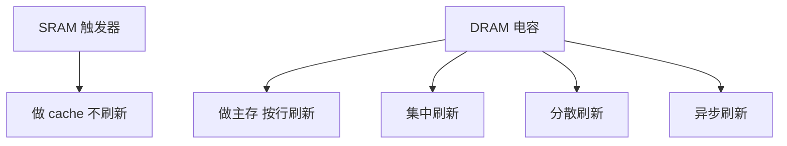

## 本章要义

主存是 CPU 按地址随机访问的那一层。先分清 **SRAM / DRAM / ROM 家族**，再会算容量扩展和刷新开销，最后理解交叉存储为什么能提高带宽。

片数 =（目标字数 / 单片字数）×（目标位数 / 单片位数）。刷新只针对 DRAM。

## 源笔记勘误

- 「主存储器处于全机中心**低位**」是浮点，应为**地位**。
- SRAM / DRAM / 扩展 / 交叉的电路图、框图全空。
- 「计算机可寻址的最小信息单元是一个存储字」不严谨。按字节编址时最小寻址单位是字节；存储字是一次并行读出的位数。
- DRAM 刷新「时间小于或等于 2ms」是某个年代芯片的刷新周期例子，不是定理。现代题会直接给刷新周期。
- ROM 家族只列名词，没写谁能在系统里在线改。

## 指标

- **存取时间 \(T_A\)**：从启动读/写到完成的时间。
- **存储周期 \(T_M\)**：连续两次独立访存的最小间隔，\(T_M>T_A\)（还要恢复）。
- 带宽 ≈ 每个周期能读出的位数 / \(T_M\)。

CPU 用 MAR（地址）、MDR（数据）和主存异步握手，`ready` 表示这次访存结束。MAR 有 \(k\) 位则最多 \(2^k\) 个可寻址单元。

## SRAM 与 DRAM

- **SRAM**：触发器存一位，只要供电就保持，不必刷新，快、贵、密低，做 cache。
- **DRAM**：电容电荷，必须刷新。慢、便宜、密高，做主存。
- 刷新：集中刷新（集中一段时间全刷，有死区）、分散刷新（每个存取周期抽一点时间）、异步刷新（行间隔均匀摊开）。刷新按**行**进行，读出再写回。题目给「64 行、刷新周期 2ms」就按行算开销。

## ROM 家族

| 类型 | 写 | 典型用途 |
|------|----|----------|
| ROM | 出厂固定 | 微程序、常量表 |
| PROM | 一次 | 小批量固化 |
| EPROM | 紫外线擦、可再写 | 老式固件 |
| EEPROM | 电擦，写次数有限 | 配置 |
| Flash | 块擦除，反复读写 | BIOS、SSD、U 盘 |

「非易失」= 断电不丢。RAM 默认易失。

## 芯片扩展

一片 \(L\times K\)（\(L\) 字 × \(K\) 位）。要组成 \(M\times N\)：

\[
\text{片数}=\frac{M}{L}\times\frac{N}{K}
\]

- **位扩展**：加宽数据，片选可共用，数据线分开。
- **字扩展**：加深地址，用译码器做片选，数据线并联。
- 字位同时扩：先位后字，或画网格。

例：用 \(16K\times 8\) 组成 \(64K\times 16\)，需要 \((64K/16K)\times(16/8)=8\) 片。

## 多体交叉

多个模块各有自己的地址寄存器、数据寄存器和读写电路。低位交叉：地址 \(M\cdot j+i\) 落在第 \(i\) 体，连续地址在不同体，可流水重叠访存。适合向量、cache 行填充。体冲突时退化成单体速度。

提高访存速度的三条路（源笔记列了）：更快的器件、层次结构（cache）、改主存结构（交叉、双端口）。

## 408 易错点

- 刷新是对 DRAM 的，SRAM 不刷。
- 存取时间 ≠ 存储周期。
- 片选逻辑错一位，容量对但地址空间出现空洞或别名。
- 「1K×8 的 RAM 要多少地址线」：10 根地址，8 根数据，加上片选、读/写。

## 考研题精练

**题 1**  
用 \(16\text{K}\times 8\) 的芯片组成 \(64\text{K}\times 16\) 的存储器，至少需要（ ）。

A. 4 片 B. 8 片 C. 16 片 D. 32 片

**解答：** 字扩展 \(64\text{K}/16\text{K}=4\)，位扩展 \(16/8=2\)，共 \(4\times 2=8\) 片。**选 B。**

**题 2**  
下列关于 DRAM 刷新的叙述中，正确的是（ ）。

A. SRAM 和 DRAM 都必须按行刷新  
B. 刷新按列进行，写回整列  
C. 刷新按行读出再写回，集中刷新会形成访存死区  
D. 刷新周期固定为 2 ms，与芯片无关

**解答：** 只有 DRAM 要刷新；按行读出写回。2 ms 只是某代芯片的例子，题面会直接给周期。**选 C。**

**题 3**  
容量为 \(1\text{K}\times 8\) 的 RAM 芯片，地址线和数据线各需要（ ）。

A. 8 根地址、8 根数据  
B. 10 根地址、8 根数据  
C. 10 根地址、10 根数据  
D. 1024 根地址、8 根数据

**解答：** \(1\text{K}=2^{10}\) 个单元，地址 10 根；每单元 8 位，数据 8 根。另需片选和读/写。**选 B。**

## 继续阅读

指令怎么描述「到主存哪取数」：[[co/05-isa|指令系统]]。cache 和虚存在 [[co/07-storage|存储层次]]。
