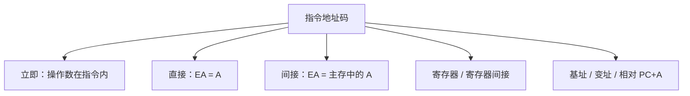

## 本章要义

指令系统是程序员能看到的机器语言界面：有哪些操作、操作数在哪、下一条在哪。格式、寻址、RISC/CISC 是三块。

访存次数 = 取指 + 间接层数 + 取数（写回另计）。立即寻址不再访存取数。

## 源笔记勘误

- 一地址「寻址范围 \(2^{24}=16M\)、2 次访存」等数字，是**假定某固定指令字长再切字段**的例题结论，不是定义。换字长就全变。
- RISC「用于小型机」、CISC「用于大型机」过时且不成立。x86 是 CISC 且统治桌面；ARM/RISC-V 是 RISC 且无处不在。
- 寻址方式只有标题，一种都没列。
- 「下一条指令的地址」写进指令格式，容易让人以为每条指令都显式带后继地址。顺序执行靠 PC+1，只有转移才改 PC。

## 指令格式

指令 = 操作码 + 地址码。地址码可能指出：操作数、结果、有时甚至后继指令（早期）。现代顺序机后继默认在 PC。

零地址：操作数在栈顶或隐含在 ACC。一地址：另一个操作数常在 ACC。二地址：目的地址兼做源。三地址：两源一目的， dest = src1 op src2。

指令字长：固定（等于或等于存储字长的整数倍，译码简单）或可变（按字节倍数，平均更短、译码复杂）。

按字节编址的对齐：半字最低 1 位为 0，字最低 2 位为 0，双字最低 3 位为 0。对齐减少访存次数、可能浪费空间；不对齐省空间、可能一次数据跨两个存储字。

## 寻址方式（源笔记空白，必须补）

数据寻址常见：

- **立即**：指令里直接给出操作数。不访存取数。
- **直接**：指令给出有效地址 EA。
- **间接**：指令给出的是地址的地址，多一次访存。
- **寄存器**：操作数在寄存器。
- **寄存器间接**：寄存器里是 EA。
- **偏移类**：基址（BR+A）、变址（IX+A）、相对（PC+A）。后两种适合数组、转移。
- **堆栈**：SP 隐含。

有效地址算出之后，才去存储器（或寄存器）取数。访存次数 = 取指令 + 间接层数 + 取操作数（还要看结果写回）。

## 操作码扩展

定长操作码：\(k\) 位最多 \(2^k\) 条，译码快，短指令浪费字段。变长 / 扩展操作码：高频指令短操作码，低频指令长操作码。扩展时每个字段要留「全 1 表示继续扩展」之类的逃逸码，否则短码和长码前缀冲突。原则：频度高 → 短码。

向上兼容：新机器能跑旧机器的目标码（源笔记「保持系统向上兼容」）。

## RISC 与 CISC

| | CISC | RISC |
|--|------|------|
| 指令 | 多、变长、复杂寻址 | 少、定长、简单寻址 |
| 访存 | 多种指令都能访存 | 通常只有 load/store |
| 控制 | 微程序多 | 硬布线多 |
| 寄存器 | 较少 | 较多 |
| 目标 | 让编译器少做事、缩短汇编 | 让每条指令更快、易流水 |

不是「大机 vs 小机」。现代 x86 内部也会把 CISC 指令译成 RISC 风格微操作再流水。

## 408 易错点

- 立即寻址的操作数在指令里，不要再去主存「取数」。
- 相对寻址的 A 是补码偏移，PC 已指向下一条。
- 扩展操作码题先算短码占掉多少编码空间，剩下再分给长码。
- 「二地址指令一定 4 次访存」是错的，取决于操作数在不在寄存器。

## 考研题精练

**题 1**  
采用立即寻址时，取得操作数需要访问主存的次数是（ ）（不含取指令）。

A. 0 B. 1 C. 2 D. 与字长有关

**解答：** 操作数就在指令的地址码字段里，不必再访存取数。**选 A。**

**题 2**  
相对寻址的有效地址 \(\text{EA}=(\text{PC})+A\)。执行该指令时，PC 的内容是（ ）。

A. 当前指令的首地址  
B. 当前指令的末地址  
C. 顺序下一条指令的地址  
D. 操作数的地址

**解答：** 取指后 PC 已加指令长度，指向下一条。\(A\) 是补码偏移。**选 C。**

**题 3**  
采用扩展操作码时，下列做法正确的是（ ）。

A. 高频指令用长操作码，低频指令用短操作码  
B. 短操作码与长操作码允许前缀相同  
C. 必须留出逃逸码，否则短码会和长码的前缀冲突  
D. 扩展操作码使译码一定比定长操作码更快

**解答：** 频度高 → 短码。每个已用短码都要避开后续扩展的前缀，通常留全 1 等逃逸。译码更复杂，不一定更快。**选 C。**

## 继续阅读

指令如何被取来、拆开、变成控制信号：[[co/06-cpu|中央处理器]]。
