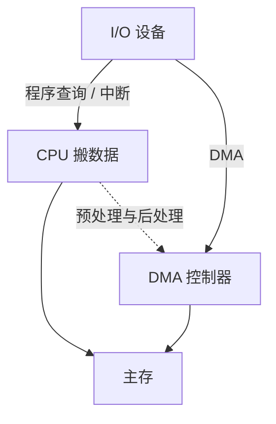

## 本章要义

CPU 不能为每个设备拉一套专线，所以有总线；设备速度差几个数量级，所以有接口、中断和 DMA。辅存是串行 / 直接存取，指标和随机的主存完全不同。

中断仍要 CPU 逐字搬；DMA 传送阶段设备与主存直通。第三种总线占用方式叫「交替访存」，不是「直接访问存储器」。

## 源笔记勘误

- **没有总线这一章。** 下面按 408 补最小集合。
- 第九/十章标题写成「输出输出」。
- DMA「三种工作方式」第三种写成「直接访问存储器」——那是 DMA 的定义，不是第三种方式。标准三分法：**停止 CPU / 周期挪用 / CPU 与 DMA 交替访存**。
- 磁盘「最外面同心圆叫 0 磁道」多数教材如此；有的图把最内标 0，看题附图。
- 光盘分代那几句过时，考点在「只读 / 一次写 / 可擦」而不是年代故事。
- 中断流程缺「关中断、识别中断源、向量」这些组成课常考点。

## 总线（源笔记整章缺失）

总线是共享的传送通路，分数据、地址、控制。按时序：同步（共用时钟）/ 异步（握手）。按层次：CPU 内部总线、系统总线、I/O 总线。

性能：带宽 = 总线宽度 × 工作频率 / 完成一次传送所需周期（还要看是否突发）。仲裁：集中（链式查询、计数器查询、独立请求）或分布。链式查询简单、不公平、对故障敏感；独立请求快、线多。

## 辅存

主存随机访问；磁带顺序访问；磁盘是直接访问（先寻道再等扇区）。

- 道密度：沿半径单位长度的磁道数。
- 位密度：单位弧长上的位数。内圈位密度更高，每道容量常做成一样（源笔记这句对）。
- 容量 \(C=n\times k\times s\)（盘面数 × 每面磁道数 × 每道扇区字节数，具体符号看题）。
- 平均寻址时间 \(T_a=T_s+T_w\)（寻道 + 旋转等待，等待常取半圈）。
- 传输率 \(D_r=D\times V\)（位密度 × 线速度）或 每秒转过的扇区字节数。

温盘（Winchester）：头、盘、定位密封在一起。控制器一边对主机、一边对驱动器。

## I/O 接口与编址

设接口的原因：选设备、缓冲匹配速度、串并转换、电平转换、传命令、反映忙/就绪/中断。

- **统一编址**（存储器映射）：用访存指令，一部分地址空间给寄存器。
- **独立编址**：专门的 IN/OUT。

连接：辐射式每台设备一套线，难扩展；总线式好增减。

## 中断

外设或异常打断 CPU。响应通常在一条指令结束后（与源笔记微中断呼应）。流程：

1. 关中断、保存断点（PC）和关键寄存器。
2. 识别中断源，取向量，进服务程序。
3. 服务（对不同设备不同）。
4. 恢复现场，开中断，返回。

单重：服务中不响应新中断。多重：允许更高级别打断。优先级由硬件排队或软件查询。

程序查询（轮询）最简单、CPU 占用最高；中断让 CPU 和设备并行，仍要 CPU 逐字搬数据。

## DMA

主存 ↔ 设备 直通，CPU 只做预处理（首址、长度）和后处理。传送中 DMA 控制器掌管总线。

三种占用总线的方式：

1. **停止 CPU**：DMA 独占，CPU 冻住。快、CPU 惨。
2. **周期挪用**：DMA 插空偷一个访存周期。
3. **交替访存**：时间片切开，CPU 和 DMA 都能推进。

不是「第三种叫直接访问存储器」。

## 408 易错点

- 中断保存的「断点」是**下一条未执行指令**的地址。
- DMA 传送阶段不需要 CPU 干预，但预处理、后处理要。
- 磁盘平均等待通常按旋转半周，不是一圈。
- 统一编址占用内存地址空间，独立编址不占。

## 考研题精练

**题 1（中断 vs DMA）**  
与中断方式相比，DMA 方式的主要特点是（ ）。

A. CPU 仍按字节把数据从接口搬到主存  
B. 传送阶段主存与设备直通，CPU 只做预处理和后处理  
C. 不需要总线  
D. 响应一定发生在一条微指令的中间

**解答：** 中断仍要 CPU 逐字搬；DMA 传送时由 DMA 控制器掌管总线。中断通常在指令结束后响应。**选 B。**

**题 2**  
DMA 占用总线的三种典型方式是（ ）。

A. 查询、中断、陷阱  
B. 停止 CPU、周期挪用、CPU 与 DMA 交替访存  
C. 写直达、写回、写分配  
D. 直接访问存储器、间接访问、存储器映射

**解答：** 「直接访问存储器」是 DMA 的定义，不是第三种占用方式。**选 B。**

**题 3**  
磁盘转速 6000 r/min，平均寻道时间 5 ms。平均旋转等待和平均寻址时间分别约为（ ）。

A. 5 ms，10 ms  
B. 10 ms，15 ms  
C. 5 ms，5 ms  
D. 10 ms，10 ms

**解答：** 转一圈 \(60/6000=10\,\text{ms}\)，平均等待半圈 5 ms。寻址时间 \(T_a=T_s+T_w=5+5=10\,\text{ms}\)。**选 A。**

## 继续阅读

回到 [[co/06-cpu|CPU]] 看中断和微中断怎么接上。存储层次见 [[co/07-storage|存储层次]]。
