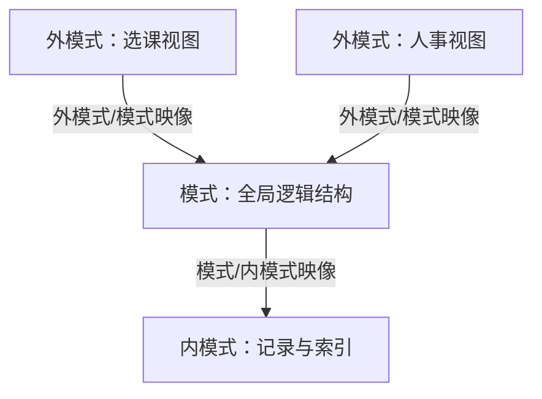

## 本章要义

数据库管的不是「一堆文件」，而是**长期、有结构、可共享**的数据。用户看见的是局部视图（外模式），系统看见的是全局逻辑（模式）和物理存放（内模式）。两层映像把这三层隔开，所以改存储不必改程序。

改存储只动下层映像（物理独立性），改全局逻辑只动上层映像（逻辑独立性）。

## 源笔记勘误

- 「数据管理的三个阶段」只列了标题，没有对比。下面补表。
- 外模式/模式映像写成「联系趣来」，是「联系起来」。
- 「一个应用程序只能使用一个外模式」这句对；同一外模式可被多个程序用。
- 内模式「不涉及物理记录、不涉及硬件」容易误解：内模式描述的是**DBMS 看见的**存储组织（记录、索引、文件），不是磁盘扇区；真正的设备细节在 OS。
- 人工/文件/库三个阶段的「数据面向谁」没写清：人工面向应用，文件仍面向应用，库才面向整个组织。

## 数据管理的三个阶段

| | 人工管理 | 文件系统 | 数据库系统 |
|---|---|---|---|
| 数据管理者 | 应用程序 | OS 文件 | DBMS |
| 数据共享 | 基本不能 | 以文件为单位，冗余大 | 以记录/字段共享，冗余可控 |
| 独立性 | 无 | 设备独立性有一点，逻辑独立性弱 | 物理 + 逻辑独立性 |
| 结构 | 无整体结构 | 记录有结构，文件之间无联系 | 数据整体结构化 |

文件系统阶段已经能存磁盘，但同一数据被多个程序各存一份，改格式就要改所有程序。数据库阶段把数据抽成公共资源，由 DBMS 统一管。

## 基本术语

- **数据**：描述事物的符号记录。形式本身不够，必须带语义。
- **数据库（DB）**：长期存储、有组织、可共享的数据集合。
- **DBMS**：夹在用户/应用和 OS 之间的数据管理软件。建库、存取、完整性、安全、并发、恢复都走它。
- **DBS**：引入数据库后的整个系统 = DB + DBMS（及工具）+ 应用 + DBA + 用户。
- **冗余度**：同一数据重复存放的程度。不是越低越好，有时为性能故意留受控冗余。
- **安全性**：防非法使用导致泄密或破坏。
- **完整性**：正确、有效、相容，值落在合法范围、关系之间对得上。
- **并发控制**：多事务同时改同一数据时不互相踩。
- **恢复**：从错误状态回到某个已知一致状态。

数据库三要素：数据、外存载体、DBMS。缺一个都不是「数据库系统」。

## 数据模型

模型是现实世界的抽象。数据模型再具体一点：描述数据、联系、语义和约束的概念工具。

两级抽象：

1. **概念模型**（信息模型）：按用户观点建模，E-R 是主力，给设计和沟通用。
2. **逻辑/结构数据模型**：按机器观点，层次、网状、关系，给 DBMS 实现用。

数据模型三要素：

- **数据结构**：对象类型的集合，描述静态。
- **数据操作**：检索与更新，描述动态。
- **完整性约束**：合法状态及状态变化的规则。

概念模型常用词：实体、属性、码（最小标识属性集）、域、实体型、实体集、联系。码是「最小」的：学号能标识学生，{学号, 姓名} 就不是码。

## 联系与 E-R

- **1:1**：A 的每个实体在 B 中至多一个对应，反之亦然。公民–身份证。
- **1:n**：A 的一个对应 B 的多个，B 的一个至多对应 A 的一个。系–学生。
- **m:n**：两边都是多个。学生–课程。

E-R：矩形实体、椭圆属性、菱形联系；联系上标 1/n/m；联系自己也可以有属性（如选修的成绩）。

源笔记这里只有画法，没有「局部 E-R 合并时三类冲突」。那部分放到 [[db/02-design|数据库设计]]。

## 三种基本数据模型

- **层次**：有向树。一根无双亲，其余恰一个双亲。IMS 一类。表示 1:n 自然，m:n 要绕。
- **网状**：有向图。可以多个无双亲，结点可多个双亲。能表示复杂联系，导航编程痛苦。
- **关系**：二维表。实体和联系都用关系。最基本规范：分量原子，表中不能再套表。检索的结果仍是表（集合操作）。存取路径对用户隐藏，独立性高。

关系术语：关系≈表，元组≈行，属性≈列，主码唯一标识元组，域是属性取值范围，分量是元组在某属性上的值，关系模式是型：`R(A1,…,An)`。

## 三级模式、两层映像

- **外模式**（用户模式）：某个用户看见的局部逻辑。一个库多个外模式。
- **模式**（概念/逻辑模式）：全局逻辑，一个库一个。含联系、完整性、安全性。
- **内模式**（存储模式）：记录怎么放、索引怎么建。一个库一个。

映像：

- **外模式/模式**：模式变了，改映像就能让外模式不动 → **逻辑独立性**。
- **模式/内模式**：换磁盘或存储方式，改映像就能让模式不动 → **物理独立性**。

外模式通常是模式的子集。数据按外模式交给用户，按内模式落盘，模式在中间当隔离层。

## 408 / 复习易错点

- DBS ⊃ DBMS ⊃ DB，别把三者当同义词。
- 「数据独立性」不是数据不依赖硬件这么空：要能指到是逻辑还是物理、对应哪一层映像。
- 关系模型「概念单一」指实体和联系都用表，不是「只能有一张表」。
- 完整性 ≠ 安全性：前者防脏数据，后者防坏人。

## 考研题精练

**题 1**  
数据库三级模式中，描述全体数据的全局逻辑结构和特征的是（ ）。

A. 外模式 B. 模式 C. 内模式 D. 存储模式

**解答：** 一个库只有一个模式（概念/逻辑模式）。外模式是用户局部视图，内模式/存储模式描述存放方式。**选 B。**

**题 2**  
当数据库的逻辑结构改变时，可以通过调整（ ）使外模式不变，从而应用程序不必改。

A. 外模式/模式映像 B. 模式/内模式映像 C. 外模式/内模式映像 D. 用户模式/存储模式映像

**解答：** 这是逻辑独立性。物理独立性靠模式/内模式映像：换磁盘或索引时模式不动。**选 A。**

**题 3**  
下列关于 DB、DBMS、DBS 的说法正确的是（ ）。

A. DBMS 包含 DBS B. DB 就是 DBMS C. DBS 包含 DBMS，DBMS 管理 DB D. 一个应用程序可以使用多个外模式

**解答：** DBS ⊃ DBMS ⊃ DB。一个应用程序只能使用一个外模式；同一外模式可被多个程序用。**选 C。**

## 继续阅读

怎么从现实走进表：[[db/02-design|数据库设计]]。关系本身的型、值和三类完整性：[[db/03-relational|关系模型]]。
