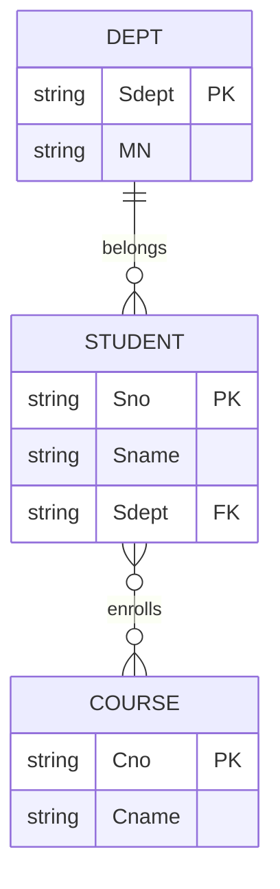

## 本章要义

设计是在给定应用环境里构造**合适**的数据库模式，再落到某个 DBMS 上。关键一跳是：用户语言 → E-R → 关系模式 → 用范式检查要不要拆。源笔记把转换规则抄全了，但缺例子；冲突分类有，合并步骤没有。

系—学生是 1:n，学生—课程是 m:n；选修成绩落在联系上，转关系时独立成 `SC(Sno, Cno, Grade)`。

## 源笔记勘误

- 「建立数据库极其应用系统」应为「及其」。
- 概念结构设计「这是数据库设计的关键」这句对，但四类方法只写了定义，没说课程/考试默认用**自底向上**（先局部 E-R，再集成）。
- E-R 转关系第 3、4 条「可以独立成表，也可以合并」没给选择标准：独立表多一次连接；合并到 n 端（1:n）或任意一端（1:1）更常见，前提是不制造过多空值。
- 物理设计只剩两句话，没有存取方法（索引、聚簇）。
- 数据字典五部分列了，处理过程的「简要说明」没强调：应说明什么条件下做什么，避免写成程序说明书。

## 六阶段

1. **需求分析**：收集数据需求和处理需求，产物是数据流图 + **数据字典**。调查：跟班、开会、专人介绍、询问、调查表、查记录。
2. **概念结构设计**：综合成独立于 DBMS 的概念模型，通常画 E-R。关键阶段。
3. **逻辑结构设计**：E-R → 某 DBMS 的数据模型（这里是关系），再用范式优化。
4. **物理设计**：选存储结构和存取方法，权衡时间、空间、维护代价。
5. **实施**：用 SQL/宿主语言建库、装数据、调试、试运行。
6. **运行维护**：评价、调整、重组、备份。设计没有「写完就结束」。

## 数据字典

需求分析的主要成果。五类描述：

- **数据项**：不可再分的单位。
- **数据结构**：数据项/结构的组合。
- **数据流**：结构在系统里的传输路径。
- **数据存储**：结构停留的地方，也是流的来源或去向。
- **处理过程**：`{名, 说明, 输入流, 输出流, 处理摘要}`。

## 概念结构的四种做法

- 自顶向下：先全局框架再细化。
- **自底向上**：先局部再集成。最常用。需求仍常自顶向下做，概念自底向上做。
- 逐步扩张：先核心，再滚雪球。
- 混合：顶层骨架 + 底层局部往里嵌。

局部 E-R 集成时三类冲突：

- **属性冲突**：类型/值域不同，或单位不同（元 vs 万元）。
- **命名冲突**：同名异义，异名同义。
- **结构冲突**：同一对象有的当实体、有的当属性；同一实体属性集不同；联系类型不同（A 里 1:n，B 里 m:n）。

处理：统一域和单位，统一命名，该升成实体就升，联系取能覆盖需求的较强一方（常把 1:n 升成 m:n 如果另一局部确实是多对多）。

## E-R 转关系（六条）

1. **实体型 → 一个关系**。属性变属性，实体码变关系码。
2. **m:n 联系 → 一个关系**。两端码 + 联系属性；码是两端码的组合。
3. **1:n 联系**：可独立成表（码取 n 端码），或**并入 n 端**（把 1 端码和联系属性加到 n 端）。
4. **1:1 联系**：可独立（两端码都是候选码），或并入任意一端。
5. **多元联系 → 一个关系**。各实体码 + 联系属性，码通常是各实体码的组合。
6. **码相同的关系可合并**（确认不是两个不同含义碰巧同码）。

例：学生(学号) —m:n— 课程(课号)，联系「选修」有成绩 → `SC(学号, 课号, 成绩)`，码 `(学号, 课号)`。系(系号) —1:n— 学生：通常把系号放进学生表，不必单独一张「属于」表。

## 逻辑模式优化

1. 确定各属性间的函数依赖。
2. 关系之间的依赖极小化，去掉冗余联系。
3. 看有没有部分依赖、传递依赖、多值依赖，定范式级别。
4. 对照应用：有的 3NF 还要为查询性能**反规范化**（受控冗余）。
5. 必要时再分解或合并。

用户子模式（外模式/视图）：别名、按权限裁剪、把连接预做成视图降低使用难度。见 [[db/06-sql|SQL]]。

## 物理设计

存取时间、空间、维护代价互相打架。常见决策：

- 在连接/选择条件的属性上建索引（代价是更新变慢）。
- 聚簇：按某属性把元组物理放一起。
- 把热数据和冷数据、易变和稳定部分分开存放。

## 复习易错点

- 概念结构独立于具体 DBMS；一上来就建表是跳步。
- 1:n 合并到 n 端，不是合并到 1 端（否则一个系主任行里塞不下多个学生）。
- 「优化」不是范式越高越好，是匹配负载。
- 数据字典不是 DBMS 系统表的别名，这里指需求分析文档。

## 考研题精练

**题 1**  
实体「系」与「学生」是 1:n 联系。把该联系并入关系时，正确做法是（ ）。

A. 把学生码并入系关系 B. 把系的码并入学生关系 C. 必须单独建一张「属于」表 D. 两端码一起做新表的主码

**解答：** 1:n 合并到 n 端，把 1 端码（系号）放进学生表。并到 1 端塞不下多个学生。独立成表也可以，但不是必须，且码取 n 端码。**选 B。**

**题 2**  
将局部 E-R 集成为全局 E-R 时，不属于三类冲突的是（ ）。

A. 属性冲突 B. 命名冲突 C. 结构冲突 D. 范式冲突

**解答：** 集成冲突只有属性、命名、结构。范式是逻辑设计阶段才检查的。**选 D。**

**题 3**  
学生与课程是 m:n，联系「选修」有属性成绩。转换后「选修」关系的主码是（ ）。

A. 学号 B. 课号 C. (学号, 课号) D. (学号, 课号, 成绩)

**解答：** m:n 联系独立成表，码是两端码的组合。成绩是联系属性，不进码。**选 C。**

## 继续阅读

转出来的关系好不好，用 [[db/05-normalization|规范化]] 衡量。表上的约束先看 [[db/03-relational|关系模型]]。
