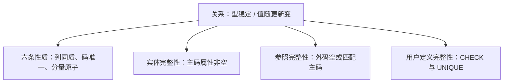

## 本章要义

关系模型三件套：**数据结构**（二维表）、**操作**（集合级的增删改查）、**完整性**（实体、参照、用户定义）。前两类完整性是关系的两个不变性，应由系统自动执行，不是靠程序员自觉。

候选码能唯一标识元组；多个候选码里只选一个当主码，系统强制的是这个主码。

## 源笔记勘误

- 「关系模式是型，关系是值」只写了标题。关系模式 `R(U, D, DOM, F)` 里 U 属性集、D 域、DOM 属性到域的映射、F 数据依赖；日常简写 `R(A1,…,An)`。某一时刻的表内容才是关系。
- 三类完整性标题是空的。下面按王珊教材口径补定义。
- 「任意两个元组的候选码不能完全相同」表述别扭：应是**候选码取值唯一标识元组**，不同元组在任一候选码上不能全等。
- FoxPro「区分列序/行序」是历史产品细节，理论模型里行列无序。

## 型与值

- **关系模式**：对关系的描述，稳定。
- **关系**：模式的一个当前值，随增删改变。
- **关系数据库**：一组关系的集合；库模式是这组关系模式的集合。

关系操作是集合操作：对象和结果都是元组的集合，不是「当前记录指针」。具体运算见 [[db/04-algebra|关系代数]]，语言见 [[db/06-sql|SQL]]。

## 基本关系的六条性质

1. **列同质**：一列来自同一域。
2. **不同列可同域**：必须用不同属性名区分（如始发站、终点站都是站名域）。
3. **列序无关**（理论）。
4. **候选码唯一**：没有两行在候选码上完全一样。多个候选码时选一个做主码。
5. **行序无关**（理论）。
6. **分量原子**：这是 1NF 的要求，表中不能再套表。

主属性：至少包含在一个候选码中的属性。非主属性：不在任何候选码中。全码：所有属性一起才构成候选码。

## 三类完整性

### 实体完整性

若属性 A 是主码的组成（主属性），则 A 不能取空。直觉：主码是元组的身份证，空了就「这个实体是谁」说不清。注意：是**主码属性**不能空，不是「所有候选码都不能空」——系统通常只强制你声明的那一个主码。

### 参照完整性

若 F 是基本关系 R 的外码，它与基本关系 S 的主码 Ks 相对应，则 R 中每个元组在 F 上的值只能：

- 空（表示「暂时不知道参照谁」，且 F 不是 R 的主属性时才允许），或
- 等于 S 中某个元组的 Ks 值。

外码和被参照主码必须定义在同一域上，属性名可以不同。学生.系号 → 系.系号。

违约处理：拒绝、级联（父行改/删则子行跟着）、置空（需语义允许）。

### 用户定义完整性

针对具体应用：成绩 0–100、性别只许男/女、非空、唯一。SQL 里用 CHECK、UNIQUE、NOT NULL 等实现，见 [[db/09-integrity|完整性约束]]。

实体 + 参照由关系系统必须支持；用户定义完整性现代 DBMS 也支持，源笔记把前两个叫「两个不变性」。

## 复习易错点

- 外码可以取空，主码不行。
- 外码不必叫同样的名字，但域要兼容。
- 「关系」有时指模式、有时指当前表，看上下文。
- 1NF 只保证原子，不保证没有冗余；消除插入/删除异常要靠 [[db/05-normalization|更高范式]]。

## 考研题精练

**题 1（候选码）**  
关系模式 \(R(U,F)\)，\(U=\{A,B,C,D\}\)，\(F=\{A\rightarrow B,\,B\rightarrow C,\,A\rightarrow D\}\)。\(R\) 的候选码是（ ）。

A. \(A\) B. \(AB\) C. \(AD\) D. \(BCD\)

**解答：** \(A\) 决定 \(B,D\)，再经 \(B\) 决定 \(C\)，故 \(A\rightarrow U\) 且不可再缩。\(AB\)、\(AD\) 含多余属性，不是候选码。**选 A。**

**题 2**  
关于实体完整性，正确的是（ ）。

A. 任一候选码的属性都不能取空 B. 主码的每个组成属性都不能取空 C. 外码不能取空 D. 非主属性不能取空

**解答：** 系统强制的是你声明的那个主码：组成属性皆非空。外码可以空（且通常不是主属性时）。**选 B。**

**题 3**  
基本关系 \(R\) 的外码 \(F\) 参照 \(S\) 的主码。下列合法的是（ ）。

A. \(F\) 取空且 \(F\) 是 \(R\) 的主属性 B. \(F\) 的值在 \(S\) 中不存在 C. \(F\) 为空或等于 \(S\) 中某主码值（\(F\) 非 \(R\) 主属性） D. \(F\) 与被参照主码可以不同域

**解答：** 参照完整性：空（一般要求不是主属性）或等于被参照主码。域必须兼容，属性名可以不同。**选 C。**

## 继续阅读

怎么在表上做运算：[[db/04-algebra|关系代数]]。设计阶段如何把 E-R 变成这些表：[[db/02-design|数据库设计]]。
