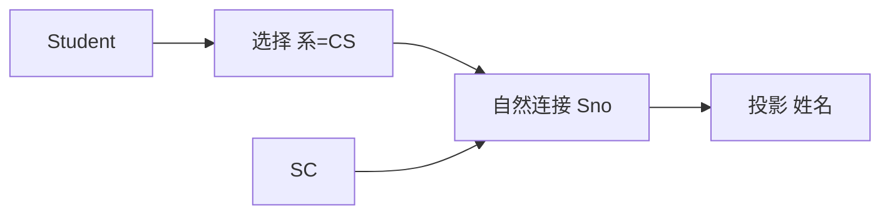

## 本章要义

关系代数用运算表达查询：输入是关系，输出仍是关系。传统集合运算要求**并兼容**（属性个数相同、对应域相同）。专门关系运算才真正体现「表」的特点。



自然连接在同名同域列上等值后去掉重复列；等值连接可以比不同名列，两列都留。

## 源笔记勘误

- 除运算公式被抄断：`R÷S = {tr[X] | tr∈R ∧ πY(S) ⊆ Yx}`，其中 `Yx` 是 x 在 R 中的象集。源笔记写成 `πy (S)Yx` 粘在一起。
- 「例子」标题是空的。下面补选修「学过 S 中全部课程」的除法。
- 自然连接被写成「就是等值连接」。自然连接 = 在**同名同域**属性上等值连接，再**去掉重复列**。等值连接可以在不同名属性上比，结果保留两列。
- 改名运算（ρ）只列了名，没有写为什么需要：自连接必须改名。

## 传统集合运算

R、S 并兼容时：

- **并** \(R \cup S\)：在 R 或 S 中的元组，去重。
- **交** \(R \cap S\)：两边都有。\(R \cap S = R - (R - S)\)。
- **差** \(R - S\)：在 R 不在 S。
- **广义笛卡尔积** \(R \times S\)：R 的每行配 S 的每行。属性拼在一起（可重名），元组数 = |R|×|S|。

## 专门关系运算

- **选择** \(\sigma_C(R)\)：挑行使 C 为真的**行**。
- **投影** \(\pi_{A_1,\ldots,A_n}(R)\)：挑**列**，结果去重。
- **改名** \(\rho_{S(A_1,\ldots)}(R)\)：换关系名或属性名，为自连接做准备。

连接：

- **θ 连接**：\(\sigma_{A \theta B}(R \times S)\)，θ 是比较符。θ 为 `=` 时叫**等值连接**。
- **自然连接** \(R \bowtie S\)：在公共属性（名和类型都相同）上等值，公共列只留一次。没有公共属性时退化成笛卡尔积。
- **外连接**：左/右/全。保留悬空元组，对面补空。SQL 的 OUTER JOIN。

## 除运算

设 \(R(X,Y)\)、\(S(Y,Z)\)，Y 同域。\(R \div S\) 得到 \(P(X)\)：那些 x，其在 R 中的象集 \(Y_x\) **包含** \(\pi_Y(S)\)。

直觉：**「选了 S 里全部课程的学生」**。

```
选修 SC(Sno, Cno)          目标课程 C(Cno)
1  C1                      C1
1  C2                      C2
1  C3
2  C1
2  C2

SC ÷ C = {1}     -- 学生 1 的象集 {C1,C2,C3} ⊇ {C1,C2}
                 -- 学生 2 的象集 {C1,C2} 也 ⊇ {C1,C2}，故 {1,2}
```

若 C 再加 C3，则只剩学生 1。SQL 里常用 `NOT EXISTS` 套查询模拟除，见 [[db/06-sql|SQL]]。

## 查询怎么写

「计算机系学生的姓名」：

\[
\pi_{\text{姓名}}(\sigma_{\text{系='CS'}}(\text{Student}))
\]

「选修了 2 号课的学生姓名」：

\[
\pi_{\text{姓名}}(\sigma_{\text{Cno}='2'}(\text{Student} \bowtie \text{SC}))
\]

先选择再连接，中间结果更小。这就是 [[db/08-optimize|查询优化]] 第一条准则。

## 复习易错点

- 投影会去重；SQL 的 SELECT 默认不去重（包），要 `DISTINCT`。
- 自然连接丢重复列，等值连接不丢。
- 除法不是算术除，是「包含全部」的全称量词。
- 并交差要求并兼容，连接不要求。

## 考研题精练

**题 1**  
自然连接与等值连接的主要区别是（ ）。

A. 自然连接不必有比较条件 B. 自然连接在同名同域属性上等值后去掉重复列 C. 等值连接一定会去掉重复列 D. 二者完全相同

**解答：** 自然连接 = 公共属性上等值 + 去重复列。等值连接可在不同名属性上比，比较的两列都保留。没有公共属性时自然连接退化成笛卡尔积。**选 B。**

**题 2**  
选修 \(SC(Sno,Cno)\) 除以课程集 \(C(Cno)=\{C1,C2\}\)，结果是（ ）。

A. 选修过 C1 或 C2 的学生 B. 象集包含 \(\{C1,C2\}\) 的学生（两门都选了） C. 恰好只选了 C1 和 C2、再无其它课的学生 D. 先做笛卡尔积再投影学号

**解答：** 除是全称量词：象集 \(\supseteq \pi_{Cno}(C)\)。还可以多选别的课。**选 B。**

**题 3**  
关系代数的投影运算，结果中（ ）。

A. 默认保留重复元组 B. 去掉重复元组 C. 与 SQL 的 SELECT 默认行为相同 D. 只去掉含空值的元组

**解答：** 代数投影是集合，去重。SQL 的 SELECT 默认是包，去重要写 `DISTINCT`。**选 B。**

## 继续阅读

这些运算对应 SQL 的 SELECT-FROM-WHERE：[[db/06-sql|SQL]]。优化器如何重排它们：[[db/08-optimize|查询优化]]。
