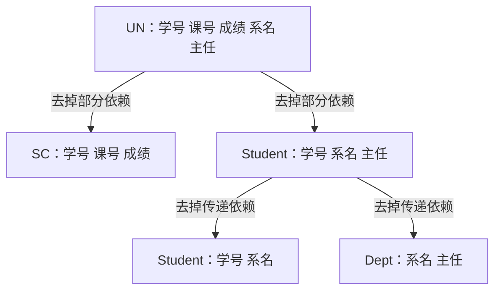

## 本章要义

逻辑设计要回答两件事：拆成几张表、每张表放哪些属性。拆不好会出现冗余、插入异常、删除异常。规范化用函数依赖当尺子，一级一级去掉有害依赖。

先拆掉非主属性对码的部分依赖进 2NF，再拆掉传递依赖进 3NF。

## 源笔记勘误

- UN 模式写成 `UN(Sno,Cno,G,Sdept,MN)`，后面举例又写成 SDN。统一为：学号、课号、成绩、系名、系主任。
- 「完全/部分函数依赖」只有标题。定义见下。
- 传递依赖在 3NF 里用到了，源笔记没单独定义。
- BCNF 写在「3NF 的不完善性」下面，但定义本身不依赖 3NF：`R∈1NF` 且每个决定因素都是候选码。
- 分解后的 `S(Sno,Sdept)` 仍有传递依赖如果还有系主任——源笔记把系主任放到了 `Dept(Sdept,MN)`，这步是对的，但没写出依赖集。

## 一个坏模式

`UN(Sno, Cno, Grade, Sdept, MN)`，语义：

- `(Sno, Cno) → Grade`
- `Sno → Sdept`
- `Sdept → MN`（一系一个主任）

码是 `(Sno, Cno)`。问题：

1. **冗余**：同一系主任随每个选课行存一次。改主任要改很多行（更新异常）。
2. **插入异常**：系刚成立、还没学生，主码课号为空，插不进去。
3. **删除异常**：系里学生都毕业，系和主任信息跟着被删。

分解：

- `Student(Sno, Sdept)`
- `SC(Sno, Cno, Grade)`
- `Dept(Sdept, MN)`

## 函数依赖

\(X \rightarrow Y\)：任一合法关系里，不存在两行在 X 上相等、在 Y 上不等。X 叫决定因素。

要点：

- 依赖是**语义**，不能只看当前几行碰巧成立。
- 对模式的所有可能关系都要成立。
- 1:1 常互相决定；m:1 则多的一边决定一的一边；m:n 一般不能函数决定。
- Y ⊆ X 时是平凡依赖；讨论规范化时看非平凡的。

**完全函数依赖** \(X \xrightarrow{F} Y\)：\(X \rightarrow Y\)，且 X 的任何真子集都不能决定 Y。  
**部分函数依赖** \(X \xrightarrow{P} Y\)：\(X \rightarrow Y\)，但存在真子集 \(X' \subset X\) 使 \(X' \rightarrow Y\)。  
**传递依赖**：\(X \rightarrow Y\)，\(Y \rightarrow Z\)，且 \(Y \not\rightarrow X\)、Z 不在 XY 里，则 \(X \rightarrow Z\) 经 Y 传递。

候选码 K：\(K \xrightarrow{F} U\)（K 完全函数决定全部属性）。性质：唯一标识；无冗余（少一个属性就不行）。主码是选定的那个候选码。

## 范式

低一级通过投影升到高一级。满足高级则自动满足低级。

### 1NF

每个分量原子。关系模型默认在 1NF。

### 2NF

1NF + **每个非主属性完全依赖于任一候选码**。  
UN 中 `Sdept`、`MN` 只依赖 `Sno`，不依赖整个 `(Sno,Cno)` → 部分依赖 → 不是 2NF。  
拆出 `Student(Sno,Sdept,MN)` 和 `SC(Sno,Cno,Grade)` 后，对码而言非主属性都完全依赖，进入 2NF。但 `Student` 里仍有 `Sno → Sdept → MN`。

### 3NF

2NF + **每个非主属性不传递依赖于候选码**。  
再拆 `Student(Sno,Sdept)`、`Dept(Sdept,MN)` 去掉传递依赖。

3NF 允许：主属性之间的传递/部分依赖。于是有时仍别扭，才要 BCNF。

### BCNF

1NF + **每个决定因素都是候选码**。  
也就是：任何非平凡 \(X \rightarrow Y\)，X 都必须含码。消除的是**任何属性**（含主属性）对码的部分/传递依赖。

例：`R(Sno, Sname, Cno)` 若学号、姓名都唯一，则 `(Sno,Cno)` 和 `(Sname,Cno)` 都是候选码，`Sno → Sname`。决定因素 Sno 不是候选码 → 3NF 但非 BCNF。拆成 `(Sno,Sname)` 和 `(Sno,Cno)`。

## 复习易错点

- 2NF 只管**非主属性**对码的部分依赖；主属性出问题要看到 BCNF。
- 「属于 3NF」蕴含属于 2NF、1NF，不必再验。
- 分解要无损连接，最好保持依赖。考试常给依赖集让你判断范式或拆表。
- 不是范式越高越好：查询总要连接时，可能故意留在 3NF 甚至更低。

## 考研题精练

**题 1**  
\(UN(Sno,Cno,Grade,Sdept,MN)\)，\(F=\{(Sno,Cno)\rightarrow Grade,\,Sno\rightarrow Sdept,\,Sdept\rightarrow MN\}\)。该模式最高属于（ ）。

A. 1NF B. 2NF C. 3NF D. BCNF

**解答：** 分量原子，故为 1NF。\(Sdept\)、\(MN\) 只依赖 \(Sno\)，对码 \((Sno,Cno)\) 是部分依赖，不是 2NF。**选 A。**

**题 2（3NF）**  
关系模式属于 3NF，是指它已是 2NF，并且（ ）。

A. 每个决定因素都是候选码 B. 每个非主属性都不传递依赖于候选码 C. 没有非主属性对码的部分依赖即可 D. 必须消除多值依赖

**解答：** 3NF = 2NF + 非主属性不传递依赖候选码。A 是 BCNF；C 只是 2NF；D 是 4NF。**选 B。**

**题 3**  
\(R(Sno,Sname,Cno)\)，学号与姓名均唯一，\(F\) 含 \(Sno\rightarrow Sname\)、\(Sname\rightarrow Sno\)。下列正确的是（ ）。

A. 只有一个候选码 \((Sno,Cno)\) B. 属于 BCNF C. 属于 3NF 但不属于 BCNF D. 不属于 3NF

**解答：** 候选码有 \((Sno,Cno)\) 和 \((Sname,Cno)\)。\(Sname\) 是主属性，没有非主属性的部分/传递依赖 → 3NF。但 \(Sno\rightarrow Sname\) 的决定因素不是候选码 → 非 BCNF。**选 C。**

## 继续阅读

这些依赖在设计阶段用来优化模式：[[db/02-design|数据库设计]]。SQL 如何声明码：[[db/06-sql|SQL]]。
