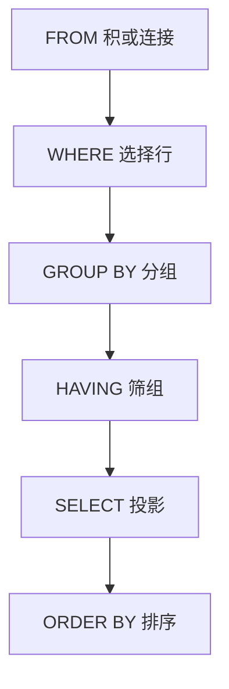

## 本章要义

SQL 是非过程语言：说「要什么」，「怎么做」交给 DBMS。对应关系代数：WHERE ≈ 选择，SELECT 列表 ≈ 投影，FROM 多表 ≈ 积/连接。和代数不同，SELECT **默认保留重复行**（包），去重要 `DISTINCT`。



书写顺序是 SELECT-FROM-WHERE，执行顺序从 FROM 起；WHERE 里不能放聚合，筛组用 HAVING。

## 源笔记勘误

- 创建视图、视图更新、创建索引都是空标题。
- 权限整节绑死 SQL Server 2000 企业管理器，复习价值低。下面改成标准 GRANT/REVOKE，产品细节只留「认证 ≠ 授权」这一句。
- `int` 写成 \(-2^{31}\sim+2^{31}\)，上界应是 \(2^{31}-1\)。
- 「优化隐藏器」应为「优化器」。
- `<> some` 不等价于 `NOT IN`（`NOT IN` 遇 NULL 会坑）；`= some` 才等价 `IN`。
- 子查询「不使用 ORDER BY」：标准里子查询无 ORDER BY，除非外面包了 TOP/LIMIT/OFFSET 这类实现扩展。

## 语言分层

- **DDL**：CREATE / ALTER / DROP。管模式。
- **DML**：SELECT / INSERT / UPDATE / DELETE。管数据。
- **DCL**：GRANT / REVOKE（有的产品还有 DENY）。

交互式直接敲；嵌入式嵌进宿主语言，一般要预编译。

```sql
CREATE TABLE Student (
  Sno   CHAR(8) PRIMARY KEY,
  Sname VARCHAR(20) NOT NULL,
  Sage  SMALLINT CHECK (Sage BETWEEN 15 AND 45),
  Sdept CHAR(2)
);
```

ALTER 加列通常允许 NULL（已有行只能填空）。DROP TABLE 连模式带数据一起拆。INSERT 可按列清单；DELETE 删的是整行；UPDATE 改符合条件的列值。

## SELECT

```sql
SELECT [ALL|DISTINCT] 列表达式 [AS 别名]
FROM 表 [别名] [, ... | JOIN ...]
WHERE 行条件
GROUP BY 分组列
HAVING 组条件
ORDER BY 列 [ASC|DESC];
```

WHERE 谓词：比较、`BETWEEN`、`IN`、`LIKE`（`%` 任意串，`_` 单字符）、`IS [NOT] NULL`、AND/OR/NOT。转义用 `ESCAPE`。

连接：INNER 只留匹配行；LEFT/RIGHT/FULL OUTER 保留悬空侧。自连接必须别名。

子查询：

- 单值：用 `>` `=` 等与标量比。
- 多值：`IN` / `ALL` / `SOME(ANY)`。`s > ALL R` 比 R 每个都大；`<> ALL` ≡ `NOT IN`（无 NULL 时）。
- `EXISTS`：只关心是否非空，常写 `SELECT *`。外层列出现在内层叫**相关子查询**，逐外层行求一次。

聚合：`AVG SUM MIN MAX COUNT`。NULL 不参与（COUNT(*) 计行，COUNT(列) 不计该列 NULL）。

GROUP BY：值相同的进一组。SELECT 里非聚合列必须出现在 GROUP BY。HAVING 筛组；WHERE 筛行，WHERE 里不能放聚合。

## 视图

视图是虚表，数据仍在基表。用处：子模式、安全裁剪、简化连接。

```sql
CREATE VIEW CS_Student AS
SELECT Sno, Sname FROM Student WHERE Sdept = 'CS'
WITH CHECK OPTION;
```

可更新视图通常要求：一行对应基表一行，没有聚合/DISTINCT/多基表任意连接。不满足就只能查。`WITH CHECK OPTION` 阻止通过视图插入/改出视图范围之外的行。

## 索引

索引是列值到行位置的目录。加速选择、连接、ORDER BY/GROUP BY；拖慢增删改。

- **聚集索引**：叶节点就是数据行，表按该键物理排序，一张表通常一个。
- **非聚集索引**：叶节点是键 + 行定位器，表本身不必按它排序。

```sql
CREATE UNIQUE INDEX idx_sname ON Student(Sname);
```

## 约束与权限

主键、UNIQUE、CHECK、DEFAULT、FOREIGN KEY——定义见 [[db/09-integrity|完整性]]。

权限两段：先认证（你是谁），再授权（你能干什么）。SQL：

```sql
GRANT SELECT, UPDATE(Sage) ON Student TO u1 WITH GRANT OPTION;
REVOKE SELECT ON Student FROM u1;
```

角色是权限的分组。源笔记里 SQL Server 的固定服务器角色/数据库角色，知道「角色减少重复授权」即可，不必背 db_denydatawriter。

## 复习易错点

- WHERE 先于 GROUP BY 先于 HAVING。
- `COUNT(*)` 与 `COUNT(列)` 对空值不同。
- 相关子查询不能当「只执行一次」想。
- 视图更新失败常常不是语法错，是视图不可更新。
- 聚集索引选错（比如常变的列）会让整表跟着搬家。

## 考研题精练

**题 1（SQL 结果）**  
表 `T(id, age)` 三行：`(1,20)`、`(2,21)`、`(3,NULL)`。执行

```sql
SELECT COUNT(*), COUNT(age), AVG(age) FROM T;
```

结果是（ ）。

A. 3, 3, 20.5 B. 3, 2, 20.5 C. 2, 2, 20.5 D. 3, 2, NULL

**解答：** `COUNT(*)` 计行得 3。`COUNT(age)` 不计该列 NULL 得 2。`AVG` 同样忽略 NULL，\((20+21)/2=20.5\)。**选 B。**

**题 2**  
下列写法中，筛的是「组」而不是「行」的是（ ）。

A. `WHERE Sage > 20` B. `HAVING COUNT(*) > 2` C. `SELECT Sage FROM Student` D. `ORDER BY Sage`

**解答：** WHERE 在分组前筛行，不能含聚合；HAVING 在 GROUP BY 之后筛组。**选 B。**

**题 3**  
关于子查询，正确的是（ ）。

A. `<> SOME` 等价于 `NOT IN` B. `= SOME` 等价于 `IN` C. 相关子查询对整句只执行一次 D. 子查询里必须写 `ORDER BY`

**解答：** `= SOME` ≡ `IN`。`<> SOME` 只要求「与某一个不等」，不是 `NOT IN`；`<> ALL` 在无 NULL 时才 ≡ `NOT IN`。相关子查询逐外层行求一次。**选 B。**

## 继续阅读

多语句同时跑：[[db/07-concurrency|并发控制]]。优化器怎么改写你的 SELECT：[[db/08-optimize|查询优化]]。
