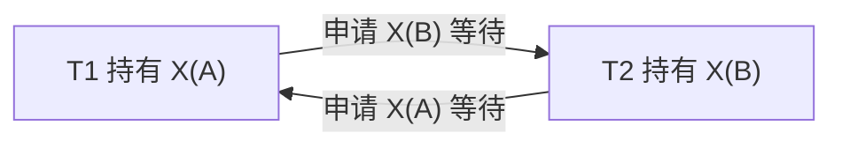

## 本章要义

事务并发能提高吞吐，但会破坏隔离性和一致性。封锁是经典手段：写前加 X 锁，按协议决定读要不要加 S 锁、何时放。事务是封锁和 [[db/10-recovery|恢复]] 的共同单位。

等待图成环就是死锁。S 与 S 相容，X 与任何锁不相容；写锁留到事务结束。

## 源笔记勘误

- 相容矩阵、三级协议「主要区别」是空标题。
- 不可重复读只写了「T2 更新」，没写它其实还包含：T2 删了 T1 读过的行，或插入了新行让 T1 的统计变了（幻读，教材有时并进不可重复读，SQL 标准单独叫 phantom）。
- 「其它事务不能更新」写在封锁总定义里，对 S 锁不精确：S 锁禁止别人写，允许别人再加 S。
- 没有死锁。两段锁协议（2PL）也没写。下面补最短可用口径。

## 三种执行

- **串行**：同一时刻一个事务。正确但浪费。
- **交叉并发**：单机上交错执行操作。教材默认模型。
- **同时并发**：多处理机真并行。调度更难。

DBMS 必须调度，使并发结果等价于某个串行次序（可串行化），这是隔离性的实现目标。

## 三类不一致

设初始 A=100。

| 现象 | 过程 | 结果 |
|---|---|---|
| 丢失修改 | T1 读 A=100 改 110；T2 读 A=100 改 120 后提交 | T1 的 +10 丢了 |
| 不可重复读 | T1 读 A=100；T2 改 A=120 提交；T1 再读到 120 | T1 两次读不一致 |
| 脏读 | T1 改 A=110 未提交；T2 读 110；T1 回滚 | T2 读到不该存在的值 |

## 锁

事务操作前申请锁。释放前别人按相容规则受限。

- **X 锁（写锁）**：独占。T 持有 X(A) 则可读可写；别人不能再加任何锁。
- **S 锁（读锁）**：共享。T 持有 S(A) 则可读；别人可再加 S，不能加 X。

相容矩阵（行=已持有，列=申请）：

| | S | X |
|---|---|---|
| **无** | 是 | 是 |
| **S** | 是 | 否 |
| **X** | 否 | 否 |

## 三级封锁协议

| 协议 | 写 | 读 | 防丢失修改 | 防脏读 | 防不可重复读 |
|---|---|---|---|---|---|
| 1 级 | 改前 X，事务结束才放 | 不加锁 | 是 | 否 | 否 |
| 2 级 | 同 1 级 | 读前 S，**读完就放** | 是 | 是 | 否 |
| 3 级 | 同 1 级 | 读前 S，**事务结束才放** | 是 | 是 | 是 |

区别就在「读锁持有多久」。1 级对应脏写防护；2 级类似 Read Committed；3 级接近 Repeatable Read。幻读还要谓词锁或串行化隔离级别。

**两段锁（2PL）**：先只加锁（扩展），再只解锁（收缩），不交错。2PL 是可串行化的充分条件。严格 2PL：所有锁留到 COMMIT/ROLLBACK，便于恢复。

死锁：T1 持 A 等 B，T2 持 B 等 A。诊断用等待图；解除通常回滚代价小的一方。预防：一次加齐、顺序加锁、超时。

## 复习易错点

- 1 级协议**读不加锁**，所以防不住脏读。
- S 与 S 相容，S 与 X 不相容。
- 可串行化 ≠ 事务必须真的串行执行。
- 封锁粒度过细并发高、开销大；过粗（表锁）简单但容易堵。

## 考研题精练

**题 1（冲突可串行化）**  
调度 \(S\)：\(r_1(A)\,w_2(A)\,r_2(B)\,w_1(B)\)。下列判断正确的是（ ）。

A. 无环，等价于 \(T_1\rightarrow T_2\) B. 无环，等价于 \(T_2\rightarrow T_1\) C. 冲突图有环，不是冲突可串行化 D. 可串行但不冲突可串行化

**解答：** \(r_1(A)\) 与 \(w_2(A)\) 冲突 ⇒ \(T_1\rightarrow T_2\)；\(r_2(B)\) 与 \(w_1(B)\) 冲突 ⇒ \(T_2\rightarrow T_1\)。有环则不是冲突可串行化。**选 C。**

**题 2**  
一级封锁协议能防止、不能防止的分别是（ ）。

A. 防丢失修改，不防脏读 B. 防脏读，不防丢失修改 C. 三种不一致都能防 D. 三种都不防

**解答：** 1 级：改前加 X 且事务结束才放，防丢失修改；读不加锁，脏读和不可重复读都防不住。防脏读要 2 级（读完才放 S），防不可重复读要 3 级（S 留到事务结束）。**选 A。**

**题 3**  
两段锁协议（2PL）保证的是（ ）。

A. 不会死锁 B. 冲突可串行化的充分条件 C. 不会脏读 D. 所有锁必须是 X 锁

**解答：** 先只加锁再只解锁，是可串行化的充分条件，不是必要条件，也不能防止死锁。脏读要靠锁的类型和持有时间。**选 B。**

## 继续阅读

事务的 ACID 和故障恢复：[[db/10-recovery|恢复技术]]。锁和 OS 里的临界区是同一类问题，见 [[os/02-process|进程]]。
