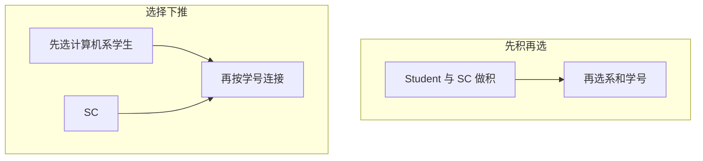

## 本章要义

关系系统只要求：用户看见的是表，并且选择、投影、（自然）连接不必由用户指定物理路径。优化器的工作就是为同一查询挑代价更小的等价操作序列。用户不必把 SQL 写成「最优」，系统通常比手写过程式遍历更强——前提是统计信息和索引还像样。

同一查询先让选择把行数打下去，再连接；积再选会多出几个数量级的中间结果。

## 源笔记勘误

- 「杷某些选择」是「把」。
- 「关系系统的定义」写完就跳到准则，没有说明：有表但只能按网状方式导航的，不算关系系统；必须支持三种运算且不依赖预定义存取路径。
- 准则列了六条，没有数字直觉。下面用学生⋈选课说明先选择能少几个数量级。
- 没有区分代数优化（等价变换）和物理优化（选索引、选连接算法）。源笔记只覆盖前者。

## 关系系统的最低要求

1. 用户观点里数据库由且主要由表构成。
2. 支持选择、投影、自然连接（或等价物），且不必先建网状系链一类物理路径。

不必完整实现关系模型每一条才配叫关系系统。

## 为什么系统能优得过用户

- 优化器看全局，用户语句只是局部习惯。
- 有目录统计：表基数、值分布、索引。
- 对物理层的了解比应用员多（缓冲、聚簇）。
- 同一 SQL 在数据量变化后可以换计划，程序写死的 nested loop 不会自己改。

## 代数优化准则

1. **选择尽量先做**。最重要。中间结果立刻变小。
2. **连接前预处理**：在连接属性上建索引，或排序后归并连接。
3. **同一关系上的投影和选择一次扫描做完**，避免重复读表。
4. **投影并入前后的双目运算**，不必为删列再扫一遍。
5. **选择 + 笛卡尔积 → 连接**。等值连接远比先积再选便宜。
6. **提取公共子表达式**，物化一次，多处用。

例：计算机系学生的选课。坏写法心理模型：`Student × SC` 再选系和学号相等。若 10⁴ 学生、10⁵ 选课，积是 10⁹ 行。好计划：先 \(\sigma_{Sdept='CS'}(Student)\)（可能 500 行），再与 SC 在 Sno 上连接。差三个数量级很常见。

物理层再选：有 Sdept 索引就索引扫描；连接用 nested-loop / sort-merge / hash。细节因引擎而异，考试认准则即可。

## 复习易错点

- 「用户写得越像关系代数越好」不成立；优化器会重写。但写 `WHERE` 里的函数包住索引列（`YEAR(date)=2024`）仍常让索引失效，这是实现问题。
- 选择下推不是永远正确：有的视图/OUTER JOIN 会挡住下推。
- 公共子表达式要权衡物化成本。

## 考研题精练

**题 1**  
代数优化中通常最重要、应尽量先做的是（ ）。

A. 把所有连接改成笛卡尔积 B. 选择尽量先做 C. 投影尽量最后做 D. 禁止使用索引

**解答：** 选择先做立刻缩小中间结果，是六条准则里最要紧的一条。投影可并入前后运算，但不是「越晚越好」。**选 B。**

**题 2**  
\(10^4\) 行学生表与 \(10^5\) 行选课表查询「计算机系学生的选课」。先做积再选，中间元组数量级约为（ ）。

A. \(10^4\) B. \(10^5\) C. \(10^9\) D. \(10^2\)

**解答：** 笛卡尔积 \(|R|\times|S|=10^9\)。先选出约几百名计算机系学生再按学号连接，能少三个数量级。**选 C。**

**题 3**  
「关系系统」的最低要求不包括（ ）。

A. 用户看见的主要是表 B. 支持选择、投影、自然连接 C. 这三种运算不必依赖预定义存取路径 D. 必须实现关系模型的每一条性质才配叫关系系统

**解答：** 不必把关系模型逐条实现完。有表却只能按网状系链导航的，不算关系系统。**选 D。**

## 继续阅读

运算定义在 [[db/04-algebra|关系代数]]。索引如何建在 [[db/06-sql|SQL]]。查找结构本身见 [[ds/06-search|查找]]。
