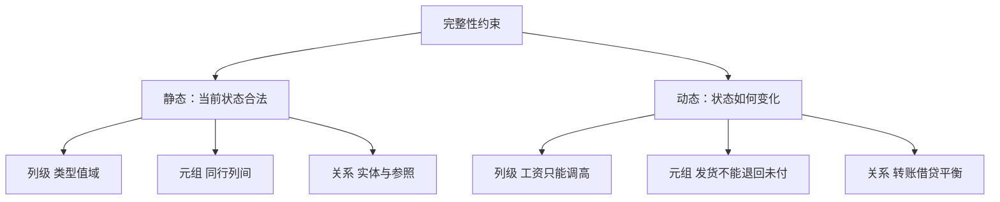

## 本章要义

完整性管的是「数据像不像真的」，不是「谁有权看」。教材按**何时检查、作用在哪一层**切成六格：静态/动态 × 列/元组/关系。关系模型那三类完整性（实体、参照、用户定义）是另一把刀，两套要能对上。

实体/参照落在静态关系格；CHECK 多在静态列或元组。能声明就别只写在应用里。

## 源笔记勘误

- 六类都只有一句定义，没有例子，也没有「用什么机制实现」。
- 静态关系约束只提了外码，漏了实体完整性（主码非空唯一）和统计约束（如经理工资 ≥ 部门平均——常靠断言/触发器）。
- 动态关系约束举「事务一致性、原子性」容易和学生混淆：ACID 的 C/A 是事务性质，完整性约束是数据上的规则；事务要保证**不违反**这些规则地走完。
- 没有写检查时机：立即约束 vs 延迟到 COMMIT（某些参照完整性、断言）。

## 六类约束

**静态**约束当前合法状态；**动态**约束状态如何变化。

### 静态列级

作用在单个属性上，与同行其它列无关。

- 类型、长度、精度
- 格式（日期、身份证位数）
- 值域或枚举（性别、成绩 0–100）
- 能否为空
- 其它（如默认值）

SQL：类型、`NOT NULL`、`CHECK (Sage>=0)`、`DEFAULT`。

### 静态元组

同一行内列与列的关系。例：`结束日期 >= 开始日期`，`实发 = 应发 - 扣款`。  
SQL：表级 `CHECK (end_date >= start_date)`。

### 静态关系

行与行、表与表。

- 实体完整性：主码唯一且非空
- 参照完整性：外码空或匹配被参照表
- 函数依赖（规范化阶段处理）
- 统计约束：部门人数 ≤ 编制

SQL：`PRIMARY KEY`、`UNIQUE`、`FOREIGN KEY`、`ASSERTION`、触发器。

### 动态列级

改定义或改值时的限制。例：不能把 `VARCHAR(20)` 直接改成更短以致截断；工资只能调高不能调低。

### 动态元组

改一行时新旧行之间的关系。例：调薪后工资 ≥ 调薪前；订单状态不能从「已发货」退回「未付款」。

### 动态关系

关系变化前后的整体限制。例：转账时借方合计减少额 = 贷方合计增加额——这常由**一个事务**里两条 UPDATE 一起保证，对应原子性和一致性。

## 和三类完整性的对应

| 关系模型 | 落在哪一格 | SQL |
|---|---|---|
| 实体完整性 | 静态关系 | PRIMARY KEY |
| 参照完整性 | 静态关系 | FOREIGN KEY |
| 用户定义 | 多在静态列/元组 | CHECK、UNIQUE、触发器 |

实现层次：声明式约束（优先）→ 触发器 → 应用代码。能声明就别写在应用里，避免漏网。

违约：拒绝（默认）、级联、置空/置默认。动态规则多用触发器 `ROLLBACK`。

## 复习易错点

- 完整性 ≠ 安全性，也 ≠ 并发隔离。
- `UNIQUE` 允许多个 NULL（多数实现），`PRIMARY KEY` 不允许 NULL。
- 外码违约动作要和业务一致：删客户时级联删订单还是拒绝，是设计决策。
- 延迟约束：事务中间可以暂时违反，COMMIT 时必须满足。

## 考研题精练

**题 1**  
关于 `PRIMARY KEY` 与 `UNIQUE`，正确的是（ ）。

A. 二者都不允许 NULL B. `UNIQUE` 允许多个 NULL（多数实现），`PRIMARY KEY` 不允许 NULL C. `PRIMARY KEY` 允许一个 NULL D. 二者完全等价

**解答：** 主码是实体完整性，非空且唯一。`UNIQUE` 只约束非空值互异，多数引擎允许多个 NULL。**选 B。**

**题 2**  
约束「结束日期 ≥ 开始日期」属于（ ）。

A. 静态列级 B. 静态元组 C. 动态列级 D. 动态关系

**解答：** 同一行内两列之间的关系，与其它行无关，是静态元组约束。单列值域才是静态列级。**选 B。**

**题 3**  
完整性与安全性的区别是（ ）。

A. 没有区别 B. 完整性防非法用户，安全性防脏数据 C. 完整性防脏数据（正确、有效、相容），安全性防未授权访问 D. 完整性只靠触发器，安全性只靠视图

**解答：** 两套目标不同。完整性用约束/断言/触发器；安全性用认证、授权、视图裁剪。**选 C。**

## 继续阅读

三类完整性的形式定义：[[db/03-relational|关系模型]]。语法：[[db/06-sql|SQL]]。事务如何保证变化过程不半残：[[db/10-recovery|恢复]]。
