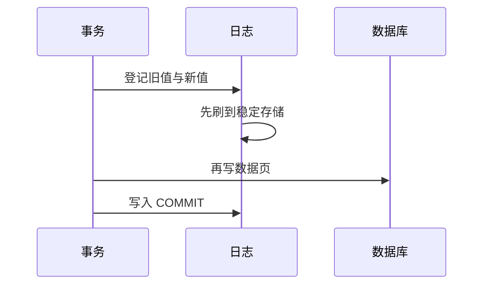

## 本章要义

恢复的原理只有一个：**冗余**。用别处的副本（备份 + 日志）重建被破坏或不正确的数据。单位是事务：要么全做，要么当没发生。

WAL：日志先于库文件落地。未提交靠旧值 UNDO，已提交但可能没刷盘的用新值 REDO。

## 源笔记勘误

- 故障种类、转储、日志都是空标题。
- 「持续性也称永久性」对；英文 Durability / Permanence。
- 「一个事务可以是一条 SQL、一组 SQL 或整个程序」对，但要强调：一个程序通常包含**多个**事务，自动提交模式下「一条语句一个事务」。
- 没有 WAL（先写日志）、没有检查点、没有 UNDO/REDO。这是恢复章节真正要考的。

## 事务

用户定义的操作序列，不可分割。结束：

- **COMMIT**：正常结束，更新永久生效。
- **ROLLBACK**：异常终止，撤销更新，回到事务开始。

### ACID

- **原子性**：全做或全不做。靠 UNDO。
- **一致性**：从一个一致状态到另一个。靠完整性约束 + 原子性 + 隔离。
- **隔离性**：并发事务互不干扰。靠 [[db/07-concurrency|封锁/调度]]。
- **持续性**：提交后的结果，随后的故障不能抹掉。靠 REDO + 备份。

## 故障

原因：硬件、系统/应用软件、操作失误、恶意破坏。后果：事务中断，或数据库本身坏掉。

| 类型 | 发生 | 内存 | 磁盘上的库 | 恢复 |
|---|---|---|---|---|
| 事务故障 | 某事务自己失败（溢出、死锁回滚） | 该事务未提交更新应丢 | 库文件还在 | UNDO 该事务 |
| 系统故障 | 掉电、OS 崩 | 缓冲全丢 | 库文件在，可能有未刷盘的已提交更新 | 重启动后：UNDO 未提交，REDO 已提交 |
| 介质故障 | 磁盘损坏 | — | 库文件没了 | 备份 + 日志正向 REDO |
| 病毒等 | 人为破坏 | 不定 | 可能被改 | 当介质故障处理 |

## 实现技术

### 转储（备份）

- 静态转储：停事务再拷，简单一致。
- 动态转储：边跑边拷，必须搭配日志才能拉齐。
- 海量（全量）vs 增量：增量只拷上次以来改过的页。

### 日志

按时间记下每个更新：事务标识、操作、对象、旧值、新值。规则：

1. **WAL**：先写日志并稳定存储，再写数据库。否则崩溃后既不能 UNDO 也不能 REDO。
2. 登记顺序与执行顺序一致。
3. 事务提交记录进日志后，才算提交成功。

### 检查点

周期把缓冲刷盘，并在日志写一个 checkpoint（此时活跃事务表）。恢复时不必从头扫整条日志：从最近检查点开始，只处理之后还活跃或其后才提交的事务。

### UNDO / REDO

- **UNDO**：用日志旧值把未提交事务改回去。逆序扫该事务的更新。
- **REDO**：用日志新值把已提交但可能没刷盘的更新再做一遍。正序。幂等：做两次等于做一次。

系统故障恢复轮廓：分析日志 → 未提交事务 UNDO → 已提交事务 REDO。介质故障：装回备份，再用备份点之后的日志 REDO。

## 复习易错点

- 已提交事务系统故障后要 REDO，不是「已经提交就不用管」——缓冲可能没落地。
- 未提交事务的脏页若已落地，必须 UNDO。
- 备份没有日志，只能回到备份那一瞬，备份之后的提交全丢。
- 原子性靠 UNDO，持续性靠 REDO，别记反。

## 考研题精练

**题 1（UNDO / REDO）**  
系统故障后，对「已提交但脏页可能未刷盘」的事务和「未提交」的事务，分别应当（ ）。

A. 都 UNDO B. 都 REDO C. 前者 REDO，后者 UNDO D. 前者不管，后者 REDO

**解答：** 已提交的更新可能还在缓冲里，必须用日志新值正向 REDO，否则破坏持续性。未提交的脏页若已落地，必须用旧值逆序 UNDO，否则破坏原子性。**选 C。**

**题 2**  
WAL（先写日志）的含义是（ ）。

A. 先改数据库，崩溃后再补日志 B. 日志先稳定存储，再写数据库 C. 只记新值、不记旧值 D. 检查点之后不必再写日志

**解答：** 若库页先落地、日志后写，崩溃时既无新值可 REDO、也无旧值可 UNDO。提交成功以 COMMIT 记录进日志为准。**选 B。**

**题 3**  
设置检查点的主要好处是（ ）。

A. 可以不再做备份 B. 恢复时不必从日志开头扫，只需从最近检查点处理活跃/其后提交的事务 C. 已提交事务不必 REDO D. 未提交事务不必 UNDO

**解答：** 检查点把缓冲刷盘并记下当时的活跃事务。恢复仍可能 REDO/UNDO，只是分析范围缩短。没有日志的备份只能回到备份那一瞬。**选 B。**

## 继续阅读

并发与恢复共享事务和锁：[[db/07-concurrency|并发控制]]。文件和磁盘坏块是 OS 层：[[os/07-file|文件管理]]。
