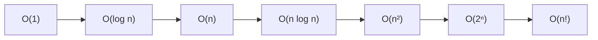

## 本章要义

数据结构研究的是：**数据元素之间有什么关系（逻辑）**、**在机器里怎么放（存储）**、**在这种放下能做哪些运算（算法）**。三者缺一不可。算法设计看逻辑结构，算法实现看存储结构。



看循环时先写出执行次数再取阶，不要看见两层 `for` 就写 \(O(n^2)\)。

## 源笔记勘误

- 原标题写成「数据结构的」就断了，本章按「基本概念」收束。
- 「复杂度如何计算」只留了「单个循环看次数、多个循环用加减乘」，没有阶的比较、最好/平均/最坏，也没有递归例子。下面补全。
- 算法「输入」被写成必须有输入。标准五特征里**输入可以是 0 个**，输出至少 1 个。

## 定义

数据元素不是孤立的，它们之间的关系叫**结构**。数据结构 = 逻辑结构 + 存储结构 + 运算。

## 逻辑结构

逻辑结构只谈元素之间的关系，与计算机无关。

| 类型 | 关系 | 直觉 |
|------|------|------|
| 集合 | 同属一个集合 | 装进一个袋子 |
| 线性结构 | 一对一 | 排队 |
| 树形结构 | 一对多 | 族谱 |
| 图状 / 网状 | 多对多 | 地图 |

408 常把前两种叫「线性」，后两种叫「非线性」。线性表、栈、队列、串是线性；树和图是非线性。

## 存储结构（物理结构）

把逻辑关系映到内存。

- **顺序存储**：物理地址连续。随机访问 O(1)，插入删除常要搬元素。
- **链式存储**：结点里存后继地址，物理上不必相邻。
- **索引存储**：先查目录再定位，类似文件系统的索引。
- **散列存储**：由关键字直接算出地址，见 [[ds/06-search|查找]]。

同一逻辑结构可以有多种存储。例如线性表既可以是数组，也可以是链表。

## 算法的五个特征

1. **有穷性**：有限步后停。
2. **确定性**：每一步无歧义。
3. **可行性**：现有计算模型下能完成。理论上可算但要跑到宇宙热寂，408 仍可能判「不可行」。
4. **输入**：0 个或多个。
5. **输出**：1 个或多个。

程序可以不终止（死循环服务），算法必须有穷。

## 时间复杂度

用问题规模 \(n\) 的函数描述基本运算次数的增长趋势，记 \(T(n)=O(f(n))\)。默认分析**最坏情况**，除非题目点名平均或最好。

常用阶（从小到大）：

\[
O(1) < O(\log n) < O(n) < O(n\log n) < O(n^2) < O(n^3) < O(2^n) < O(n!)
\]

计算规则：

- **加法**：顺序执行，取最大项。\(O(n)+O(n^2)=O(n^2)\)。
- **乘法**：嵌套循环相乘。两层 \(n\times n\) 就是 \(O(n^2)\)。
- **循环**：看循环体执行次数。`for (i=n; i>=1; i/=2)` 是 \(O(\log n)\)。
- **递归**：写出递推式。二分递归且规模减半、合并线性，通常 \(T(n)=2T(n/2)+O(n)=O(n\log n)\)。

只含一个循环、循环体 O(1)，复杂度就是循环次数的阶。

空间复杂度 \(S(n)=O(g(n))\) 只算**额外**辅助空间。输入本身占用一般不计入。递归的系统栈要算。

## 408 易错点

- 「原地算法」空间是 \(O(1)\)，不是「没用数组」。
- \(O(2n)\) 与 \(O(n)\) 是同一阶；比较大小时先化简。
- 最好、平均、最坏可以差一个数量级：插入排序最好 \(O(n)\)，平均/最坏 \(O(n^2)\)。源笔记第七章把直接插入写成 \(O(n)\)，是把最好情况当成了一般情况。

## 考研题精练

**题 1（复杂度，408 高频）**  
下列程序段的时间复杂度是（ ）。

```c
int i = 1;
while (i * i <= n) {
    for (int j = 1; j <= i; j++) x++;
    i++;
}
```

A. \(O(\sqrt n)\) B. \(O(n)\) C. \(O(n\log n)\) D. \(O(n^2)\)

**解答：** 外层 \(i\) 走到约 \(\sqrt n\)。内层次数是 \(1+2+\cdots+\sqrt n=\Theta(n)\)。看见双重循环选 D 是最常见的错。**选 B。**

**题 2**  
算法的五个特征里，哪一条说得不对？

A. 必须有穷 B. 每一步确定 C. 必须至少有一个输入 D. 必须至少有一个输出

**解答：** 输入可以是 0 个（例如打印常数表）。输出至少 1 个。**选 C。**

**题 3**  
原地算法的空间复杂度通常是（ ）。

A. \(O(1)\) B. \(O(\log n)\) C. \(O(n)\) D. 与是否使用数组无关

**解答：** 原地指额外空间为常数（递归栈另说）。「没用数组」不是判据。**选 A。**

## 继续阅读

下一章用线性表把「逻辑一对一」落到数组和链表：[[ds/02-linear-list|线性表]]。复杂度会在 [[ds/07-sort|排序]] 里反复用到。
