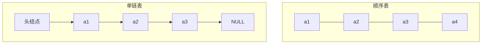

## 本章要义

线性表是 \(n\)（\(n\ge 0\)）个同类型元素的有限序列。除表头外每个元素恰有一个前驱，除表尾外恰有一个后继。空表 \(n=0\) 合法。

实现只有两条主路：**顺序表（数组）** 和 **链表**。408 几乎每年都考插入删除的移动次数、头结点作用、以及双链表指针改接顺序。



插入到第 \(i\) 个位置：顺序表平均搬 \(n-i+1\) 个；链表先找到结点再改指针。

## 源笔记勘误

- 插入、删除的「平均移动次数」写到「则为」就断了。完整公式见下。
- 所有操作都标了「代码」却没有代码。下面补上可默写的 C 风格实现。
- 双链表「定义」是空标题；循环链表 / 静态链表几乎只有一句话。

## 顺序表

三个属性：基址 `data`、容量 `MaxSize`、当前长度 `length`。逻辑相邻 ⇒ 物理相邻，所以：

- 按下标随机访问 \(O(1)\)。
- 存储密度高（结点只存数据）。
- 插入删除要搬元素。

位序从 1 计（教材习惯）。在第 \(i\) 个位置插入：

```c
bool ListInsert(SqList *L, int i, ElemType e) {
    if (i < 1 || i > L->length + 1) return false;
    if (L->length >= L->MaxSize) return false;
    for (int j = L->length; j >= i; j--)
        L->data[j] = L->data[j - 1];
    L->data[i - 1] = e;
    L->length++;
    return true;
}
```

- 最好：插在表尾，\(O(1)\)。
- 最坏：插在表头，移动 \(n\) 次，\(O(n)\)。
- 平均：各位置等概率 \(p_i=1/(n+1)\)，移动次数期望

\[
\sum_{i=1}^{n+1} p_i\cdot(n-i+1)=\frac{n}{2}
\]

删除第 \(i\) 个元素：后面的元素前移。

- 最好：删表尾，\(O(1)\)。
- 最坏：删表头，移动 \(n-1\) 次。
- 平均：\(p_i=1/n\)，期望移动

\[
\sum_{i=1}^{n} p_i\cdot(n-i)=\frac{n-1}{2}
\]

源笔记两处公式都停在「则为」，就是上面这两个结果。

## 单链表与头结点

头指针永远指向第一个结点。头结点是带头链表里「不存业务数据」的那个结点。

设头结点的理由（默写）：

1. 在第一个元素前插入、删除第一个元素，与其它位置操作统一。
2. 空表与非空表的头指针都不为空，处理统一。

**头插法**得到的链表与输入顺序相反；**尾插法**保持原序，需要一个尾指针。

按位查找 \(O(n)\)，按值查找平均也是 \(O(n)\)。在 \(p\) 之后插入 `s`：

```c
s->next = p->next;
p->next = s;
```

两句顺序不能反。删除 `p` 的后继 `q`：

```c
q = p->next;
p->next = q->next;
free(q);
```

单链表在 \(p\) 结点「之前」插入，必须先从头找到前驱，仍是 \(O(n)\)。

## 双链表

每个结点多一个 `prior`。在 \(p\) 之后插入 \(s\) 的一种正确顺序：

```c
s->next = p->next;
p->next->prior = s;
s->prior = p;
p->next = s;
```

先把 \(s\) 接到后面那半，再改 \(p\)->next，否则会丢掉后继。删除 \(q=p\)->next：

```c
p->next = q->next;
q->next->prior = p;
free(q);
```

## 循环链表与静态链表

- 循环单链表：尾结点 `next` 指向头结点，形成一个环。判空：`head->next == head`（带头时）。
- 循环双链表：空表时 `head->prior == head && head->next == head`。
- 静态链表：用数组模拟指针，`next` 存下标。首元通常不放数据，只当头；尾结点 `next = -1`。没有指针的语言、或需要「分配/回收结点」的考题会用它。

## 对比（常考表）

| | 顺序表 | 单链表 |
|--|--------|--------|
| 访问第 \(i\) 个 | \(O(1)\) | \(O(n)\) |
| 插入删除 | 平均搬 \(n/2\) | 找到后 \(O(1)\) |
| 空间 | 预分配，可能浪费 | 按需，多一个指针 |
| 适用 | 查询多、表长稳定 | 插入删除多、长度变化大 |

## 408 易错点

- 位序 \(i\) 从 1 开始，数组下标从 0 开始，写代码时差 1。
- 「带头结点」和「头指针」不是同一个东西。
- 求表长：顺序表 O(1)，单链表若不另存长度则 O(n)。
- 两个指针（快慢、前后）是链表题的常规手法，不属于「新结构」。

## 考研题精练

**题 1**  
在长度为 \(n\) 的顺序表第 \(i\)（\(1\le i\le n+1\)）个位置插入，平均移动次数是（ ）。

A. \(n/2\) B. \((n-1)/2\) C. \(n/2+1\) D. \(n+1\)

**解答：** 等概率插在 \(1\ldots n+1\)，移动 \(n,n-1,\ldots,0\)，平均 \(n/2\)。**选 A。**

**题 2**  
带头结点的单链表中，判断空表的条件是（ ）。

A. `head == NULL` B. `head->next == NULL` C. `head->data == 0` D. `head->next == head`

**解答：** 头结点始终在，空表时后继为空。D 是循环链表空表。**选 B。**

**题 3**  
在双向链表结点 `p` 之后插入 `s`，正确顺序是（ ）。

A. `s->next=p->next; p->next=s; s->prior=p; p->next->prior=s;`  
B. `s->next=p->next; s->prior=p; p->next->prior=s; p->next=s;`  
C. `p->next=s; s->prior=p; s->next=p->next; p->next->prior=s;`

**解答：** 必须先接 `s` 的两根指针，再改原后继的 `prior`，最后才改 `p->next`。C 会丢掉原后继。**选 B。**

## 继续阅读

栈和队列是操作受限的线性表：[[ds/03-stack-queue|栈和队列]]。
