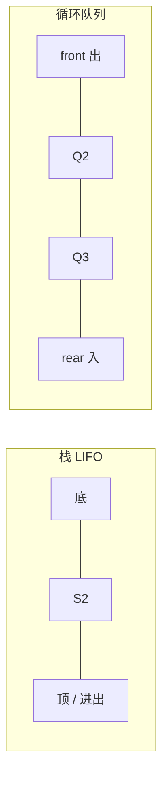

## 本章要义

栈和队列都是操作受限的线性表。栈只在栈顶插入删除，**LIFO**；队列在队尾插入、队头删除，**FIFO**。408 高频：循环队列判满、共享栈、中缀转后缀、递归与栈的关系。



## 源笔记勘误

- 顺序栈 / 链栈 / 循环队列的操作全是空标题，没有初始条件与代码。
- 阶乘递归写成 **\(O(N\log N)\)**，错。一次递归规模减 1，时间是 **\(O(n)\)**，系统栈深度也是 \(O(n)\)。
- 斐波那契只写了朴素递归 \(O(2^n)\)，没写记忆化后是 \(O(n)\)。
- 「表达式求值」规则写成「遇到数字进栈、遇到符号算两个数」——那是**后缀表达式**的求值，不是中缀。源笔记后面的「加括号改后缀」才是中缀转换，两段被混在一起。

## 栈

- 栈顶：允许插入删除的一端。栈底固定。
- 顺序栈：用数组，`top` 指向栈顶。约定 `top=-1` 为空，`top==MaxSize-1` 为满（也可以让 `top` 指向下一个空位，两种写法题面要看清）。
- 链栈：头插即入栈。一般不满。空栈 `top==NULL`。
- **共享栈**：两个栈从数组两端向中间生长。`top0=-1`，`top1=MaxSize`。栈满条件 `top0 + 1 == top1`。空间利用率高于两个独立小数组。

```c
bool Push(SqStack *S, ElemType x) {
    if (S->top == MaxSize - 1) return false;
    S->data[++S->top] = x;
    return true;
}
```

## 队列与循环队列

顺序队列若只把队头固定在下标 0，出队要整体平移，\(O(n)\)。所以做成环：

\[
rear=(rear+1)\bmod MaxSize,\quad front=(front+1)\bmod MaxSize
\]

`front==rear` 既可能空也可能满。两种标准解法：

1. **牺牲一个单元**：满的条件是 `(rear+1)%MaxSize==front`。空仍是 `front==rear`。队中元素个数 `(rear-front+MaxSize)%MaxSize`。
2. **另设 `size` 或 `tag`**：用计数或上次操作是入还是出，区分空满。

408 默认考方法 1。源笔记两种都提到了，但没写出元素个数公式。

链队：头指针指向头结点，尾指针指向最后一个结点。出队后若队列空，必须把 `rear` 也拉回头结点，否则悬空。

双端队列：两端都能进都能出。输入受限 / 输出受限双端队列是选择题常客：判断一个出队序列是否合法。

## 栈的应用

### 括号匹配

左括号入栈，右括号弹出一个左括号看是否同类。扫完栈必须空。

### 中缀 → 后缀（源笔记那三步）

1. 按优先级给运算符和运算数加括号（原括号不动）。
2. 把运算符挪到对应右括号后面。
3. 去掉括号。

机器实现用运算符栈（调度场）：数字直接输出；左括号入栈；右括号弹出直到左括号；运算符弹出到栈顶优先级不大于自己为止再入栈。

### 后缀求值

从左到右：数字入栈；遇到算符弹出两个操作数（先出的是右操作数），算完再压回。这才是源笔记「遇到符号就算栈顶两个数」那一段。

### 递归

递归要有**递归式**和**边界**。系统用栈保存返回地址和局部变量，所以递归能改写成非递归栈。

```c
long fact(int n) {
    if (n <= 1) return 1;
    return n * fact(n - 1);
}
```

\(T(n)=T(n-1)+O(1)=O(n)\)，不是 \(O(n\log n)\)。朴素 `fib(n)=fib(n-1)+fib(n-2)` 是 \(O(\varphi^n)\)，常记 \(O(2^n)\)；带表记忆后 \(O(n)\)。

## 408 易错点

- 共享栈满：两栈顶相邻，不是两个栈都到数组中点。
- 循环队列容量为 \(m\) 且牺牲一格时，最多装 \(m-1\) 个。
- 出栈序列：若入栈顺序 1…n，不出现「大的先出、中间那个比两边都小却夹在不合法位置」——用栈模拟最快。
- 递归空间不是 \(O(1)\)。

## 考研题精练

**题 1**  
容量为 3 的栈，输入序列 `1 2 3 4`，不可能的输出是（ ）。

A. `1 2 3 4` B. `4 3 2 1` C. `2 3 4 1` D. `3 1 2 4`

**解答：** D 里 3 先出则 1、2 在栈中且 2 在 1 上面，接着只能先出 2 不能出 1。B 需要容量 4，题干容量 3 时 `4 3 2 1` 也做不到——先把 1 2 3 压满，4 进不去。若按「无限栈」则 B 合法、D 仍非法。408 若没给容量，**选 D**；给了容量 3 则 B、D 都不行，以题干为准。

**题 2**  
循环队列用数组 `Q[0..n-1]`，`front` 指向队头，`rear` 指向队尾的下一空位。牺牲一个单元判满时，队满条件是（ ）。

A. `front==rear` B. `(rear+1)%n==front` C. `rear+1==front` D. `rear==n-1`

**解答：** 空：`front==rear`。满：再入队会撞上头，即 `(rear+1)%n==front`。**选 B。**

**题 3**  
表达式 `a+b*(c-d)` 的后缀是（ ）。

A. `ab+cd-*` B. `abcd-*+` C. `abc-d*+` 不对 D. `a b c d - * +` 即 `abcd-*+`

**解答：** 中缀转后缀：`a b c d - * +`。**选 D / `abcd-*+`。**

## 继续阅读

树的遍历非递归版就是栈，层序就是队列：[[ds/04-tree|树]]。
