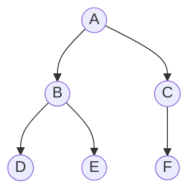
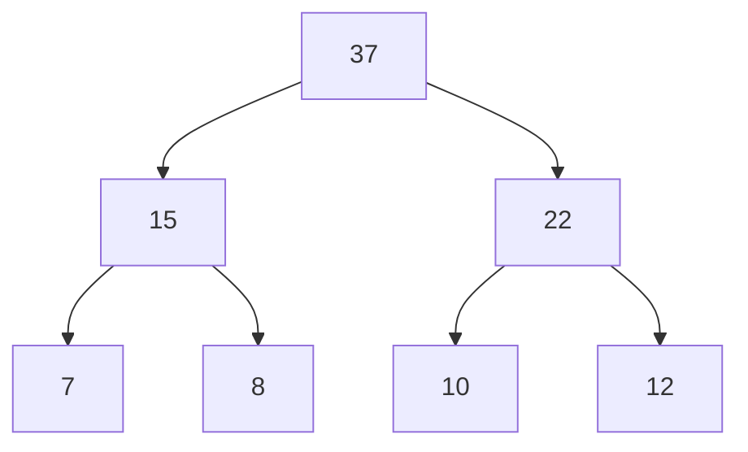

## 本章要义

树是递归结构：空树，或一个根加上若干互不相交的子树。二叉树每个结点至多两棵子树，且左右有序——只有左和只有右是两棵不同的树。遍历、线索化、哈夫曼是本课三大动手点。



先序 ABDECF，中序 DBEAFC，后序 DEBFCA。叶子 \(n_0=n_2+1\)。

## 源笔记勘误

- 「满二叉树 / 完全二叉树 / 斜树」只有名词，没有定义。
- 线索二叉树讲了「有 N+1 个空指针」，但没写 `ltag/rtag`，也没写如何沿线索遍历。
- 哈夫曼只有建树四步，没有 WPL、前缀编码、为何能得到最短编码。
- 遍历「递归 / 非递归」是空条目。

## 术语

- **结点的度**：孩子个数。度为 0 是叶子。树的度 = 结点度的最大值。
- **层次**：根为第 1 层（王道约定）。深度自上而下，高度自下而上。树的高度 = 最大层次。
- **性质 1**：结点数 \(n=\) 分支数 \(+1\)。每个非根结点恰有一条指向它的边。
- **性质 2**：度 \(m\) 的树第 \(i\) 层至多 \(m^{i-1}\) 个结点。
- **性质 3**：高 \(h\) 的 \(m\) 叉树至多 \((m^h-1)/(m-1)\) 个结点。
- **性质 4**：\(n\) 个结点的 \(m\) 叉树最小高度 \(\lceil\log_m(n(m-1)+1)\rceil\)。

## 树的存储

- **双亲表示法**：数组，每个结点记父下标。找父 O(1)，找孩子要扫表。
- **孩子表示法**：每个结点一条孩子单链表，头指针放进数组。
- **孩子兄弟表示法**：两个指针 = 长子 + 右兄弟。这就是树转二叉树的存储形态，见 [[ds/08-tree-forest|树与森林]]。

## 二叉树

五种形态：空；仅根；只有左；只有右；左右都有。

- **斜树**：所有结点都只有左孩子或都只有右孩子，退化成线性表。
- **满二叉树**：每一层都是满的，高 \(h\) 恰有 \(2^h-1\) 个结点。
- **完全二叉树**：深度为 \(h\) 时，1…\(h-1\) 层满，第 \(h\) 层结点靠左连续排列。满 ⊂ 完全。

性质（默写）：

1. 叶子数 \(n_0=n_2+1\)。因为 \(n=n_0+n_1+n_2\)，边数 \(n-1=n_1+2n_2\)。
2. 第 \(k\) 层至多 \(2^{k-1}\) 个（根为第 1 层）。
3. 高 \(H\) 至多 \(2^H-1\) 个。
4. \(n\) 个结点的完全二叉树高度 \(\lfloor\log_2 n\rfloor+1\)。

顺序存储只适合完全二叉树：下标 \(i\)（从 1 计）的左孩子 \(2i\)、右孩子 \(2i+1\)、双亲 \(\lfloor i/2\rfloor\)。一般二叉树用二叉链表。

## 遍历

```c
void PreOrder(BiTree T) {
    if (!T) return;
    visit(T);
    PreOrder(T->lchild);
    PreOrder(T->rchild);
}
```

中序把 `visit` 夹在两棵子树中间，后序放到最后。层序用队列：根入队，出队时左右孩子入队。

先序/中序/后序的非递归都是显式栈。先序也可「先访问再右左入栈」。由先序+中序或后序+中序可唯一确定二叉树；先序+后序一般不能（除非再加度或其它信息）。

## 线索二叉树

\(n\) 个结点的二叉链表有 \(2n\) 个指针，只有 \(n-1\) 条边，空指针 \(n+1\) 个。把空的左指针改指**前驱**，空的右指针改指**后继**，并加两个标志：

- `ltag=0`：`lchild` 是左孩子；`ltag=1`：左线索。
- `rtag` 同理。

中序线索化后，找中序后继：若 `rtag==1` 直接走右线索；否则进右子树再一路向左。中序遍历可以不用栈。先序/后序线索化规则类似，后序找后继更麻烦（可能要找父）。

## 哈夫曼树

带权路径长度 \(WPL=\sum w_i l_i\)，\(l_i\) 是叶子到根的路径长度。哈夫曼算法：每次挑权最小的两棵树合并，新根权为二者之和，直到剩一棵。得到的是 WPL 最小的二叉树。

哈夫曼编码是前缀编码：任一字符编码不是另一字符编码的前缀，才能无歧义解码。权大的叶子离根更近。源笔记只写了建树，没有这句——408 常问「是不是前缀码 / WPL 多少」。

哈夫曼树没有度为 1 的结点，\(n\) 个叶子必有 \(n-1\) 个内部结点，总结点 \(2n-1\)。左右孩子谁大谁小不影响 WPL，但编码串可能不同。



## 408 易错点

- 二叉树第 \(k\) 层至多 \(2^{k-1}\)，不是 \(2^k-1\)（那是高度为 \(k\) 的总结点数）。
- 完全二叉树最后一个内部结点的编号是 \(\lfloor n/2\rfloor\)。
- 线索化是对某一种遍历次序而言的，没有「与次序无关的线索树」。
- 哈夫曼树不唯一，WPL 唯一。

## 考研题精练

**题 1**  
\(n\) 个结点的完全二叉树，叶子数是（ ）。

A. \(\lfloor n/2\rfloor\) B. \(\lceil n/2\rceil\) C. \(\lfloor (n+1)/2\rfloor\) D. \(n-1\)

**解答：** 编号 1…n，叶子从 \(\lfloor n/2\rfloor+1\) 到 n，共 \(n-\lfloor n/2\rfloor=\lceil n/2\rceil\)。**选 B。**

**题 2**  
由先序 `ABDCE` 和中序 `BDAEC` 得到的后序是（ ）。

A. `DBECA` B. `DBCEA` C. `DCEBA` D. `DECBA`

**解答：** 先序根 A，中序左 BDA、右 EC。左子树根 B、中序 D 在 B 左。右子树根 C、中序 E 在 C 左。后序：左 D、B；右 E、C；根 A → `DBECA`。**选 A。**

**题 3**  
哈夫曼树 5 个叶子，总结点数是（ ）。

A. 5 B. 9 C. 10 D. 不确定

**解答：** 无度 1 结点，\(n\) 叶 ⇒ \(n-1\) 内部 ⇒ \(2n-1=9\)。**选 B。**

## 继续阅读

图不再要求「只有一个根、无回路」：[[ds/05-graph|图]]。树与森林的互相转换见 [[ds/08-tree-forest|附录]]。
