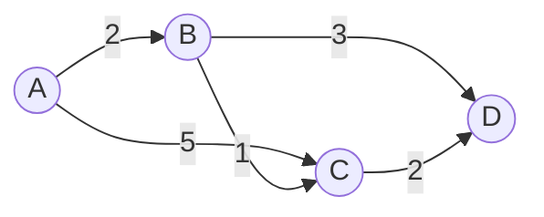

## 本章要义

图 \(G=(V,E)\)：\(V\) 是有限非空顶点集，\(E\) 是边（或弧）的有限集合。树是「连通且无回路」的特殊无向图。图允许多对多、允许回路、不必有根。

邻接矩阵看边快、费空间；邻接表看度省空间。最小生成树用 Prim/Kruskal，最短路用 Dijkstra/Floyd。

## 源笔记勘误

- **第五章开头把树的定义整段贴进了图。** 树是「唯一根 + 子树划分」；图是顶点集和边集。后面虽然补了 \(G=(V,E)\)，第一段必须删掉。
- DFS 写「递归需要栈，所以**时间**复杂度为 \(O(|V|)\)」——那是**空间**。时间在邻接表上是 \(O(|V|+|E|)\)。
- Prim 写成「普利姆（**Prlm**）」，应为 Prim / 普里姆。
- Kruskal 的时间「主要在排序」是对的，但没写并查集判回路，也没写 \(O(|E|\log|E|)\)。
- 关键路径只有 AOE 定义，没有事件最早/最晚时间、活动最早/最晚开始、关键活动判定。

## 基本概念

- 无向边 \((v,w)=(w,v)\)；有向弧 \(\langle v,w\rangle\)，\(v\) 弧尾，\(w\) 弧头。
- **简单图**：无自环、无重复边。408 默认简单图。
- **完全图**：无向任意两点有边，边数 \(n(n-1)/2\)；有向则任意两点各有反向弧，弧数 \(n(n-1)\)。
- 无向**连通**：任意两点有路径。**连通分量**是极大连通子图。\(n\) 个顶点少于 \(n-1\) 条边必不连通。
- **强连通**：有向图中任意有序点对都互相可达。
- **生成树**：包含全部 \(n\) 个顶点、恰 \(n-1\) 条边的极小连通子图。再加边出环，再减边不连通。
- 度：无向记 \(TD(v)\)；有向分出度、入度，\(TD=OD+ID\)。握手定理：度之和 = \(2|E|\)。
- 带权图叫网。无权最短路数边，有权最短路数权和。

## 存储

- **邻接矩阵**：\(n\times n\)。无向对称。查边 \(O(1)\)，空间 \(O(n^2)\)，适合稠密图。
- **邻接表**：每个顶点一条出边链表。空间 \(O(n+e)\)，适合稀疏图。找入边要扫全表（或再做逆邻接表）。
- 有向图十字链表、无向图邻接多重表：边结点同时挂两个顶点，方便找入边/删边。了解即可。

## 遍历

DFS 像树的先序，BFS 像层序。

| | 邻接表 | 邻接矩阵 | 额外空间 |
|--|--------|----------|----------|
| DFS | \(O(|V|+|E|)\) | \(O(|V|^2)\) | 递归栈最坏 \(O(|V|)\) |
| BFS | \(O(|V|+|E|)\) | \(O(|V|^2)\) | 队列最坏 \(O(|V|)\) |

连通图调用一次即可；非连通要对每个未访问顶点再调一次，得到连通分量个数。

## 最小生成树

连通带权无向图。Prim：从一点长树，每次加「树内到树外」权最小边，\(O(n^2)\)（邻接矩阵朴素实现），适合**稠密图**。Kruskal：边按权排序，用并查集，不形成回路就加入，\(O(|E|\log|E|)\)，适合**稀疏图**。

两条都要求边权能比较；图必须连通，否则得到最小生成森林。

## 最短路径

- **Dijkstra**：单源，边权**非负**。集合 \(S\) 装已确定最短路的点，每次把 `dist` 最小且不在 \(S\) 的点加入，松弛它的出边。朴素 \(O(n^2)\)。
- **Floyd**：每对顶点。三重循环，中间点 \(k\) 从 0 到 \(n-1\)：`A[i][j]=min(A[i][j], A[i][k]+A[k][j])`，\(O(n^3)\)。允许负权，**不允许负权环**（对角出现负值即有负环）。

无权图 BFS 就是最短路（按边数）。

## 拓扑排序与关键路径

**AOV**：顶点是活动，弧是先后约束。拓扑：反复输出入度为 0 的顶点并删它的出边。能输出全部顶点 ⇔ 无环。有环则不是 AOV。

**AOE**：边是活动，权是持续时间，顶点是事件。

- 事件最早发生时间 \(ve\)：源点 0，沿拓扑取 max。
- 事件最晚发生时间 \(vl\)：汇点等于 \(ve\)，逆拓扑取 min。
- 活动最早 \(e=ve(起点)\)，最晚 \(l=vl(终点)-权\)。
- \(e=l\) 的活动是关键活动，它们组成关键路径（可能不止一条）。关键路径长度 = 工期。

## 408 易错点

- 邻接表的边结点数：无向图 \(2|E|\)，有向图 \(|E|\)。
- Dijkstra 不能直接用于负权；再怎么「改一下初始化」都不行。
- Prim / Kruskal 得到的生成树形状可以不同，权和相同（权互异时树唯一）。
- 拓扑序列不唯一。入度为 0 的点有多个时可任选，栈或队列实现得到的序列不同。

## 考研题精练

**题 1**  
\(n\) 个顶点的无向完全图，边数是（ ）。

A. \(n\) B. \(n(n-1)\) C. \(n(n-1)/2\) D. \(n^2\)

**解答：** 每对顶点一条边。**选 C。** 有向完全图才是 \(n(n-1)\)。

**题 2**  
邻接表存无向图，边数为 \(e\)，DFS 或 BFS 的时间是（ ）。

A. \(O(n)\) B. \(O(e)\) C. \(O(n+e)\) D. \(O(n^2)\)

**解答：** 访问顶点 \(O(n)\)，扫邻接表 \(O(e)\)。矩阵存是 \(O(n^2)\)。**选 C。**

**题 3**  
Dijkstra 不适用于（ ）。

A. 无向带权 B. 有向带权 C. 负权边 D. 非负权

**解答：** 松弛依赖「已确定顶点的距离不再变」，负权会破坏。负权用 Bellman-Ford。**选 C。**

## 继续阅读

查找里的树（BST、B 树）和图没有直接包含关系，但「路径 / 层次」的直觉来自本章和上一章：[[ds/06-search|查找]]。
