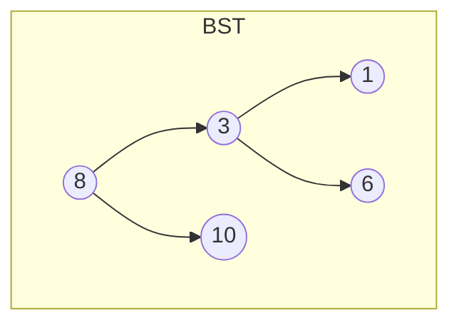

## 本章要义

查找：在集合里找满足条件的元素。关键字应能唯一标识（讨论成功/失败查找时）。平均查找长度 ASL = 各关键字比较次数的期望。结构决定 ASL：线性、树、散列三条线。

折半要求有序顺序表；散列看冲突处理：链地址 vs 开放定址。

## 源笔记勘误

- 顺序查找列了「1 2 3 4」四个空点，没有任何内容。
- 分块查找的 ASL 公式写完就空了：应是「索引表 ASL + 块内 ASL」。
- BST「查找时间复杂度是 \(O(n)\)」只说了**最坏**（退化成链）。平均是 \(O(\log n)\)。
- AVL 的 LR / RL 只有标题。
- B 树「非叶结点结构如下」后面是空的。
- **构造散列函数第一条写成「开放定址法：H(key)=a×key+b」**。那是**直接定址法**。开放定址是**冲突处理方法**（线性探测、平方探测等）。这是源笔记里最严重的概念串台之一。
- 装填因子与 ASL 的关系只留了空行。

## 顺序、折半、分块

顺序查找：从表头或表尾比到尽头。成功 ASL\((n+1)/2\)，失败 \(n+1\)（不设哨兵时）。时间 \(O(n)\)。设哨兵可减少边界判断，不降阶。

折半查找：表必须**有序且随机访问**（顺序表）。每次把区间中点与 key 比，一半扔掉。判定树是近似完全二叉树，成功 ASL \(\approx\log_2(n+1)-1\)，时间 \(O(\log n)\)。高度 \(\lfloor\log_2 n\rfloor+1\)。

分块查找（索引顺序）：块间有序、块内无序。先在索引上折半（或顺序）定位块，再在块内顺序查。

\[
ASL = ASL_{\text{索引}} + ASL_{\text{块内}}
\]

块长约 \(\sqrt{n}\) 时较优。

## 二叉排序树（BST）

空树，或左 < 根 < 右，且左右仍是 BST（通常约定不含相等关键字；相等可规定放右边，题面为准）。

查找失败落到空指针。插入：按查找路径走到空位挂上。删除分三种：

1. 叶子：直接摘掉。
2. 只有一棵子树：孩子顶上去（「子承父业」）。
3. 两棵子树都有：用中序前驱或后继（左子树最大 / 右子树最小）的值覆盖，再删那个结点。源笔记「一个孩子继承、另一个归顺」不精确，标准做法是前驱/后继替换。

平均查找、插入、删除 \(O(\log n)\)；最坏斜树 \(O(n)\)。这就是要 AVL / 红黑 / B 树的原因。

## AVL

BST + 任意结点左右子树高度差绝对值 ≤ 1。平衡因子 \(BF\in\{-1,0,1\}\)。插入后从下往上找到最小不平衡子树，四种旋转：

| 类型 | 插入位置 | 做法 | 口诀 |
|------|----------|------|------|
| LL | 左孩子的左 | 右旋 | 正正右旋 |
| RR | 右孩子的右 | 左旋 | 负负左旋 |
| LR | 左孩子的右 | 先左旋左孩子，再右旋根 | 先局部变 LL |
| RL | 右孩子的左 | 先右旋右孩子，再左旋根 | 先局部变 RR |

高度 \(O(\log n)\)，ASL \(O(\log n)\)。

## B 树与 B+ 树

\(m\) 阶 B 树：

1. 每个结点至多 \(m\) 棵子树（至多 \(m-1\) 个关键字）。
2. 根若非叶，至少 2 棵子树。
3. 非根内部结点至少 \(\lceil m/2\rceil\) 棵子树。
4. 结点形态：\(P_0,K_1,P_1,\ldots,K_n,P_n\)，关键字有序，指针夹在关键字之间。
5. 所有叶子在同一层，叶子是失败结点、不带记录。

2-3 树是 3 阶 B 树，2-3-4 树是 4 阶 B 树。插入上溢则分裂，中间关键字上提；删除下溢则向兄弟借或合并。

B+ 树与 B 树的关键差别（默写）：

- B+：\(n\) 个关键字 ⇒ \(n\) 棵子树；B：\(n\) 个关键字 ⇒ \(n+1\) 棵子树。
- B+ 非根关键字个数 \([\lceil m/2\rceil,m]\)；B 是 \([\lceil m/2\rceil-1,m-1]\)。
- B+ 叶子串成链表并带全部记录，内部结点只做索引，关键字会重复出现在叶子；B 的关键字不重复，叶子不带记录。

数据库和文件系统的索引几乎都是 B+，因为范围扫描走叶子链表。

## 散列表

散列函数 \(Hash(key)=Addr\)。不同关键字映到同一地址叫冲突，这些关键字叫同义词。

**构造函数**（不要和冲突处理混）：

1. **直接定址**：\(H(key)=a\cdot key+b\)。不冲突，地址空间要跟得上关键字集合。
2. **除留余数**：\(H(key)=key \bmod p\)，\(p\) 取不大于表长的质数。
3. 数字分析、平方取中、折叠：按关键字数字分布选。

**冲突处理**：

- **开放定址**：冲突后探下一个空位。线性探测 \(d+1,d+2,\ldots\)（易堆积）；平方探测 \(d\pm1^2,d\pm2^2,\ldots\)（至少探到一半单元）；双散列；伪随机。
- **拉链法**：同义词串在一条链表上，插入删除方便。

装填因子 \(\alpha=n/m\)（记录数 / 表长）。\(\alpha\) 越大冲突越多，ASL 随 \(\alpha\) 升，**与表长无直接关系**。成功 ASL 在均匀假设下，线性探测约 \(\frac{1}{2}(1+1/(1-\alpha))\)，拉链约 \(1+\alpha/2\)。开放定址要求 \(\alpha<1\)；拉链可以 \(\alpha>1\)。

## 408 易错点

- 折半查找不能用在链表上（不能 O(1) 取中点）。
- BST 删除有两棵子树时，不是随便把左子树整个挂到右子树下面（会破坏形态与复杂度，虽然中序有序可能还在）。
- 直接定址 ≠ 开放定址。
- B 树叶子在同一层是定义，不是「尽量平衡」。

## 考研题精练

**题 1**  
有序表长 16，折半查找失败时最多比较（ ）次。约定 mid 取下整，low>high 停。

A. 4 B. 5 C. 6 D. 8

**解答：** 判定树高度 \(\lfloor\log_2 16\rfloor+1=5\)，失败在空指针上还要再比一次到 low>high，408 常取 5 或按判定树外结点深度。王道口径失败最多 \(\lfloor\log_2 n\rfloor+1=5\)。**选 B。**

**题 2**  
散列表长 13，\(H(k)=k\bmod 13\)，线性探测。插入 27 后再插 40，40 的位置是（ ）。27 先占 \(1\)。

A. 1 B. 2 C. 3 D. 14

**解答：** \(40\bmod 13=1\)，1 被 27 占，线性探测到 2。**选 B。**

**题 3**  
m 阶 B 树根最少（ ）棵子树。

A. 2 B. \(\lceil m/2\rceil\) C. m D. 1

**解答：** 根至少 2 叉（除非整树只有根）。非根至少 \(\lceil m/2\rceil\)。**选 A。**

## 继续阅读

内部排序经常先「排好再折半」：[[ds/07-sort|排序]]。
