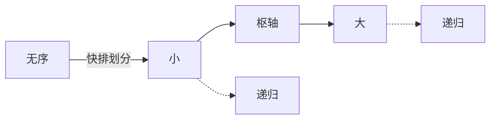

## 本章要义

排序把无序序列变成有序。先问三件事：**稳定吗**、**时间最坏/平均/最好**、**额外空间**。关键字相等时，若排序后相对次序不变，则稳定。



先背一张表：稳定否、最好/平均/最坏、额外空间。

## 源笔记勘误

- 直接插入写成「时间复杂度为 \(O(n)\)」。那是**最好**（已经有序，每趟只比 1 次）。平均和最坏都是 \(O(n^2)\)。
- 冒泡的时间复杂度是空标题。最好（加交换标志且已有序）\(O(n)\)，平均/最坏 \(O(n^2)\)。
- 简单选择排序算法说明是空白，只剩复杂度推导。
- 快排「代码」是 1、2 两个空点。
- 堆排序「什么是堆排序」下面两个空点，没写建堆和下沉。
- 「基数排序也叫桶排序」不严谨。基数用「分配 + 收集」按位；桶排序按区间分桶，再对桶排序。只在「都不是基于比较」这点上相近。
- 外部排序三问只有标题。

## 插入类

**直接插入**：前面已排好，把当前元素插入到已序段的合适位置。稳定。空间 \(O(1)\)。最好 \(O(n)\)，平均/最坏 \(O(n^2)\)。

**折半插入**：用折半找插入点，移动仍要 \(O(n)\)，故仍是 \(O(n^2)\)。稳定。比较次数降了，移动次数不变。

**希尔**：按增量把序列分成若干子序列，对各子序列直接插入，增量缩到 1。增量序列常用 \(n/2, \lfloor d/2\rfloor, \ldots, 1\)。不稳定（相等元可能进不同组）。空间 \(O(1)\)。最好约 \(O(n^{1.3})\)，最坏可达 \(O(n^2)\)，取决于增量。

## 交换类

**冒泡**：相邻逆序就交换，一趟把一个极值沉底或浮顶。加 `flag`：一趟零交换则可提前结束。稳定。空间 \(O(1)\)。

**快速排序**：选枢轴，小的放左、大的放右，再递归两边。平均 \(O(n\log n)\)，最坏（已有序且总选端点）\(O(n^2)\)。空间是递归栈：最好 \(O(\log n)\)，最坏 \(O(n)\)。不稳定。随机选枢轴或三数取中可避免最坏。

```c
int Partition(int A[], int low, int high) {
    int pivot = A[low];
    while (low < high) {
        while (low < high && A[high] >= pivot) high--;
        A[low] = A[high];
        while (low < high && A[low] <= pivot) low++;
        A[high] = A[low];
    }
    A[low] = pivot;
    return low;
}
```

## 选择类

**简单选择**：第 \(i\) 趟在 \(A[i..n-1]\) 里选最小的与 \(A[i]\) 交换。比较次数固定 \(n(n-1)/2\)，所以总是 \(O(n^2)\)，没有「最好 \(O(n)\)」。不稳定（交换会打乱相等元次序）。空间 \(O(1)\)。

**堆**：完全二叉树，且父结点不小于（大顶）或不大于（小顶）孩子。堆排序：先 \(O(n)\) 建堆，再 \(n-1\) 次「取堆顶 + 末元上来 + 下沉」，每次下沉 \(O(\log n)\)，合计 \(O(n\log n)\)。不稳定。空间 \(O(1)\)。

建堆从最后一个非叶 \(\lfloor n/2\rfloor\) 向下沉到根。这比「一个个插入」的 \(O(n\log n)\) 建堆更优，408 要会说「建堆是 \(O(n)\)」。

## 归并与基数

2 路归并：先看成 \(n\) 个长度为 1 的有序段，两两合并，直到一段。时间 \(O(n\log n)\) 稳定，最好最坏一样。空间 \(O(n)\)（要临时数组）。

基数（LSD 为例）：按最低位到最高位，每一位做一次稳定的分配/收集（桶是队列）。\(d\) 位、基数 \(r\)、\(n\) 个关键字：时间 \(O(d(n+r))\)，空间 \(O(n+r)\)（有的书写 \(O(r)\)，那是只算桶指针、没算收集缓冲）。稳定。**不是基于关键字比较**，不受 \(O(n\log n)\) 比较下界约束。

## 对照表

| 算法 | 最好 | 平均 | 最坏 | 空间 | 稳定 |
|------|------|------|------|------|------|
| 直接插入 | \(O(n)\) | \(O(n^2)\) | \(O(n^2)\) | \(O(1)\) | 是 |
| 希尔 | — | 约 \(O(n^{1.3})\) | \(O(n^2)\) | \(O(1)\) | 否 |
| 冒泡 | \(O(n)\) | \(O(n^2)\) | \(O(n^2)\) | \(O(1)\) | 是 |
| 快排 | \(O(n\log n)\) | \(O(n\log n)\) | \(O(n^2)\) | \(O(\log n)\sim O(n)\) | 否 |
| 简单选择 | \(O(n^2)\) | \(O(n^2)\) | \(O(n^2)\) | \(O(1)\) | 否 |
| 堆 | \(O(n\log n)\) | \(O(n\log n)\) | \(O(n\log n)\) | \(O(1)\) | 否 |
| 归并 | \(O(n\log n)\) | \(O(n\log n)\) | \(O(n\log n)\) | \(O(n)\) | 是 |
| 基数 | \(O(d(n+r))\) | 同左 | 同左 | \(O(n+r)\) | 是 |

## 外部排序

内存装不下时，在外存和内存之间倒数据。

1. **初始归并段**：置换选择排序能得到平均长度约 \(2w\) 的初始段（\(w\) 是内存能容纳的记录数），优于「内存排一趟就输出一段」。
2. **减少归并趟数**：用最佳归并树安排各段归并顺序，让短段早归并，I/O 最少。
3. **多路选最小**：败者树，比较次数与路数近似对数，避免 \(k\) 路归并每次做 \(k-1\) 次傻比较。

## 408 易错点

- 比较排序最坏下界 \(\Omega(n\log n)\)，所以没有「比较排序最坏还是 \(O(n)\)」这种神功。
- 快排已序最慢，插入已序最快——别记反。
- 堆排序和简单选择都是选择类，但堆不是 \(O(n^2)\)。
- 稳定性：选择、希尔、快排、堆都不稳定；插入、冒泡、归并、基数稳定。
- 题目给「只允许用常数额外空间」时，归并直接出局。

## 考研题精练

**题 1**  
下列排序中，不稳定的是（ ）。

A. 直接插入 B. 归并 C. 快排 D. 冒泡

**解答：** 快排交换可能打乱相等元。堆排、希尔、简单选择也不稳定。**选 C。**

**题 2**  
对 \(n\) 个数堆排序，时间是（ ）。

A. \(O(n)\) B. \(O(n\log n)\) C. \(O(n^2)\) D. 最好 \(O(n)\)

**解答：** 建堆 \(O(n)\)，n-1 次取顶并下沉各 \(O(\log n)\)，总 \(O(n\log n)\)，最好最坏同阶。**选 B。**

**题 3**  
一组关键字已基本有序，应选（ ）。

A. 快排 B. 堆排 C. 直接插入 D. 基数

**解答：** 直接插入最好 \(O(n)\)。快排遇有序退化 \(O(n^2)\)。**选 C。**

## 继续阅读

树、二叉树、森林的转换见 [[ds/08-tree-forest|附录]]。复杂度符号回 [[ds/01-basics|基本概念]]。
